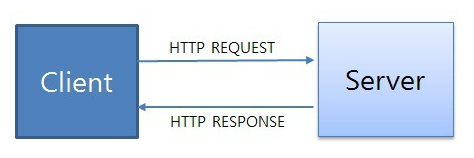

__22.02.26__

# HTTP란 무엇인가?

### HTTP`(HyperText Transfer Protocol)`
___
- 텍스트 기반의 통신 규약으로 **인터넷에서 데이터를 주고받을 수 있는 프로토콜**
- 모든 프로그램이 이 규약에 맞춰 개발해서 서로 정보를 교환할 수 있음

### 동작
___
클라이언트 즉, 사용자가 브라우저를 통해서 어떠한 서비스를 url을 통하거나 다른 것을 통해서 요청(request)하면 서버에서는 해당 요청사항에 맞는 결과를 찾아서 사용자에게 응답(response)하는 형태로 동작
- 요청 : `client → server`
- 응답 : `server → client`

HTML 문서만이 HTTP 통신을 위한 유일한 정보 문서는 아님  
Plain Text로부터 JSON 데이터 및 XML과 같은 형태의 정보도 주고 받을 수 있으며, 보통은 클라이언트가 어떤 정보를 HTML 형태로 받고 싶은지, JSON 형태로 받고 싶은지 명시해주는 경우가 많음

### 특징
___
- HTTP 메세지는 HTTP 서버와 HTTP 클라이언트에 의해 해석됨
- TCP/IP를 이용하는 응용 프로토콜  
  (컴퓨터와 컴퓨터간에 데이터를 전송할 수 있도록 하는 장치로 인터넷이라는 거대한 통신망을 통해 원하는 정보(데이터)를 주고 받는 기능을 이용하는 응용 프로토콜)
- HTTP는 연결 상태를 유지하지 않는 `비연결성 프로토콜`  
  (이러한 단점을 해결하기 위해 Cookie와 Session이 등장)
- HTTP는 연결을 유지하지 않는 프로토콜이기 때문에 요청/응답 방식으로 동작



### 예시
___
- 서버 : 어떠한 자료에 대한 접근을 관리하는 네트워크 상의 시스템 **(요청에 대한 응답을 보내줌)**
- 클라이언트 : 그 자료에 접근할 수 있는 프로그램  
  EX) 웹 브라우저, 어플리케이션 등..

클라이언트 프로그램에서 사용자가 회원가입을 시도하게 되면, 서버로 회원정보를 보내게 되고 서버는 회원 정보를 저장해주기도 한다.  
이 과정에서 **클라이언트와 서버 간의 교류가 HTTP라는 규약을 이용하여 발생하게 된다.**

### Request(요청)
___
`클라이언트가 서버에게 연락하는 것`을 요청이라고 하며 요청을 보낼때는 요청에 대한 정보를 담아 서버로 전송

#### EX
서버가 주문서를 받아 클라이언트가 어떤 것을 원하는지 파악할 수 있게 함.  
이처럼 **요청은 식당에서 주문서를 작성하는 것과 같다**고 생각하면 됨

#### Request Method(요청의 종류)
- `GET` : 자료를 **요청**할 때 사용
- `POST` : 자료의 **생성**을 요청할 때 사용
- `PUT` : 자료의 **수정**을 요청할 때 사용
- `DELETE` : 자료의 **삭제**를 요청할 때 사용

#### Request HTTP 메세지 예시
```
GET https://google.com HTTP/1.1  
User-Agent: Mozilla/5.0 (Windows NT 10.0; Win64; x86)...
Upgrade-Insecure-Requests: 1
```
1. 시작줄(첫 줄)
첫 줄은 시작줄로 **메서드 구조 버전**으로 구성되었음
- GET : HTTP Method
- https://google.com : 사이트 주소
- HTTP/1.1 : HTTP 버전

2. 헤더(두 번째 줄부터)
두번째 줄부터는 헤더이며, **요청에 대한 정보**를 담고 있음  
User-Agent, Upgrade-Insecure-Requests등이 헤더에 해당되며 헤더의 종류는 매우 많음

3. 본문(헤더에서 한 줄 띄우고)
본문은 **요청을 할 때 함께 보낼 데이터를 담는 부분**  
현재 예시에는 단순히 주소로만 요청을 보내고 있고 따로 데이터를 담아 보내지 않기 때문에 본문이 비어있음


### Response(응답)
___
`서버가 요청에 대한 답변을 클라이언트에게 보내는 것`을 응답이라고 함

#### Status Code(상태 코드)
상태 코드에는 굉장히 많은 종류가 있음  
모두 숫자 세 자리로 이루어져 있으며, 아래와 같이 크게 다섯 부류로 나눌 수 있음
- `1XX(조건부 응답)` : 요청을 받았으며 작업을 계속함
- `2XX(성공)` : 클라이언트가 요청한 동작을 수신하여 이해했고 승낙했으며 성공적으로 처리했음을 가리킴
- `3XX(리다이렉션 완료)` : 클라이언트는 요청을 마치기 위해 추가 동작을 취해야함
- `4XX(요청 오류)` : 클라이언트에 오류가 있음을 나타냄
- `5XX(서버 오류)` : 서버가 유효한 요청을 명백하게 수행하지 못했음을 나타냄

### Response HTTP 메시지 예시
```
HTTP/1.1 200 OK
Connection: keep-alive
Content-Encoding: gzip
Content-Length: 35653
Content-Type: text/html;

<!DOCTYPE html><html lang="ko" data-reactroot=""><head><title....
```

1. 시작줄(첫 줄)
첫 줄은 **버전 상태코드 상태메시지**로 구성. 200은 성공적인 요청이었다는 뜻
2. 헤더(두 번째 줄부터)
헤더로 **응답에 대한 정보**를 담고 있음
3. 본문(헤더 뒤부터)
응답에는 대부분의 경우 본문이 있음.  
보통 데이터를 요청하고 응답 메세지에는 **요청한 데이터를 담아서 보내주기 때문**  
**응답 메세지에 HTML이 담겨 있는데 이 HTML을 받아 브라우저가 화면에 렌더링함**
  
