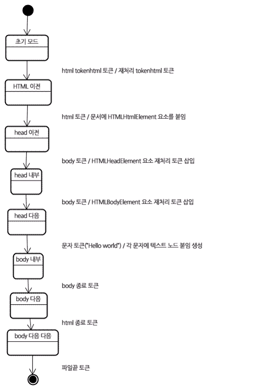

__22.03.04__
# 브라우저는 어떻게 동작하는가?

### 브라우저의 주요 기능
___
사용자가 선택한 자원을 서버에 요청하고 브라우저에 표시하는 것  
자원은 보통 HTML 문서지만 PDF나 이미지 또는 다른 형태일 수 있음  
자원 주소는 `URI(Uniform Resource Identifier)`에 의해 정해짐

### 기본 구조
___
#### 주요 구성 요소
1. 사용자 인터페이스
2. 브라우저 엔진 - 사용자 인터페이스와 렌더링 엔진 사이의 동작을 제어
3. 렌더링 엔진 - 요청한 콘텐츠를 표시, EX) HTML을 요청하면 HTML과 CSS를 파싱하여 화면에 표시함
4. 통신 - HTTP 요청과 같은 네트워크 호출에 사용됨. 이것은 플랫폼 독립적인 인터페이승이고 각 플랫폼 하부에서 실행됨
5. UI 백엔드 - 콤보 박스와 창 같은 기본적인 장치를 그림. 플랫폼에서 명시하지 않은 일반적인 인터페이스로서, OS 사용자 인터페이스 체계를 사용
6. 자바스크립트 해석기 - 자바스크립트 코드를 해석하고 실행
7. 자료 저장소 - 자료를 저장하는 계층. 쿠키를 저장하는 것과 같이 모든 종류의 자원을 하드 디스크에 저장할 필요가 있음. HTML5 명세에서는 브라우저가 지원하는 웹 데이터베이스가 정의되어 있음


#### 렌더링 엔진
- 역할 : 요청 받은 내용을 브라우저 화면에 표시하는 일  

렌더링 엔진은 HTML 및 XML 문서와 이미지를 표시할 수 있음.  
물론 플러그인이나 브라우저 확장 기능을 이용해 PDF와 같은 다른 유형도 표시할 수 있음  

##### 렌더링 엔진들
- 게코(Gecko) 엔진 : 모질라에서 직접 만듬
- 웹킷(Webkit) 엔진 
  - 최초 리눅스 플랫폼에서 동작하기 위해 제작된 오픈소스 엔진
  - 사파리와 크롬이 사용

##### 동작 과정
렌더링 엔진은 통신으로부터 요청한 문서의 내용을 얻는 것으로 시작하는데 문서의 내용은 보통 8KB 단위로 전송됨

[기본적인 동작 과정]


1. HTML 문서를 파싱하고, `콘텐츠 트리` 내부에서 태그를 `DOM 노드`로 변환
2. 외부 CSS 파일과 함께 포함된 스타일 요소도 파싱
3. 스타일 정보와 HTML 표시 규칙은 `렌더 트리`라고 부르는 또 다른 트리를 생성

> 렌더 트리는 색상 또는 면적과 같은 시각적 속성이 있는 사각형을 포함하고 있는데 정해진 순서대로 화면에 표시됨
4. 랜더 트리 생성이 끝나면 배치가 시작되는데 이것은 각 노드가 화면의 정확한 위치에 표시되는 것을 의미
5. UI 백엔드에서 렌더 트리의 각 노드를 가로지르며 형상을 만들어 내는 그리기 과정

✅ 일련의 과정들이 점진적으로 진행됨  
✅ 좀 더 나은 사용자 경험을 위해 가능하면 빠르게 내용을 표시하는데 모든 HTML을 파싱할 때까지 기다리지 않고 배치와 그리기 과정을 시작    
 👉 네트워크로부터 나머지 내용이 전송되기를 기다리는 동시에 받은 내용의 일부를 먼저 화면에 표시하는 것

[동작 과정 예시]
1. 웹킷


2. 게코


> 둘은 용어를 다르게 사용하지만 기본적으로 동일함


#### 파싱과 DOM 트리 구축
___
문서 파싱 : 브라우저가 코드를 이해하고 사용할 수 있는 구조로 변환하는 것을 의미, 파싱 결과는 보통 문서 구조를 나타내는 노드 트리인데 파싱 트리(parse tree) 또는 문법(syntax tree)라고 부름

##### 문법
파싱은 문서에 작성된 언어 똔는 형식의 규칙에 따르는데 파싱할 수 있는 모든 형식은 정해진 용어와 구문 규칙에 따라야 함  
이것을 `문맥 자유 문법`이라고 함  
인간의 언어는 이런 모습과는 다르기 때문에 기계적으로 파싱이 불가능함

##### 파서-어휘 분석기 조합
파싱은 1)어휘 분석과 2)구문 분석이라는 두 가지로 구분 가능  

1) 어휘 분석  
자료를 토큰으로 분해하는 과정  
`토큰(=용어집)` → 유효하게 구성된 단위의 집합체, 인간의 언어로 말하자면 사전에 등장하는 모든 단어에 해당

2) 구문 분석  
언어의 구문 규칙을 적용하는 과정  

파서는 보통 두 가지 일을 하는데 자료를 유효한 토큰으로 분해하는 `어휘 분석기(=토큰 변화기)`가 있고, 언어 구문 규칙에 따라 문서 구조를 분석함으로써 파싱 트리를 생성하는 파서가 있음  
`어휘 분석기`는 공백과 줄 바꿈 같은 의미 없는 문자를 제거  


파싱 과정은 반복됨  
파서는 보통 `어휘 분석기`로부터 새 토큰을 받아서 구문 규칙을 일치하는지 확인함  
- 규칙에 맞으면 토큰에 해당하는 노드가 파싱 트리에 추가되고 파서는 또 다른 토큰을 요청함  
- 규칙에 맞지 않으면, 파서는 토큰을 내부적으로 저장하고 토큰과 일치하는 규칙이 발견될 때까지 요청함
  - 맞는 규칙이 없는 경우 예외로 처리하는데 이것은 문서가 유효하지 않고 구문 오류를 포함하고 있다는 의미


##### 변환
파서 트리는 최종 결과물이 아님  
파싱은 보통 문서를 다른 양식으로 변환하는데 컴파일이 하나의 예가 됨  
소스 코드를 기계 코드로 만드는 컴파일러는 파싱 트리 생성 후 이를 기계 코드 문서로 변환함


##### 허위와 구문에 대한 공식적인 정의
어휘는 보통 `정규 표현식`으로 표현함    
구문은 보통 `BNF`라고 부르는 형식에 따라 정의함  
문법이 `문맥 자유 문법`이라면 언어는 정규 파서로 파싱할 수 있음  
문맥 자유 문법을 쉽게 말하면 완전히 `BNF`로 표현 가능한 문법

##### 파서의 종류
1) 하향식 파서 : 구문의 상위 구조로부터 일치하는 부분을 찾기 시작
2) 상향식 파서 : 낮은 수준에서 점차 높은 수준으로 찾음
    - 입력 값의 오른쪽으로 이동하면서 구문 규칙으로 갈수록 남는 것이 점차 감소하기 때문에 `이동-감소 파서`라고 부름

##### 파서 자동 생성
파서를 생성해 줄 수 있는 도구를 `파서 생성기` 라고 함  
언어에 어휘나 구문 규칙 같은 문법을 부여하면 동작하는 파서를 만들어 줌  
파서를 생성하는 것은 파싱에 대한 깊은 이해를 필요로 하고 수동으로 파서를 최적화하여 생성하는 것은 쉬운 일이 아니기 때문에 파서 생성기는 매우 유용함  

웹킷은 잘 알려진 두 개의 파서 생성기를 사용함  
어휘 생성을 위한 `플렉스(Fkex)` : 토큰의 정규 표현식 정의를 포함하는 파일을 입력 받음  
파서 생성을 위한 `바이슨(Bison)` : BNF 형식의 언어 구문 규칙을 입력 받음ㅁ


#### HTML 파서
___
HTML 파서는 HTML 마크업을 파싱 트리로 변환함  

##### HTML 문법 정의
- HTML의 어휘와 문법은 W3C에 의해 명세로 정의되어 있음
##### 문맥 자유 문법이 아님
- 모든 전통적인 파서는 HTML에 적용할 수 없음  
- 파싱은 CSS와 자바스크립트를 파싱하는데 사용됨  
- HTML은 파서가 요구하는 문맥 자유 문법에 의해 쉽게 정의 할 수 없음
  - HTML 정의를 위한 공식적인 형식으로 DTD(문서 형식 정의)가 있지만 이것은 문맥 자유 문법이 아님
- HTML이 XML과 유사하기 때문 → 사용할 수 있는 XML 파서는 많음
- HTML vs. XHTML(HTML을 XML 형태로 재구성한 것)
  - HTML이 더 "너그럽다"
  - HTML은 암묵적으로 태그에 대한 생략이 가능
  - 전반적으로 뻣뻣하고 부담스러운 XML에 반하여 HTML은 `"유연한"`문법
  - ✅ 정리하자면, HTML은 파싱하기 어렵고 전통적인 구문 분석이 불가능하기 때문에 문맥 자유 문법이 아니라는 것, XML 파서로도 파싱하기 쉽지 않음
##### HTML DTD
- HTML의 정의는 DTD 형식 안에 있는데 SGML 계열 언어의 정의를 이용한 것
- 이 형식은 허용되는 모든 요소와 그들의 속성 그리고 중첩 구조에 대한 정의를 포함함
- 앞서 말 한대로 HTML DTD는 문맥 자유 문법이 아님

##### DOM
- `파싱 트리`는 DOM 요소와 속성 노드의 트리로서 출력 트리가 됨
- DOM 👉 `Document Object Model`, 이것은 HTML 문서의 객체 표현이고 외부를 향하는 자바스크립트와 같은 HTML 요소의 연결 지점, 트리의 최상위 객체는 `문서`
- DOM과 마크업은 1:1의 관계를 맺음

예를 들면, 
```html
 <html>
  <body>
   <p>Hello World</p>
   <div></div>
  </body>
</html>  
```

아래와 같은 DOM 트리로 변환


- 트리가 DOM 노드를 포함한다고 말하는 것은 DOM 접점의 하나를 실행하는 요소를 구성한다는 의미
- 브라우저는 내부의 다른 속성들을 이용하여 이를 구체적으로 실행함

##### 파싱 알고리즘
HTML은 일반적으로 하향식 또는 상향식 파서로 파싱이 안되는데 그 이유는 다음과 같음
1. 언어의 너그러운 속성
2. 잘 알려져 있는 HTML 오류에 대한 브라우저의 관용
3. 변경에 의한 재파싱. 일반적으로 소스는 파싱하는 동안 변하지 않지만 HTML에서 document.write을 포함하고 있는 스크립트 태그는 토큰을 추가할 수 있기 때문에 실제로는 입력 과정에서 파싱이 수정됨

👉 브라우저는 HTML 파싱을 위해 별도의 파서를 생성함

파싱 알고리즘은 `토큰화`와 `트리 구축` 두 단계로 되어 있음
- 토큰화 : HTML에서는 토큰은 시작 태그, 종료 태그, 속성 이름과 속성 값
    - 토큰화는 토큰을 이지해서 트리 생성자로 넘기고 다음 토큰을 확인하기 위해 다음 문자를 확인함. 그리고 입력의 마지막까지 이 과정을 반복함

  

###### 토큰화 알고리즘
- 알고리즘의 결과물은 HTML 토큰  
- 알고리즘은 상태 기계(State Machine)라고 볼 수 있음  
- 각 상태는 하나 이상의 연속된 문자를 입력받아 이 문자에 따라 다음 상태를 갱신함 그러나 결과는 현재의 토큰화 상태와 트리 구축 상태의 영향을 받는데, 이것은 같은 문자를 읽어도 현재 상태에 따라 다음 상태의 결과가 다르게 나온다는 것을 의미함


 
###### 트리 구축 알고리즘
- 파서가 생성되면 문서 객체가 생성됨  
- 트리 구축이 진행되는 동안 문서 최상단에서는 DOM 트리가 수정되고 요소가 추가됨  
- 토큰화에 의해 발행된 각 노드는 트리 생성자에 의해 처리됨  
- 각 토큰을 위한 DOM 요소의 명세는 정의되어 있음  
- DOM 트리에 요소를 추가하는 것이 아니라면 열린 요소는 스택(임시 버퍼 저장소)에 추가됨  
- 이 스택은 부정확한 중첩과 종료되지 않은 태그를 교정함  
- 알고리즘은 상태 기계라고 설명할 수 있고, 상태는 `삽입 모드`라고 부름  



##### 파싱이 끝난 이후의 동작
이번 단게에서 브라우저는 문서와 상호작용할 수 있게 되고, 문서 파싱 이후에 실행되어야 하는 `지연 모드` 스크립트를 파싱하기 시작  
문서 상태는 `완료`가 되고, `로드` 이벤트가 발생함


##### 브라우저의 오류 처리
HTML 페이지에서 `유효하지 않은 구문` 이라는 오류는 없음 👉 브라우저가 모든 오류 구문을 교정하기 때문

파서는 적어도 다음과 같은 오류를 처리해야 함
1. 어떤 태그의 안쪽에 추가하려는 태그가 금지된 것일 때 일단 허용된 태그를 먼저 닫고 금지된 태그는 외부에 추가
2. 파서가 직접 요소를 추가해서는 안됨. 문서 제작자에 의해 뒤늦게 요소가 추가될 수 있고 생략 가능한 경우도 있음. HTML, HEAD, BODY, TBODY, TR,TD, LI 태그가 이런 경우
3. 인라인 요소 안쪽에 블록 요소가 있는 경우 부모 블록 요소를 만날 때까지 모든 인라인 태그를 닫음
4. 이런 방법이 도움이 되지 않으면, 태그를 추가하거나 무시할 수 있는 상태가 될 때까지 요소를 닫음

#### CSS 파싱
___
HTML과는 다르게 CSS는 문맥 자유 문법이고, 일반 파서 유형을 이용하여 파싱 가능

|token|정규 표현식|
|:---:|:---:|
|omment |\/*[^]*+([^/][^]*+)\/  |
|num     |  [0-9]+&#124;[0-9]"."[0-9]+|  
|nonascii  |  [\200-\377]  |
|nmstart   | [_a-z]&#124;{nonascii}&#124;{escape}  |
|nmchar   | [_a-z0-9-]&#124;{nonascii}&#124;{escape}|  
|name      |  {nmchar}+  |
|ident      |  {nmstart}{nmchar}|  

`ident` 는 식별자(identifier)를 줄인 것

##### 웹킷 CSS 파서
- 웹킷은 CSS 문법 파일로부터 자동으로 파서를 생성하기 위해 플렉스와 바이슨 파서 생성기를 사용함  
- 바이슨은 상향식 이동 감소 파서를 생성함  
- 파이어폭스는 직접 작성한 하향식 파서를 사용함  

두 경우 모두 각 CSS 파일은 스타일 시트 객체로 파싱되고 각 객체는 CSS 규칙을 포함함  
CSS 규칙 객체는 선택자와 선언 객체 그리고 CSS 문법과 일치하는 다른 객체를 포함함


    


 


