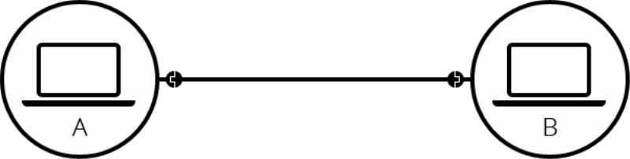
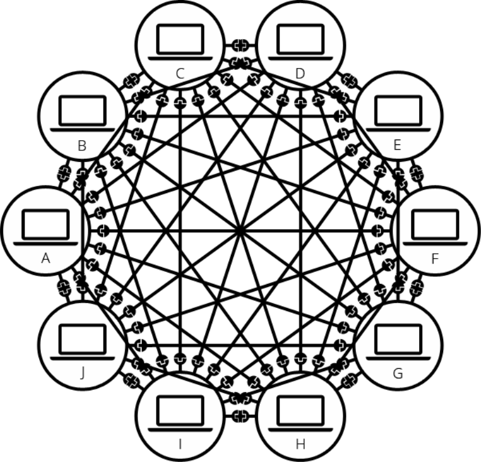
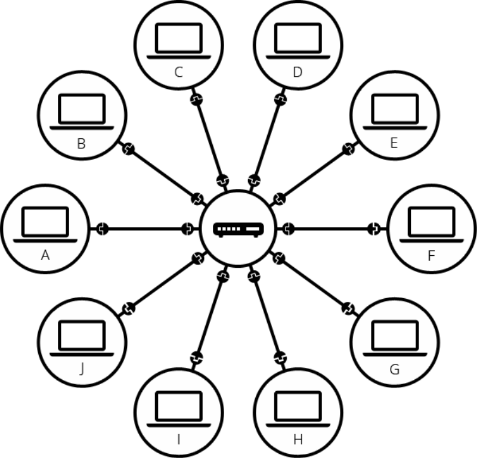
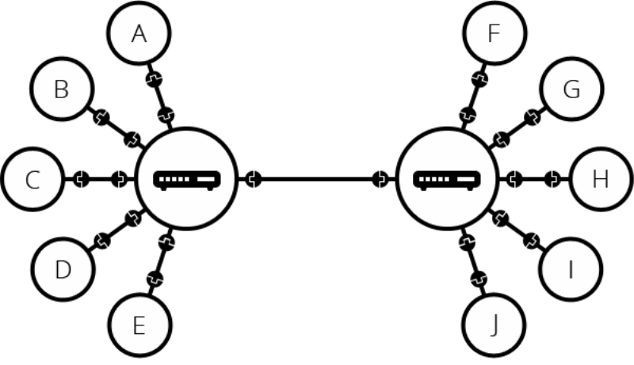
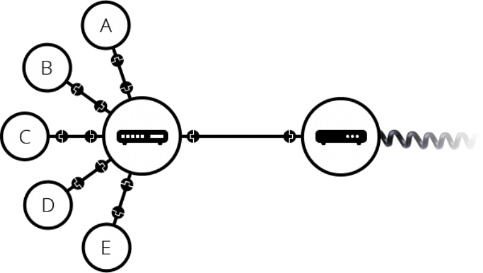
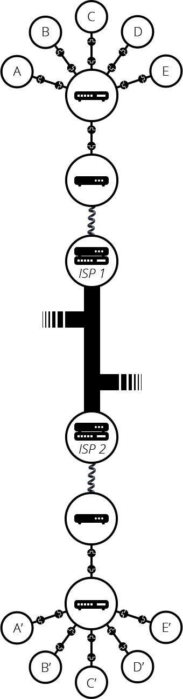

__22.02.26__
# 인터넷이란?

## TCP/IP 란?
___
이유 👉 컴퓨터간의 통신을 위해서  
정의 👉 컴퓨터와 컴퓨터간의 `지역네트워크(LAN)` `광역 네트워크(WAN)`에서 원할한 통신을 가능하도록 하기 위한 통신규약  

선택한 이유 👉 `TCP/IP`의 개방성, 즉 하드웨어, 운영체제, 접속매체에 관계없이 동작할 수 있다는 점 때문에 인터넷 통신을 위한 핵심으로 선택  

✅ TCP, IP 2개의 프로토콜이 이루어져 있음 👉 IP기반에 TCP가 사용되어서 이렇게 불림

- IP : 네트워크 상에서 컴퓨터는 고유한 주소가 있음. 컴퓨터 주소는 인터넷에 접속할 때 컴퓨터 각각에 부여받음
  - 주소는 총 4byte
- TCP : 클라이언트와 서버간에 데이터를 신뢰성있게 전달하기 위해 만들어진 프로토콜
  - 근거리 통신망(LAN), 원거리 통신망(WAN), 인트라넷, 인터넷 등 컴퓨터에서 실행되는 프로그램 간에 일련의 데이터를 안정적으로 순서대로 에러없이 데이터를 교환할 수 있게 함

✅ 인터넷이란 ‼️ 
- 각 컴퓨터들간의 TCP/IP 통신 프로토콜을 이용해서 서로 데이터를 주고 받도록한 네트워크
- 네트워크의 네트워크를 구현하여 모든 컴퓨터를 하나의 통신망 안에 연결하고자 하는 의도에서 인터넷이라고 함

## 네트워크

두 개의 컴퓨터간의 통신

- 간단하게 두 개의 컴퓨터가 통신이 필요할때 물리적(케이블 선) 또는 무선(WiFi, Bluetooth)로 연결되어야함
 
그러나 수 많은 컴퓨터가 연겯되면???

그래서 `라우터` 이용

- 각 컴퓨터는 라우터에 연결
✅ 라우터는 데이터를 원하는 컴퓨터한테 데이터를 잘 전달하게 해줌
- 하지만 이 방법으로도 몇백, 몇천대의 컴퓨터는 단일 라우터로 확장이 불가능 
- ‼️ 그래서 라우터끼리 연결해서 네트워크를 확장

- 아주 먼 곳에 있는 지역과는 케이블 연결이 불가능 
  - 이 문제는 전력 및 전화와 같이 집에 연결된 케이블이 존재.
  - 그래서 네트워크를 전화 시설과 연결하기 위해 `모뎀`이라는 특별한 장비가 필요

- 그래서 네트워크는 전화망에 연결되어 데이터를 주고 받을 수 있음
- 네트워크를 인터넷 서비스 제공업체 ISP에 연결
- `ISP`는 모두 함께 연결되는 몇몇 특수한 라우터를 관리하고 다른 ISP의 라우터에도 액세스를 할 수 있는 회사
  - EX) 한국에는 LG U+, KT, SKT등
- 네트워크 메세지는 ISP 네트워크를 통해 대상 네트워크로 전달됨
- 인터넷은 이러한 전체 네트워크 인프라로 구성됨
- ISP는 중간에서 데이터를 전달해주는 역할

## 정리
1. 컴퓨터와 컴퓨터를 케이블 또는 무선 연결
2. 개수가 많아지면 복잡하여 라우터 등장
3. 단일 라우터만으로도 몇백, 몇천대 연결을 불가능하여 라우터와 라우터를 연결
4. 거리가 먼 지역은 케이블과 무선으로 연결이 불가능
5. 그래서 네트워크의 정보를 전화 시설에서 처리 할 수 있는 모뎀이 나옴
6. 한 네트워크에서 도달하려는 네트워크로 데이터를 보내기위해서 ISP에 연결