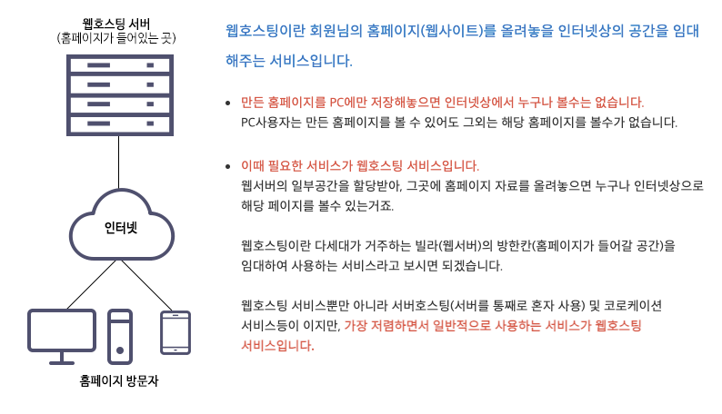
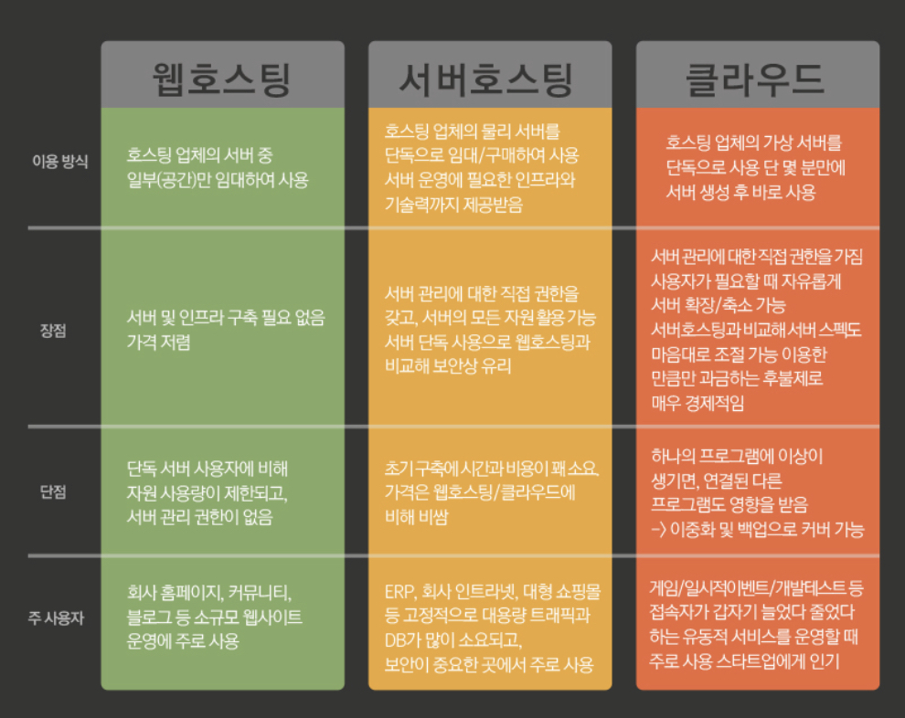
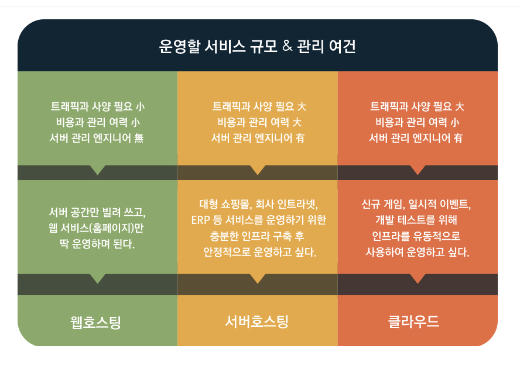

__22.03.08__

# 호스팅이란?

## ✅ 1. 호스팅이란 뭘까?
___ 
- 호스팅 뜻 : 어떤 서비스를 빌려서 사용한다는 말을 의미  
- 웹 호스팅 : 외부의 서버를 빌려서 기능을 사용한다는 말을 의미

호스팅에는 웹 호스팅, 서버 호스팅, 클라우드 호스팅과 같은 종류가 있음

## ✅ 2. 웹 호스팅
___

쉡게 말해서 HTML이나 CSS와 같은 코드를 이용해서 웹 페이지를 제작했다고 치자.  
웹 페이지를 제작햇다고 해서 누구나 내 사이트에 접속할 수 있는 것은 아님  
배포과정을 거치고 도메인까지 연결을 해야 비로소 하나의 웹 사이트가 되는 것  
이 배포과정을 전문 업체에 맡기는 것  

## ✅ 3. 서버 호스팅
___
서버 호스팅과 웹 호스팅은 무엇이 다른가?

웹 호스팅의 경우   
👉 서버 중 **일부**만 빌리는 서비스  
→ 저렴한 가격으로 서버 및 인프라의 구축이 필요 없지만 서버의 일부분만 사용하기 때문에 사용량이 제한되고 서버 관리 권한이 없음  
→ 주로 소규모 웹사이트에 주로 사용됨  
서버 호스팅은  
👉 서버 하나를 통째로 구매할 수 있으며, 서버 운영에 필요한 인프라와 기술력까지 제공받을 수 있는 서비스  
→ 서버 관리에 대한 직접 권한을 갖고 서버를 단독으로 사용하기 때문에 보안상으로도 유리하지만 초기 구축단계에서 웹 호스팅에 비해 시간과 비용이 많이 듬  
→ 주로 회사의 인터라넷, 대형 쇼핑몰등 고정적으로 대용량 트래픽과 DB가 많이 사용되는 곳에서 사용함 

## ✅ 4. 클라우드 호스팅
___
웹 호스팅의 장점과 서버 호스팅의 장점을 모두 가지고 있는 호스팅  
‼️ 최근 많은 주목을 받는 호스팅 방법 ‼️  

아마존의 EC2와 구글의 클라우드 플랫폼 등 다양한 서비스가 존재  
### 장점 
👉 간단하게 누구나 서버를 생성하고 관리 가능  
👉 트래픽의 변동에도 유연하게 대처할 수 있기 때문에 일시적인 이벤트나 인프라가 유동적인 곳에 사용하기 편리  

## ✅ 5. 비교
___
- 개인 블로그나 소규모 트래픽이 필요한 곳 👉 웹 호스팅
- 트래픽과 DB의 사용량이 많아 서버 관리 인프라가 같이 필요한 곳 👉 서버 호스팅 
- 트래픽의 변화에 유동적인 대처가 가능하며 빠른 시간안에 서버를 구축할 수 있는 서비스 👉 클라우드 호스팅
