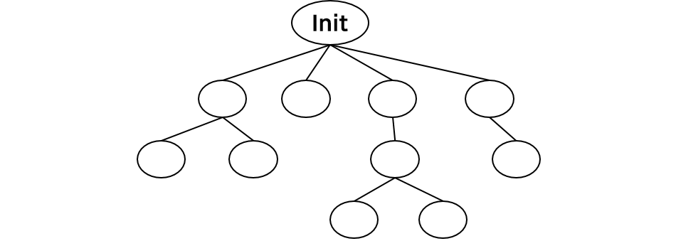

__22.05.25__

## 쓰레드(Thread)
1. [프로세스 생성과 종료](프로세스-생성과-종료)

## 프로세스 생성과 종료
프로세스는 프로세스에 의해 만들어진다. 컴퓨터가 부팅이 되면 운영체제가 메모리에 올라오는데 운영체제가 
처음으로 수행하는 일 중 하나는 **최초의 프로세스를 생성**하는 것이다.  
이렇게 처음 만들어진 프로세스가 다른 프로세스륾 만들고 그 프로세스가 또 다른 프로세스를 만드는 과정을 반복한다.  

위와 같이 최초의 프로세스는 **Init**이다. 이 이름은 운영체제마다 다르고, init은 UNIX 운영체제 기준 이름이다.  
여기서 여러 다른 프로세스들이 생성되면 위와 같이 **트리 모양**으로 나타낼 수 있다. 여기서 프로세스를 생성한 쪽이 **부모 프로세스**, 만들어지 프로세스를 **자식 프로세스**라고 한다.
같은 부모를 갖는 자식 프로세스끼리는 서로 **형제 프로세스**라고 한다.  

프로세스는 각각 고유의 번호를 갖는데 이를 **PID(Process Identifier)** 라고 한다. PID는 일반적으로 정수형을 표현한다.  
**PPID**는 부모의 PID를 말한다.