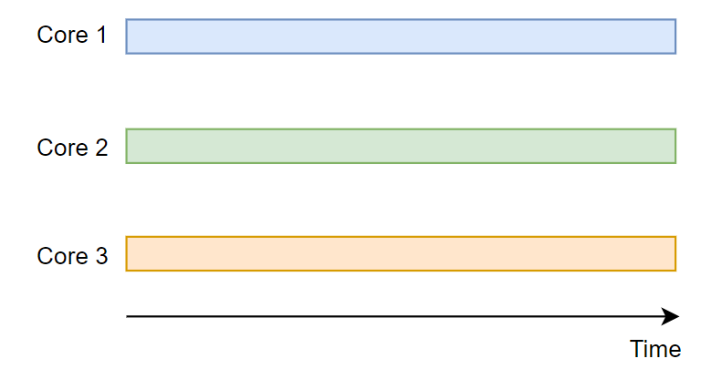
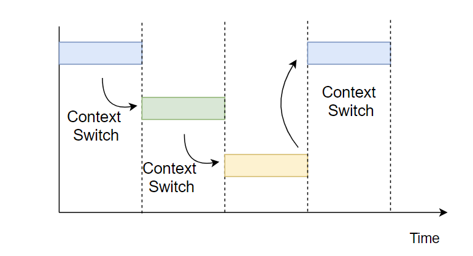
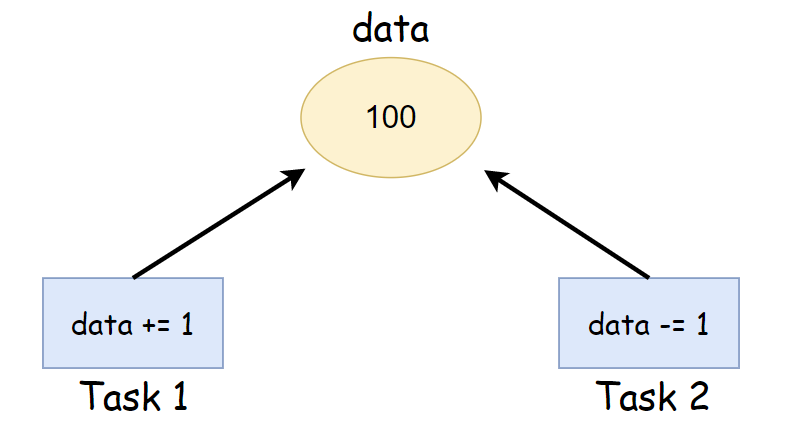
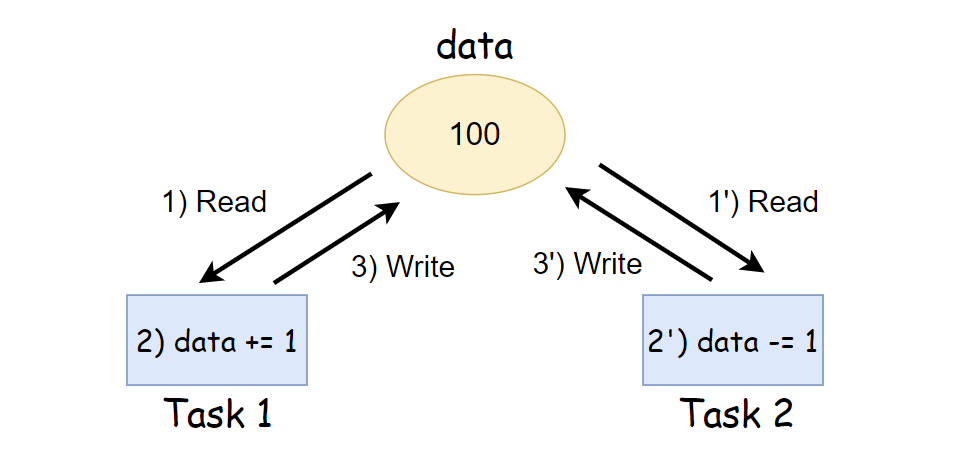

__22.05.30__

#동시성과 병렬성

concurrency(동시성)과 Parallelism(병렬성)은 헷갈리기 쉬운 개념

|Concurrency(동시성)|Parallelism(병렬성)|
|:---:|:---:|
|동시에 실행되는 것처럼 보이는 것|실제로 동시에 실행되는 것|
|논리적인 개념|물리적인 개념|
|싱글코어, 멀티코어에서 가능|멀티코어에서만 가능|

## Parallelism
Parallelism은 여러 코어에서 여러 작업을 동시에 수행하는 것입니다. 코어가 하나밖에 없다면 병렬적으로 프로그램을 실행할 수 없습니다.  

CPU는 single core의 성능을 올리는 데 한계를 느끼고 multi-core 체제로 넘어갔습니다. 여러 코어에서 여러 작업을 동시에 수행하면서 성능을 올리려 한 것입니다.

하나의 코어에서 하던 작업을 세 개의 코어에서 나누어하니 이론적으로는 성능이 3배까지 좋아질 수 있습니다.  
모든 작업을 병렬적으로 수행하기는 어려우니 3배의 성능 향상을 기대하긴 어렵지만 기존 성능이 향상될 것입니다. 하지만 여러 작업을 동시에 수행하니 `race condition` 혹은 `동기화 문제`가 발생할 수 있습니다.

## Concurrency
Concurrency는 빠르게 전환하며 여러 작업을 수행하여 동시에 여러 작업이 실행되는 것처럼 보이는 것입니다. 한 개의 코어에서도 여러 작업을 Concurrent하게 실행할 수 있고 작업간에는 context switching이 일어납니다.  

Concurrent하게 실해되는 Task들은 운영체제의 스케줄링 정책에 의해 실행되며 서로 복잡하게 엉켜있습니다.  
이들이 어떻게 엉켜있는지 생각하는 것은 어려우니 동시에 실행된다고 생각하는게 Concurrency입니다. 그렇기 때문에 Task가 동시에 수행될 때 생길 수 있는 문제점, 대표적으로 `동기화 문제`가 발생할 수 있습니다.

### 동기화 문제는 Concurrent한 Task 사이에서 발생한다.
동기화 문제는 여러 작업이 동시에 공유된 자원에 접근하려 할 때 발생합니다. 동시에라는 말 때문에 멀티코어에서만 발생할 것 같지만 한 코어에서 concurrent하게 동작하는 task 사이에서도 동기화 문제가 발생합니다.

한 코어에서 실행되는 Task1과 Task2가 동시에 공유자원인 data에 접근하려 합니다.

원래대로라면 data에 1을 더하고 다시 1을 뺐으니 작업이 끝난 후 data에 100이 들어가 있어야 합니다. 하지만 동기화 문제가 발생하면 data에 99나 101이 들어올 수 있습니다.

Task1이 data에 100을 읽어 1을 더하고 있는 사이 (1) Task2에서도 data를 읽어(1')갑니다. 이 때는 아직 Task1이 data를 101로 업데이트 하기 전이기 때문에 Task2도 100이라는 값을 읽게 됩니다. Taks1은 data += 1을 실행(2)하고 data를 101로 업데이트(3)합니다.
Task2는 data를 100으로 읽었으므로 100에서 1을 뺀(2') 99로 data 값을 업데이트(3')합니다. 동기화 문제가 발생하면 예상되는 결과와 다른 결과가 생길 수 있습니다. 
이렇듯 Concurrent Task 사이에는 동기화 문제가 발생할 수 있기 때문에 이를 막기 위한 동기화 기법을 사용해주어야 합니다.

## 결론
concurrency를 이해하면 동기화를 이해하는데 도움이 됩니다. 동기화에 대한 설명을 보다보면 Concurrent라는 단어를 자주 만나게 됩니다. 
Concurrent하게 동작하는 프로세스나 쓰레드가 동기화 문제를 일으키기 때문입니다.

> Concurrent access to shared data may result in data inconsistency.

Concurrent를 제대로 이해하지 못했을 때 이를 단순히 '동시에' 라고 해석하면 안된다.
빠르게 전환하며 실행되며 동시에 실행되는 것처럼 보이는 것이라고 이해해야 하고, 이러한 종류로 실행되는 것들이 동기화 문제를 발생시킬 수 있다는 점을 알아야 한다.

_22_05_31_

### 메모리 관리 방법
위 단편화 현상을 줄이고, 적절한 swap을 통해 효율적으로 메모리를 관리하기 위한 방법

1. 연속 메모리 할당  
    - 프로세슬 메모리에 연속적으로 할당하는 기법
    - 할당과 제거를 반복하다보면 Scattered Holes가 생겨나고 이로 인한 외부 단편화가 발생  
    - `<연속 메모리 할당에서 외부 단편화를 줄이기 위한 할당 방식>`  
   1. 최초 적합(First Fit)
       - 가장 처음 만나는 빈 메모리 공간에 프로세스를 할당
       - 빠름  
   2. 최적 적합(Best Fit)
      - 빈 메모리 공간의 크기와 프로세스의 크기 차이가 가장 적은 곳에  프로세스를 할당
   3. 최악 적합(Worst Fit)
      - 빈 메모리 공간의 크기와 프로세스의 크기 차이가 가장 큰 곳에 프로세스를 할당
      - 이렇게 생긴 빈 메모리 공간에 또 다른 프로세스를 할당할 수 있을 거라는 가정에서 기인
2. 페이징(Paging) - 가상 메모리 사용, 외부 단편화 해결, 내부 단편화 존재
   - 하나의 프로세스가 사용하는 **메모리 공간이 연속적이어야 한다는 제약을 없애는** 메모리 관리 방법이다. 외부 단편화와 압축 작업을 해소하기 위해 생긴 방법론으로, **물리 메모리는 Frame이라는 고정 크기로 분리**되어 있고, **논리 메모리(프로세스가 점유하는)는 페이지라 불리는 고정 크기의 블록으로 분리**된다.(페이지 교체 알고리즘에 들어가는 페이지)
   - 페이징 기법을 사용함으로써 논리 메모리는 물리 메모리에 저장될 때, 연속되어 저장될 필요가 없고 물리 메모리의 남는 프레임에 적절히  배치됨으로 **외부 단편화를 해결할 수 있는 큰 장점**이 있다.
   - 하나의 프로세스가 사용하는 공간은 여러 개의 페이지로 나뉘어서 관리되고(논리 메모리에서), 개별 페이지는 순서에 상관없이 물리 메모리에 있는 프레임에 mapping 되어 저장된다고 볼 수 있다.
   - **단점** : **내부 단편화 문제의 비중이 늘어나게 된다.** 예를 들어, 페이지 크기가 1,024B이고 프로세스 A가 3,172B의 메모리를 요구한다면 3개의 페이지 프레임(1,024*3=3,072)하고도 100B가 남기 때문에 총 4개의 페이지 프레임이  필요한 것이다. 결론적으로 4번째 페이지 프레임에는 924B(1,024-100)의 여유 공간이 남게되는 내부 단편화 문제가 발생하는 것이다.
    
_22_06_04_
3. 세그멘테이션(Segmentation) - 가상 메모리 사용, 내부 단편화 해결, 외부 단편화 존재
   - 페이징에서처럼 논리 메모리와 물리 메모리를 같은 크기의 블록이 아닌, **서로 다른 크기의 논리적 단위인 세그먼트(Segment)로 분할** 사용자가 두 개의 주소로 지정(세그먼트 번호 + 번위) 세그먼트 테이블에는 각 세그먼트의 기준(세그먼트의 시작 물리 주소)과 한계(세그먼트의 길이)를 저장
   - **단점** : 서로 다른 크기의 세그먼트들이 메모리에 적재되고 제거되는 일이 반복되다 보면, 자유 공간들이 많은 수의 작은 조각들로 나누어져 못 쓰게 될 수 있다.**(외부 단편화)**
4. 메모리 풀(Memory Pool)
    - 필요한 메모리 공간을 필요한 크기, 개수 만큼 **사용자가 직접 지정하여 미리 할당받아 놓고 필요할 때마다 사용하고 반납**하는 기법
      - 메모리의 할당, 해제가 잦은 경우에 메모리 풀을 쓰면 효과적이다.
      - 미리 할당해놓고 사용하지 않는 순간에도 계속 할당해놓으므로 **메모리 누수가 있는 방식**이다.
    - **장점** : 메모리 풀 없이 동적할당과 해제를 반복하면 메모리 랜덤 한(실제로는 알고리즘에 의한) 위치에 할당과 해제가 반복되면서 단편화를 일으킬 수 있겠지만 미리 공간을 할당해놓고 가져다 쓰고 반납하기 때문에 할당과 해제로 인한 **외부 단편화가 발생하지 않는다.** 또한 필요한 크기만큼 할당을 해놓기 때문에 **내부 단편화 또한 생기지 않는다.**
    - **단점** : 하지만 메모리 단편화로 인한 메모리 낭비량보다 메모리 풀을 만들었지만 쓰지 않았을 때 메모리 양이 커질 경우 사용하지 않아야 한다.