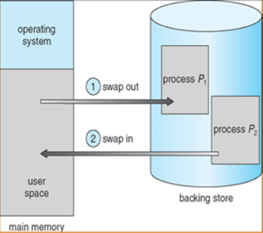

_22_05_30_

# 메모리 관리란?

➰ 메모리란 ?  
→ 메인 메모리, RAM을 뜻한다. 프로그램 실행 시 필요한 주소, 정보들을 저장하고 가져다 사용할 수 있게 만드는 공간.  
 즉, 작업을 위해 사용되는 공간

## 메모리 관리가 필요한 이유는 ?
각각의 프로세스는 독립된 메모리 공간을 갖고, 운영체제 혹은 다른 프로세스의 메모리 공간에 접근할 수 없는 제한이 걸려있다. 단지, 운영체제만이 운영체제 메모리 영역과 사용자 메모리 영역의 접근에 제약을 받지 않기 때문에 운영체제에서 메모리를 관리한다.
또한, 멀티프로그래밍 환경으로 변화하면서 한정된 메모리를 효율적으로 사용해야 했고, 운영체제가 이를 어떻게 관리하는지에 대한 관리방법이 중요하다 ‼️

### 운영체제의 역할
실행파일이 로더에 의해 메모리에 올라오고 운영체제는 이 실행 파일을 메모리 어느 부분에 올릴지 결정한다.  
﹢자바는 OS의 메모리 영역에 직접적으로 접근하지 않고, JVM이라는 가상 머신을 이용해서 간접적으로 접근한다.

### Swapping
메모리의 관리를 위해 사용되는 기법.  
메모리에 적재되어 있으나 현재 사용되지 않고 있는 프로세스를 관리하는 역할.  
표준 Swapping 방식으로는 round-robin과 같은 스케줄링의 다중 프로그래밍 환경에서 CPU 할당 시간이 끝난 프로세스의 메모리를 backing store(보조기억장치, ex.하드디스크)로 내보내고 다른 프로세스의 메모리를 불러 들일 수 있다.

→ 이 과정을 swap이라고 한다. 주 기억장치(RAM)로 불러오는 과정을 **swap-in**, 보조 기억장치로 내보내는 과정을 **swap-out**이라 한다. swap에는 큰 디스크 전송시간이 필요하기 때문에 **현재에는 메모리 공간이 부족할 때 Swapping이 시작된다.**

### 단편화 현상
메모리의 공간이 작은 조각으로 나뉘어 사용 가능한 메모리가 충분히 존재하지만 할당(사용)이 불가능한 상태

1. 내부 단편화    
 → 프로세스가 사용하는 메모리 공간에 포함된 남는 부분. 예를 들어 메모리 분할 자유 공간이 10,000B가 있고 Process A가 9,998B를 사용하게 되면 2B라는 남는 공간이 있고, 이 현상을 내부 단편화라 한다.
2. 외부 단편화  
    → 메모리 공간 중 사용하지 못하게 되는 일부분. 물리 메모리(RAM)에서 사이사이 남는 공간을 모두 합치면 충분한 공간이 되는 부분들이 분산되어 있을 때 발생한다.  

➰ 압축  
외부 단편화를 해소하기 위해 프로세스가 사용하는 공간들을 한쪽으로 몰아, 자유공간을 확보하는 방법론이지만, 작업 효율이 좋지 않다.

