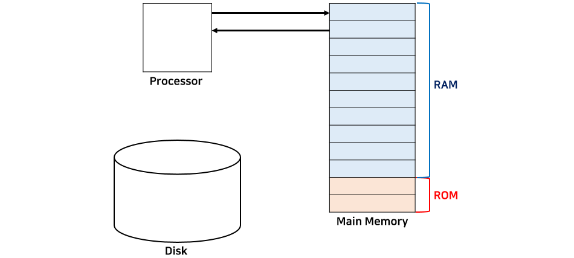
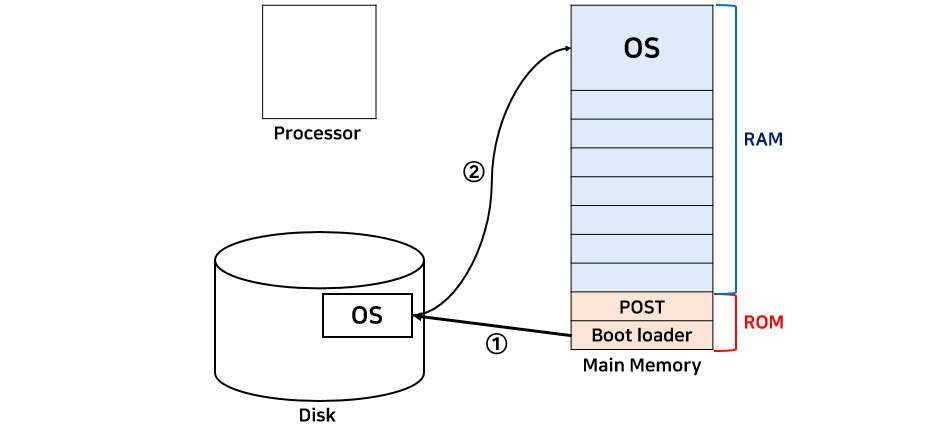

_22.03.29_

# 운영체제란?
___

운영체제는(Operating System)은 사용자가 컴퓨터를 사용하기 위해 필요한 소프트웨어이다.  
우리가 일반적으로 컴퓨터를 사용하면서 실행한 모든 프로그램들은 운영체제에서 관리하고 제어한다.  
대표적인 Windows, Linux, Max OSX, IOS 등이 있다.  

### 1. 운영체제 목적
___
가장 주된 목적은 **컴퓨터의 하드웨어를 관리**하는 것이다.  
CPU, 메모리, 디스크, 키보드, 마우스, 네트워크 등이 있으며 이를 잘 관리해주어야 컴퓨터를 효율적으로 사용할 수 있다.  
운영체제의 성능이 좋을수록 컴퓨터의 성능 역시 좋아진다고 할 수 있다.  

운영체제는 **사용자에게 편의를 제공**하는 목적도 가지고 있다.   
운영체제가 없다면 위에서 말한 하드웨어에 관한 모든 관리를 사용자가 해야한다는 점과 같이 불편함을 겪을 것이다.  

정리 ) 운영체제는 컴퓨터의 성능을 높이고`Performance`, 사용자에게 편의성 제공`Convenience`을 목적으로 하는 `컴퓨터 하드웨어를 관리하는 프로그램`이다.

### 2. 부팅(Booting)
___
[ 컴퓨터의 구조를 단순화한 그림 ]

`Processor`는 일반적으로 CPU를 말한다.  
`main Memory`를 보면 ROM과 RAM으로 나누어져 있다.  
- ROM : **비휘발성**으로 메모리에서 극히 일부를 차지한다.(수 KB)
- RAM : **휘발성**으로 메모리의 대부분을 차지하며 실제 프로그램이 할당되는 곳이다.(수 MB ~ 수 GB)

`ROM` 은 하드디스크와 같이 비휘발성으로 전원이 꺼져도 그 안의 내용이 계속 유지됨  
`RAM` 은 휘발성이므로 전원이 꺼지면 메모리안의 모든 내용이 지워진다.  

컴퓨터의 전원이 켜지면 프로세서(CPU)에서 ROM에 있는 내용을 읽는다. ROM안에는 `POST(Power-On Self-Test)`, `부트로더(boot loader)`가 저장되어 있다.  
POST는 전원이 켜지면 가장 처음에 실해되는 프로그램으로 현재 컴퓨터의 상태를 검사한다. 작업이 끝나면 부트 로더가 실행된다.  
부트로더는 하드디스크에 저장되어있는 운영체제를 찾아서 메인 메모리(RAM)에 가지고 온다. 이러한 부트로더의 과정을 **부팅**이라고 한다. 

[ 부트로더가 진행하는 모습 ]   

위와 같은 상태가 되면 운영체제가 수행할 준비를 마친 것이다. 운영체제가 종료하는 시점은 컴퓨터의 전원이 꺼지는 시점이다.

운영제체는 크게 **커널(kerner)** 과 **명령어 해석기(Command Interpreter, shell)** 로 나뉜다.

커널은 운영체제의 핵심으로 **운영체제가 수행하는 모든 것**이 저장되어있다.  
명령어 해석기는 사용자가 **커널(운영체제)에 요청하는 명령어를 해석하여 커널에 요청하고 그 결과를 출력**한다. 

### 3. 운영체제의 위치
___
**사용자 프로그램(Application)**은 특정 윤영체제에 맞춰서 만든다. 그러므로 한 애플리케이션은 서로 다른 운영체제에서 수행할 수 없다. 

애플리케이션은 위의 그림과 같이 운영체제 위에서 수행한다. 즉, 하드웨어 자원을 직접적으로 사용하지 않고 **운영체제가 제공하는 자원만을 사용할 수 있다.**

- 프로세스, 메모리, 하드디스크 등 하드웨어 자원이 존재하고, 이를 효율적으로 사용해야한다.
- 자원 관리 위해 프로세스 관리, 메모리 관리, 디스크 관리, 네트워크, 보안 등 기능이 나눠져 있다. 
- 애플리케이션들의 요청에 따라 각 기능들이 수행하여 적절히 자원을 분배한다.

