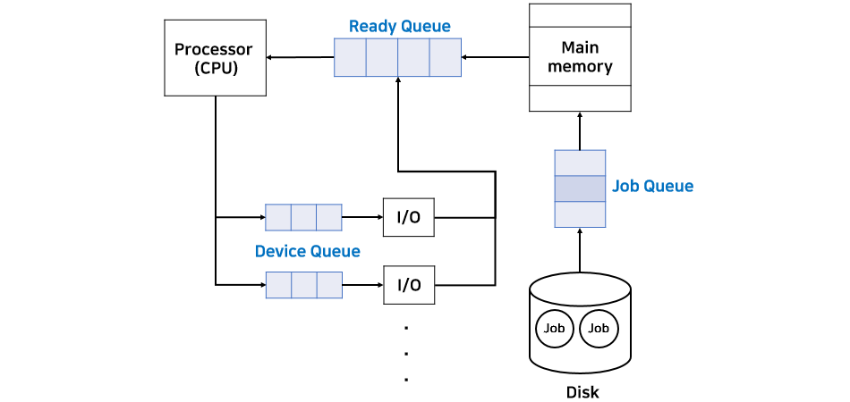

_22.03.31_

# 프로세스 관리

## 1. 프로세스(Process)
___

프로세스는 메인 메모리에 할당되어 **실행중인 상태**인 프로그램을 말한다. 프로그램은 일반적으로 하드디스크(보조기억장치)에 저장되어 아무 일도 하지 않는 상태이다. 프로세스는 실행하면서  stac, pointer, data, text, register 등이 끊임없이 변한다. 프로세스는 job, task 등으로 불리기도 한다.  

### 1.2 프로세스의 상태
- New : 프로그램이 메인 메로리에 할당된다. 
- Ready : 할당된 프로그램이 초기화 같은 작업을 통해 실행되기 위한 모든 준비를 마친다.
- Running : CPU가 해당 프로세스를 실행한다,
- Waiting : 프로세스가 끝나지 않은 시점에서 I/O로 인해 CPU를 사용하지 않고 다른 작업을 한다.(해당 작업이 끝나면 다시 CPU에 의해 실행되기 위해 Ready 상태로 돌아가야한다.)
- Terminated : 프로세스가 완전히 종료된다.

[ 프로세스 상태 전이도 ]

### 1.3 PCB(Process Control Block)
PCB는 **프로세스에 대한 모든 정보**가 모여있는 곳으로, Task Control Block(TCB)이라고도 한다.  
PCB 안에는 프로세스의 상태, 프로세스의 번호(PID), 해당 프로세스의 program counter(pc), register 값, MMU 정보, CPU 점유 시간등이 포함되어 있다.  
PCB는 운영체제 내부의 프로세스를 관리하는 코드 부분에 저장되어 있다. 

CPU는 한 프로세스가 종료될 때까지 수행하는 것이 아니라 여러 프로세스를 중간 중간 바꿔가면서 수행해야 한다. 그러므로 CPU는 수행 중인 프로세스를 나갈 때, 이 프로세스의 정보를 어딘가에 저장하고 있어야 다음에 이 프로세스를 수행할 때 이전에 수행한 그 다음부터 이어서 작업할 수 있다. 이러한 정보를 저장하는 곳이 PCB이다.  

### 1.4 프로세스 큐
프로세스는 수행하면서 상태가 여러 번 변하는데 이에 따라 서비스를 받아야하는 곳이 다르다.
그리고 프로세스는 일반적으로 여러 개가 한 번에 수행되므로 그에 따른 순서가 필요하다. 
이러한 순서를 대기하는 곳을 **큐(queue)**라고 부른다.

- Job Queue : 하드디스크에 있는 프로그램이 실행되기 위해 메인 메모리의 할당 순서를 기다리는 큐
- Ready Queue : CPU 점유 순서를 기다리는 큐
- Device Queue : I/O를 하기 위한 여러 장치가 있는데, 각 장치를 기다리는 큐가 각각 존재

위와 같이 여러 큐가 존재하는데, 각 큐 내부에 저장된 실제 데이터는 각 프로세스의 **PCB**가 저장되어 있다.  
그리고 이러한 순서를 기다리는 공간이 있다면 이 순서를 정해주는 알고리즘이 있어야 한다. 이러한 알고리즘을 **스케쥴링(Scheduling)**이라 한다.

- Job Queue - Job Scheduler`(Long-term scheduler)`
- Ready Queue - CPU Scheduler`(Short-term scheduler)`
- Device Queue - Device Scheduler

Job queue의 순서를 정해주는 job scheduler를 long-term scheduler라고도 하는데, 이는 이 스케쥴링이 발생하는 시간이 비교적 오래걸리기 때문이다.(대략 초~분)  
반면에 ready queue의 스케쥴러를 short-term scheduler라고도 하는데, 이는 스케줄링이 발생하는 시간이 매우 짧기 때문이다.  
CPU scheduling은 말 그대로 프로세스가 CPU를 점유하는 순서를 정해주는데 이는 매우 빠른 시간안에 이루어져야 한다. 현대 컴퓨터가 여러 프로그램을 동시에 사용하는 것 같은 효과를 주는 이유가 이 스케쥴링 속도가 매우 빠르게 이루어지기 때문이다.  

## 2. 멀티프로그래밍 (Multiprogramming)
___
멀티프로그래밍은 단일 프로세서(CPU) 환경에서 **여러 개의 프로세스가 동시에 실행**되는 것을 말한다.(실제로 동시에 실행되지 않음)  
여러 프로세스가 실행되려면 이 프로세스들은 모두 메인 메모리에 존재하고 있어야 한다. 멀티프로그래밍에 관한 몇 가지 용어와 개념에 대해 살펴보자

### 2.1 Degree of multiprogramming
현재 메모리에 할당되어 있는 프로세스 개수를 말한다.

### 2.2 I/O bound process VS CPU bound process
프로세스는 I/O bound process와 CPU bound process로 나뉜다.

- I/O bound process : 해당 프로세스에서 I/O 작업이 차지하는 비중이 높은 프로세스
- CPU bound process : 해당 프로세스에서 CPU 작업(계산)이 차지하는 비중이 높은 프로세스

운영체제, 정확히는 job scheduler는 I/O bound process와 CPU bound process를 적절히 분배해서 메모리에 할당해주어야 한다.  

### 2.3 Medium-term scheduler
Medium-term scheduler는 말 그대로 short-term보다는 덜 발생하지만, long-term보다는 자주 발생하는 scheduler이다. 하는 일은 운영체제가 실행하는 동안 주기적으로 메인 메모리에 있는 전체 프로세스를 검사하여 보조기억장치로 옮길 프로세스를 찾아 옮긴다. 
옮기는 기준은 여러가지가 있지만, 대표적으로 장기간 사용하지 않는 프로세스가 있다.  

이 기준으로 동작하는 것이 **Swapping**이다. 이는 메인 메모리에서 장시간 사용하지 않는 프로세스를 하드디스크(**Swap device** = Backing store, 일발적으로 하드디스크는 File System + Backing store로 구성)로 옮겨주고`Swap out`,  
나중에 이 프로세스가 다시 사용되려고 하면 하드디스크에서 해당 프로세스에 다시 메인 메모리에 할당해준다`Swap in`

`Swap out`을 통해 메인 메모리의 공간이 생기므로 이를 더욱 효율적으로 사용할 수 있다. 만약 swap out된 프로세스가 다시 `swap in`으로 메인 메모리에 할당되려고 할 때 **이전의 공간으로 할당되는 것을 보장하지 않는다.**  
왜냐하면 `swap out`으로 생긴 메모리 공간은 다를 프로세스가 사용할 수 있기 때문이다.

### 2.4 Context Switching(문맥 전환)
Context Switching은 CPU가 한 프로세스에서 다른 프로세스에서 다른 프로세스로 옮겨가는 것을 말한다. 즉, 한 프로세스가 실행중인 것을 멈추고 다른 프로세스가 실행되는 것이다.

- Scheduler : 여기서 스케줄러는 CPU scheduler를 말하며, CPU가 어느 프로세스를 선택할지 정한다.
- Dispatcher : 실제 context switching이 발생하면 CPU의 내부 데이터를 이전 프로세스 데이터에서 새로 시작되는 데이터로 바꿔준다. 다시 말해서 현재 CPU 데이터는 이전 프로세스의 PCB에 갱신하고, 새로 시작되는 프로세스의 PCB 데이터를 CPU로 복원(restore)해준다.
- **Context switching overhead** : Context switching이 발생할 때마다, dispatcher에서 수행하는 작업을 매번 수행해야하며 이 모든 것은 overhead이다. 그리고 문맥 전환은 매우 자주 발생하는 작업이므로 overhead를 줄이기 위해서는 dispatcher를 구현하는 코드에 대한 효율을 최대한 높여주어야 한다. 