__22_02_21__

# URI `(Uniform Resource Identifier)`

URI? URL? URN???????????????

👉 URI는 로케이터(Locator), 이름(Name) 또는 둘 다 추가로 분류될 수 있다

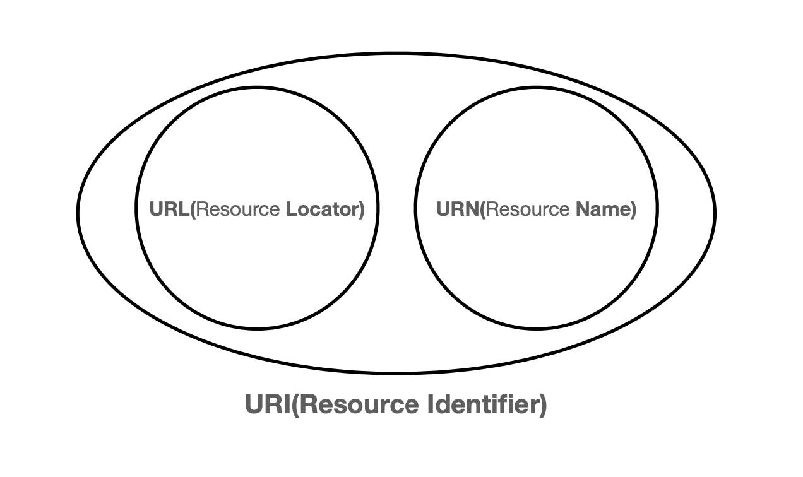
- URL 👉 `(Resource Locator)` 리소스의 위치
- URN 👉 `(Resource Name)` 리소스의 이름

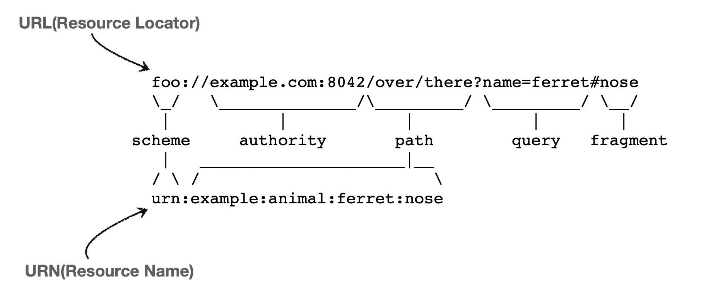
이름을 부여하면, 결국 찾을 수가 없음~~~~~~!!!!!!!!!!!!!   
→ URL만 사용

## URI 단어 뜻
- Uniform : 리소스 식별하는 통일된 방식
- Resource : 자원, URI로 식별할 수 있는 모든 것(제한 없음)
- Identifier : 다른 항목과 구분하는데 필요한 정보

- URL : Uniform Resource Locator
- URN : Uniform Resource Name

### URL, URN 단어 뜻
- URL - Locator: 리소스가 있는 위치를 지정
- URN - Name: 리소스에 이름을 부여
- 위치는 변할 수 있지만, 이름은 변하지 않는다.
- urn:isbn8960777331 (어떤 책의 isbn URN)
- URN 이름만으로 실제 리소스를 찾을 수 있는 방법이 보편화 되지 않음
- **앞으로 URI와 URL을 같은 의미로 이야기**

## 전체 문법
- scheme://[userinfo@]host[:port][/path][?query][#fragment]
- https://www.google.com:443/search?q=hello&hl=ko

- 프로토콜(https)
- 호스트명(www.google.com)
- 포트번호(443)
- 패스(/search)
- 쿼리 파라미터(q=hello&hl=ko)

- 주로 프로토콜 사용
- 프로토콜 : 어떤 방식으로 자원에 접근할 것인가 하는 약속 규칙
  - EX ) http, https, ftp 등등
- http는 80포트, https는 443포트를 주로 사용, 포트는 생략 가능
- https는 http에 보안 추가

### userinfo
- URL에 사용자 정보를 포함해서 인증
- 거의 사용하지 않음

### host
- 호스트명
- 도메인명 또는 IP주소를 직접 사용가능

### PORT
- 포트
- 접속 포트
- 일반적으로 생략, 생략시 http는 80, https는 443

### Path
- 리소스 경로(path), 계층적 구조
- EX )
  - /home/file1.png
  - /members
  - /members/100, /items/iphone12

### query
- key=value 형태
- ?로 시작, &로 추가 가능 ?keyA=value&keyB=valueB
- query parameter, query string등으로 불림, 웹서버에 제공하는 파라미터, 문자 형태

### fragment
- html 내부 북마크 등에 사용
- 서버에 전송하는 정보 아

# 웹 브라우저의 요청 흐름

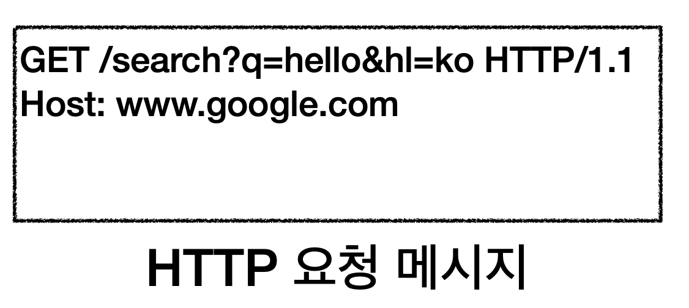
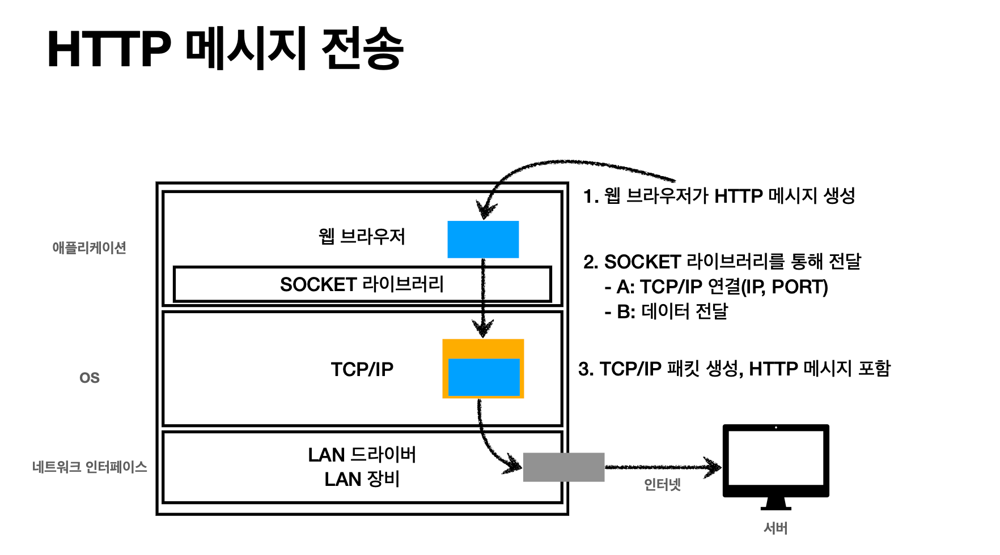
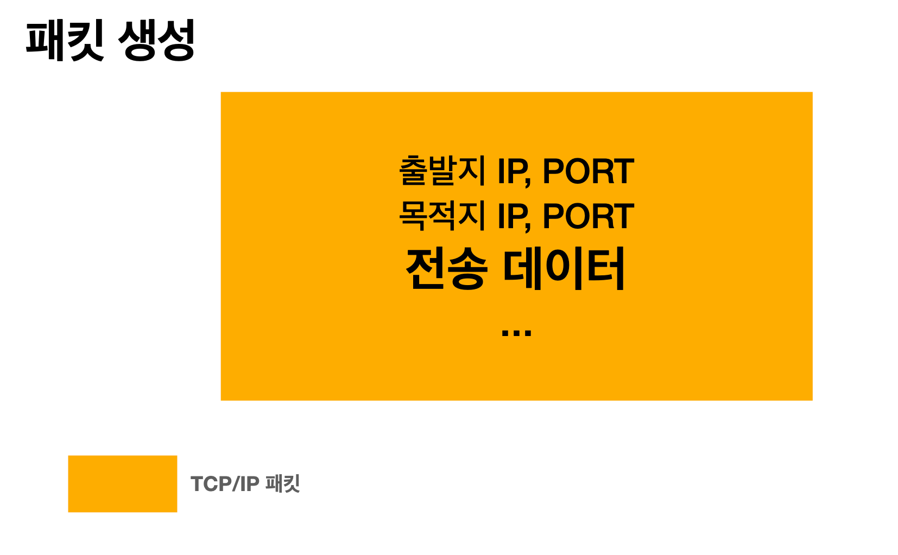
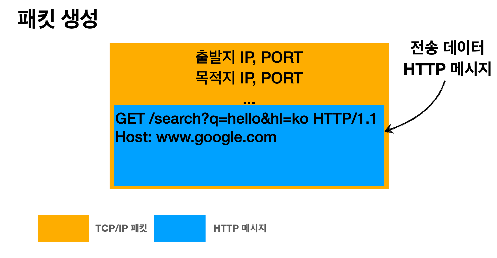
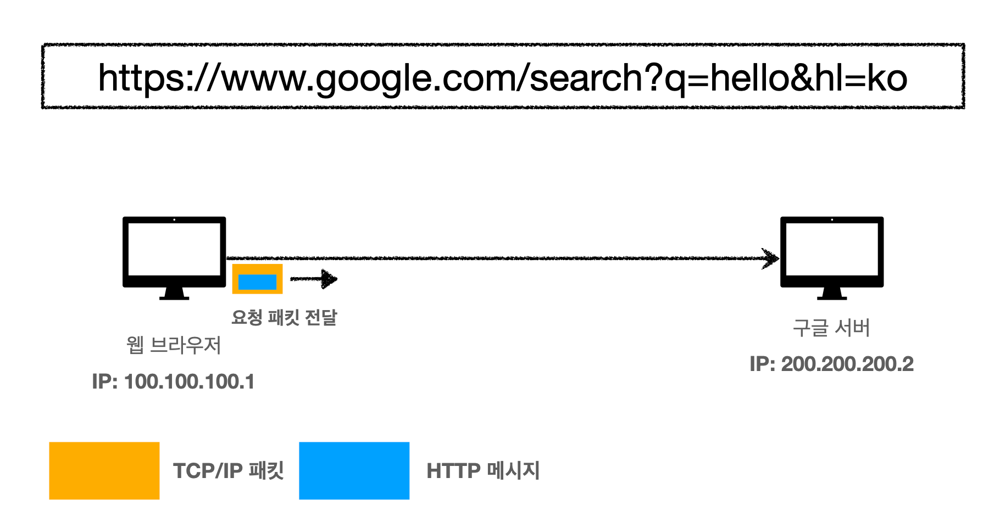
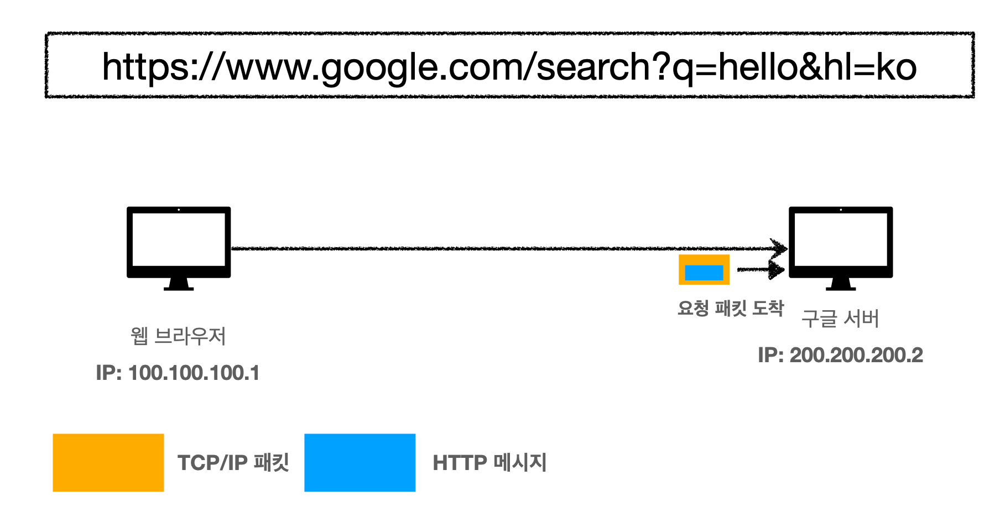
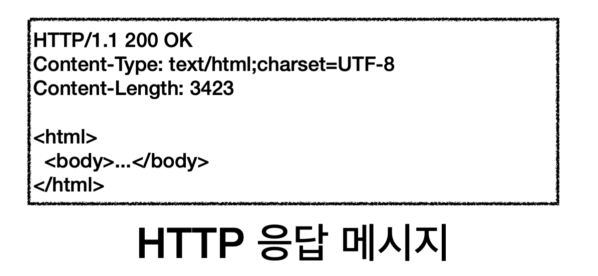
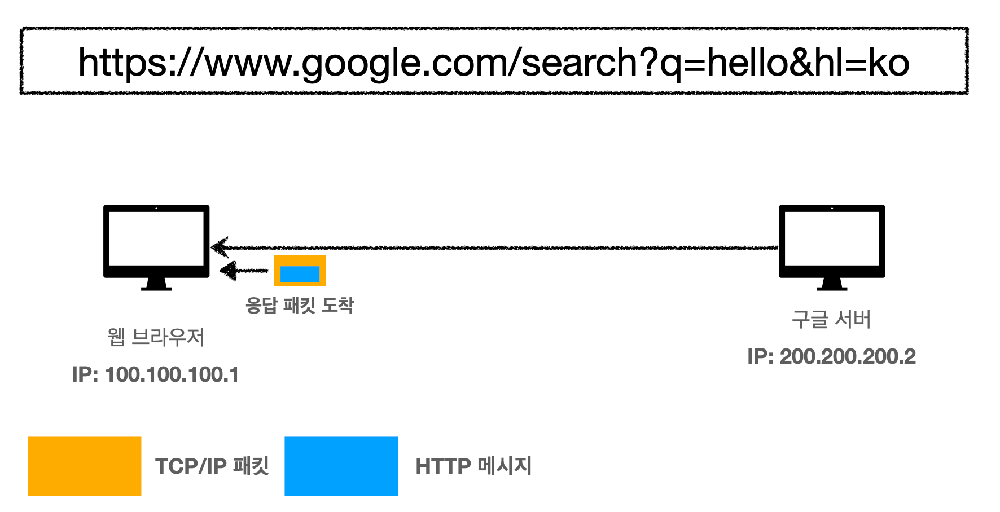
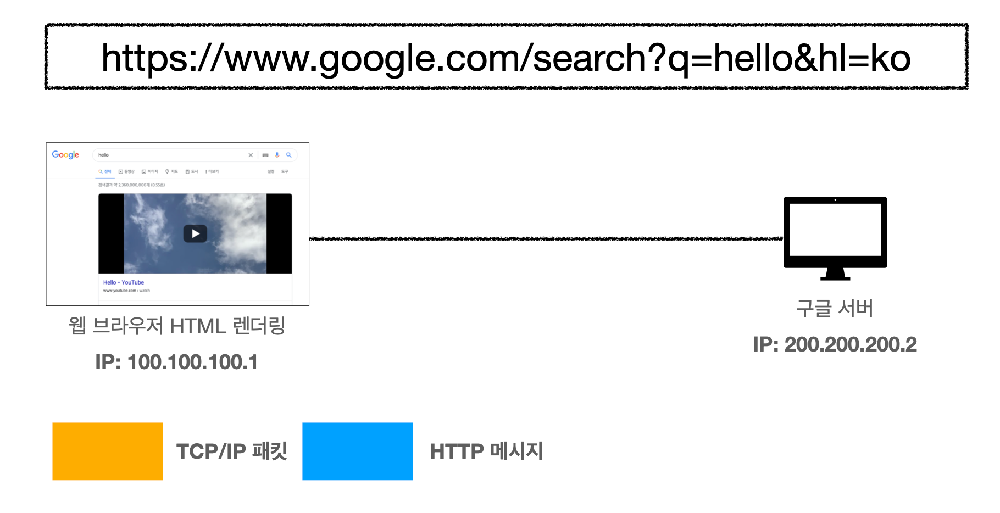