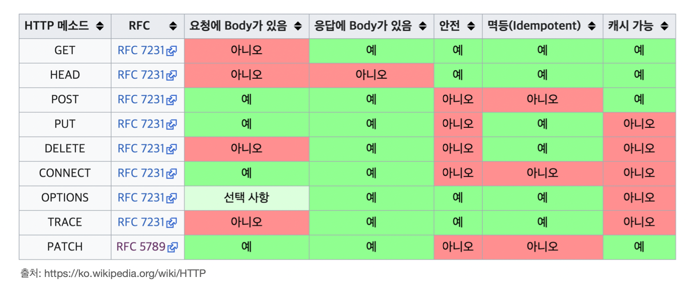

_22.06.21_

# HTTP 메서드
1. [HTTP API를 만들어보자](HTTP-API를-만들어보자)
2. [HTTP 메서드](HTTP-메서드)
3. [HTTP 메서드의 속성](HTTP-메서드의-속성)
4. [HTTP 메서드 활용](HTTP-메서드-활용)

## HTTP API를 만들어보자
### 요구사항
**회원 정보 관리 API를 만들어라.**
- 회원 목록 조회
- 회원 조회
- 회원 등록
- 회원 수정
- 회원 삭제

### API URI 설계
**URI (Uniform Resource Identifier)**
- 회원 목록 조회 /read-member-list
- 회원 조회 /read-member-by-id
- 회원 등록 /create-member
- 회원 수정 /update-member
- 회원 삭제 /delete-member

#### 이것은 좋은 URI 설계일까???????
✅ 가장 중요한 것은 **리소스 식별**

### API URI 고민
- 리소스의 의미는 뭘까?
  - 회원을 등록하고 수정하고 조회하는게 리소스가 아니다!
  - 예) 미네랄을 캐라 → 미네랄이 리소스
  - **회원이라는 개념 자체가 바로 리소스다.**
- 리소스를 어떻게 식별하는게 좋을까?
  - 회원을 등록하고 수정하고 조회하는 것을 모두 배제
  - **회원이라는 리소스만 식별하면 된다. → 회원 리소스를 URI에 매핑**

#### 리소스 식별, URI 계층 구조 활용
- **회원** 목록 조회 /members
- **회원** 조회 /members/{id}
- **회원** 등록 /members/{id}
- **회원** 수정 /members/{id}
- **회원** 삭제 /members/{id}
- 참고 : 계층 구조상 상위를 컬렉션으로 보고 복수단어 사용 권장(member → members)
🙋 어떻게 구분하나요 ⁇ 🙋‍

#### 리소스와 행위를 분리
**가장 중요한 것은 리소스를 식별하는 것**
- **URI는 리소스만 식별!**
- **리소스**와 해당 리소스를 대상으로 하는 **행위**을 분리
  - 리소스 : 회원
  - 행위 : 조회, 등록, 삭제, 변경
- 리소스는 명사, 행위는 동사
- 행위(메서드)는 어떻게 구분?

## HTTP 메서드
### 중류 
- 주요 메서드
  - GET : 리소스 조회
  - POST : 요청 데이터 처리, 주로 등록에 사용
  - PUT : 리소스를 대체, 해당 리소스가 없으면 생성
  - PATCH : 리소스 부분 변경
  - DELETE : 리소스 삭제
- 기타 메서드
  - **HEAD** : GET과 동일하지만 메시지 부분을 제외하고, 상태 줄과 헤더만 반환
  - **OPTIONS** : 대상 리소스에 대한 통신 가능 옵션(메서드)을 설명(주로 CORS에서 사용)
  - **CONNECT** : 대상 자원으로 식별되는 서버에 대한 터널을 설정
  - **TRACE** : 대상 리소스에 대한 경로를 따라 메시지 루프백 테스트를 수행

#### GET
```
GET /search?q=hello&hl=ko HTTP/1.1  
Host: www.google.com
```
- 리소스 조회
- 서버에 전달하고 싶은 데이터는 query(쿼리 파라미터, 쿼리 스트링)을 통해서 전달
- 메시지 바디를 사용해서 데이터를 전달할 수 있지만, 지원하지 않는 곳이 많아서 권장하지 않음

#### POST
```
POST /members HTTP/1.1
Content-Type: application/json
{
  "username": "hello",
  "age": 20
}
```
- 요청 데이터 처리
- **메시지 바디를 통해 서버로 요청 데이터 전달**
- 서버는 요청 데이터를 **처리**
  - 메시지 바디를 통해 들어온 데이터를 처리하는 모든 기능을 수행함
- 주로 전달된 데이터로 신규 리소스 등록, 프로세스 처리에 사용

##### 예시
- 스펙 : POST 메서드는 **대상 리소스가 리소스의 고유 한 의미 체계에 따라 요청에 포함된 표현을 처리하도록 요청**
- 예를 들어 POST는 다음과 같은 기능에 사용됨
  - HTML 양식에 입력된 필드와 같은 데이터 블록을 데이터 처리 프로세스에 제공
    - 예) HTML FORM에 입력한 정보로 회원 가입, 주문등에서 사용
  - 게시판, 뉴스 그룹, 메일링 리스트, 블로그 또는 유사한 기사 그룹에 메시시 게시
    - 예) 게시판 글쓰기, 댓글 달
  - 서버가 아직 식별하지 않은 새 리소스 생성
    - 예) 신규 주문 생성
  - 기존 자원에 데이터 추가
    - 예) 한 문서 끝에 내용 추가하기
- **정리 : 이 리소스 URI에 POST 요청이 오면 요청 데이터를 어떻게 처리할지 리소스마다 따로 정해야 함 → 정해진 것이 없음**

##### 정리
- **1. 새 리소스 생성(등록)**
  - 서버가 아직 식별하지 않은 새 리소스 생성
- **2. 요청 데이터 처리**
  - 단순히 데이터를 생성하거나, 변경하는 것을 넘어서 프로스세를 처리해야 하는 경우
  - 예) 주문에서 결제 완료 → 배달 시작 → 배달 완료 처럼 단순히 값 변경을 넘어 프로세스의 상태가 변경되는 경우
  - POST의 결과로 새로운 리소스가 생성되지 않을 수 도 있음
  - 예) POST /orders/{orderId}/start-delivery (**컨트롤 URI**)
- **3. 다른 메서드로 처리하기 애매한 경우**
  - 예) JSON으로 조회 데이터를 넘겨야 하는데, GET 메서드를 사용하기 어려운 경우
  - 애매하면 POST

#### PUT
```
PUT /members/100 HTTP/1.1
Content-Type: application/json
{
  "username": "hello",
  "age": 20
}
```
- **리소스를 대체**
  - 리소스가 있으면 대체
  - 리소스가 없으면 생성
  - 쉽게 이야기해서 덮어버림
- **중요! 클라이언트가 리소스를 식별**
  - 클라이언트가 리소스 위치를 알고 URI 지정
  - POST와 차이점

#### PATCH
```
PATCH /members/100 HTTP/1.1
Content-Type: application/json
{
  "age": 50
}
```
- 리소스 부분 변경

#### DELETE
```
DELETE /members/100 HTTP/1.1
Host: localhost:8080
```
- 리소스 제거

## HTTP 메서드의 속성
- 안전(Safe Methods)
- 멱등(Idempotent Methods)
- 캐시 가능(Cacheable Methods)



### 안전(Safe)
- 호출해도 리소스를 변경하지 않는다
- Q : 그래도 계속 호출해서, 로그 같은게 쌓여서 장애가 발생하면??
- A : 안전은 해당 리소스만 고려한다. 그런 부분까지 고려하지 않음

### 멱등(Idempotent)
- f(f(x)) = f(x)
- 한 번 호출하든 두 번 호출하든 100번 호출하든 결과가 똑같음
- 멱등 메서드
  - **GET** : 한 번 조회하든, 두 번 조회하든 같은 결과가 조회됨
  - **PUT** : 결과를 대체함. 따라서 같은 요청을 여러 번 해도 최종 결과는 같음
  - **DELETE** : 결과를 삭제함. 같은 요청을 여러 번 해도 삭제된 결과는 똑같음
  - **✅ POST** : 멱등이 아니다!! 두 번 호출하면 같은 결제가 중복해서 발생할 수 있음
- 활용
  - 자동 복구 메커니즘
  - 서버가 TIMEOUT 등으로 정상 응답을 못주었을 때, 클라이언트가 같은 요청을 다시 해도 되는가? 판단 근거
- Q : 재요청 중간에 다른 곳에서 리소스를 변경해버리면?
  - 사용자 1 : GET → username:A, age:20
  - 사용자 2 : PUT → username:A, age:30
  - 사용자 1 : GET → username:A, age:30 → 사용자2의 영향으로 바뀐 데이터 조회
- **A : 멱등은 외부 요인으로 중간에 리소스가 변경되는 것까지는 고려하지는 않는다.**

### 캐시 가능(Cacheable)
- 응답 결과 리소스를 캐시해도 사용해도 되는가?
- GET, HEAD, POST, PATCH 캐시 가능
- 실제로는 GET, HEAD 정도만 캐시로 사용
  - POST, PATCH는 본문 내용까지 캐시 키로 고려해야 하는데, 구현이 쉽지 않음


## HTTP 메서드 활용
- [클라이언트에서 서버로 데이터 전송](클라이언트에서-서버로-데이터-전송)
- [HTTP API 설계 예시](HTTP-API-설계-예시)

### 클라이언트에서 서버로 데이터 전송 
#### 데이터 전달 방식은 크게 2가지
- **쿼리 파라미터를 통한 데이터 전송**
  - GET
  - 주로 정렬 필터(검색어)
- **메시지 바디를 통한 데이터 전송**
  - POST, PUT, PATCH
  - 회원 가입, 상품 주문, 리소스 등록, 리소스 변경

##### 4가지 상황
1.**정적 데이터 조회**
  - 이미지, 정적 텍스트 문서
2. **동적 데이터 조회**
    - 주로 검색, 게시판 목록에서 정렬 필터(검색어)
3. **HTML Form을 통한 데이터 전송**
    - 회원 가입, 상품 주문, 데이터 변경
4. **HTTP API를 통한 데이터 전송**
    - 회원 가입, 상품 주문, 데이터 변경
    - 서버 to 서버, 앱 클라이언트, 웹 클라이언트(Ajax)

###### 1. 정적 데이터 조회
**쿼리 파라미터 미사용**  
클라이언트
```
GET /static/star.jpg HTTP/1.1
Host: localhost:8080
```
- 이미지, 정적 텍스트 문서
- 조회는 GET 사용
- 정적 데이터는 일반적으로 쿼리 파라미터 없이 리소스 경로로 단순하게 조회 가능

###### 2. 동적 데이터 조회
**쿼리 파라미터 사용**  
클라이언트
```
GET /search?q=hello&hl=ko HTTP/1.1
Host: www.google.com
```
서버 → 쿼리 파라미터를 기반으로 정렬 필터해서 결과를 동적으로 생성

- 주로 검색, 게시판 목록에서 정렬 필터(검색어)
- 조회 조건을 줄여주는 필터, 조회 결과를 정렬하는 정렬 조건에 주로 사용
- 조회는 GET 사용
- GET은 쿼리 파라미터 사용해서 데이터를 전달