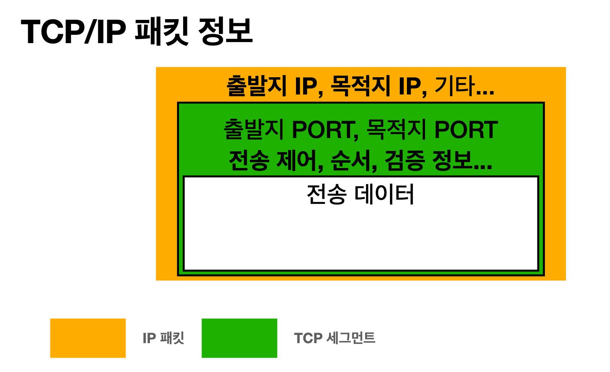

__22_02_21__

# 인터넷 네트워크
- 인터넷 통신
- IP(Internet Protocol)
- TCP, UDP
- PORT
- DNS

### IP(인터넷 프로트콜)
#### 역할 
- 지정한 IP 주소(IP Address)에 데이터 전달
- 패킷(Packet)이라는 통신 단위로 데이터 전달

#### 한계
- 비연결성
  - 패킷을 받을 대상이 없거나 서비스 불능 상태여도 패킷 전송
  
    
- 비신뢰성
  - 중간에 패킷이 사라지면?
  
  - 피킷이 순서대로 안오면?
    
- 프로그램 구분
  - 같은 IP를 사용하는 서버에서 통신하는 애플리케이션이 둘 이상이라면??
  

### TCP 
#### 인터넷 프로토콜 스택의 4계층

##### 프로토콜 계층

#### 특징
전송 제어 프로토콜`(Transmission Control Protocol)`
- 연결지향 - TCP 3 way handshake `(가상 연결)`

  - 최근에는 3번 ACK를 보낼때, 데이터도 함께 전성
- 데이터 전달 보증

- 순서 보장

  - ✅ 패킷내에 있는 정보들로 가능!!!
- 신뢰할 수 있는 프로토콜
- 현재는 대부분 TCP 사용

#### UDP 특징
사용자 데이터그램 프로토콜`(User Datagram Protocol)`
- 하얀 도화지에 비유 (기능이 거의 없음)
- 연결지향 - TCP 3 way hadnshake ❌
- 데이터 전달 보증 ❌
- 순서 보장 ❌
- 데이터 전달 및 순서가 보장되지 않지만, 👉 단순하고 빠름
- 정리
  - IP와 거의 같다. +PORT +체크섬 정도만 추가
  - 애플리케이션에서 추가 작업 필요

### PORT
같은 IP를 사용하는 서버에서 통신하는 애플리케이션이 둘 이상일 때 구분하기 위해서 사용

- 0 ~ 65535 할당 가능
- 0 ~ 1023 : 잘 알려진 포트, 사용하지 않는 것이 좋음
  - FTP - 20, 21
  - TELENT - 23
  - HTTP - 80
  - HTTPS - 443

### DNS
- IP는 기억하기 어려움
- IP는 변경될 수 있음

#### 도메인 네임 서비스`(Domain Name System)`
- 전화번호부
- 도메인 명을 IP주소로 변환

