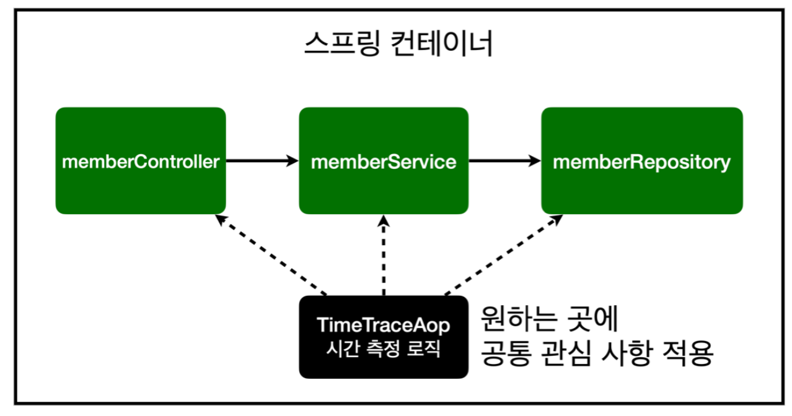
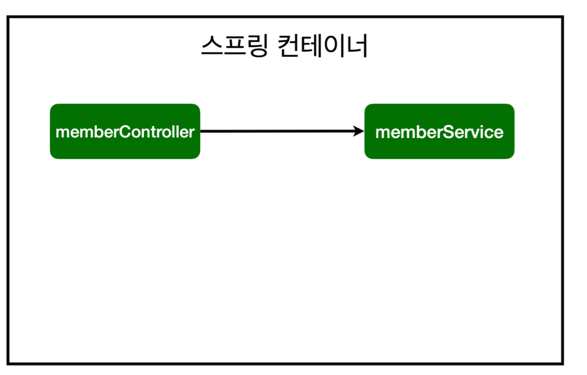
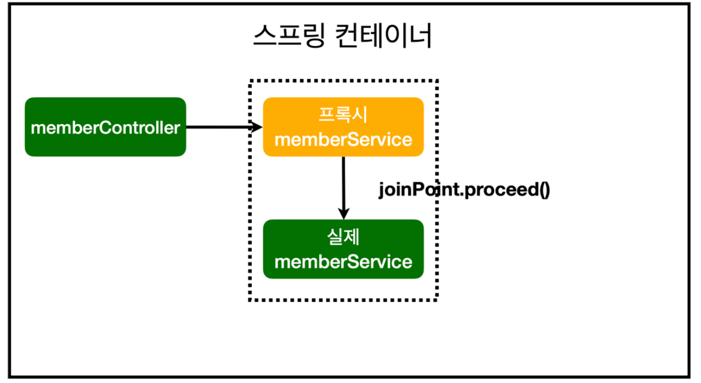
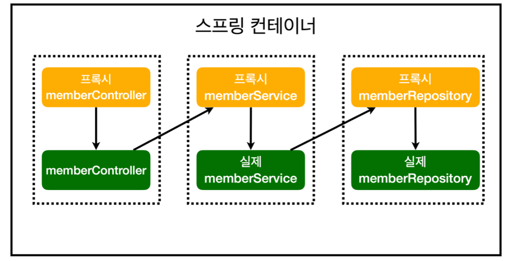

_22_02_02_
# AOP

### 문제
- 회원가입, 회원 조회에 시간을 측정하는 기능은 핵심 관심 사항이 아니다.
- 시간을 측정하는 로직은 공통 관심 사항
- 시간을 측정하는 로직과 핵심 비즈니스의 로직이 섞여서 유지보수가 어려움
- 시간을 측정하는 로직을 별도의 공통 로직으로 만들기 매우 어려움
- 시간을 측정하는 로직을 변경할 때 모든 로직을 찾아가면서 변경해야함

### AOP 적용
- AOP : Aspect Oriented Programming
- 공통 관심 사항 (cross-cutting concern) vs. 핵심 관심 사항 (core concern) 분리


### 시간 측정 AOP 등록
```java
package com.example.hello.hellospring.aop;

import org.aspectj.lang.ProceedingJoinPoint;
import org.aspectj.lang.annotation.Around;
import org.aspectj.lang.annotation.Aspect;
import org.springframework.stereotype.Component;

@Component
@Aspect
public class TimeTraceAop {

    @Around("execution(* com.example.hello.hellospring..*(..))")
    public Object execute(ProceedingJoinPoint joinPoint) throws Throwable{
        long start = System.currentTimeMillis();

        System.out.println("START: " + joinPoint.toString());

        try{
            return joinPoint.proceed();
        }finally {
            long finish = System.currentTimeMillis();
            long timeMs = finish - start;

            System.out.println("END: "+ joinPoint.toString()+" "+timeMs+"ms");
        }
    }
}
```

### 해결
- 회원가입, 회원 조회등 핵심 관심사항과 시간을 측정하는 공통 관심 사항을 분리함
- 시간을 측정하는 로직을 별도의 공통 로직으로 만듬
- 핵심 관심 사항을 깔끔하게 유지할 수 있음
- 변경이 필요하면 이 로직만 변경하면 됨
- 원하는 적용 대상을 선택할 수 있음


## 스프링의 AOP 동작 방식 설명
### AOP 적용 전 의존관계


### AOP 적용 후 의존관계


### AOP 적용 후 전체 그림

- 실제 Proxy가 주입되는지 콘솔에 출력해서 확인하기