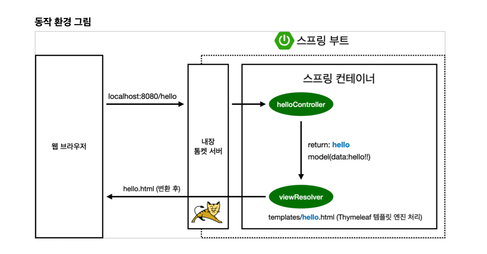
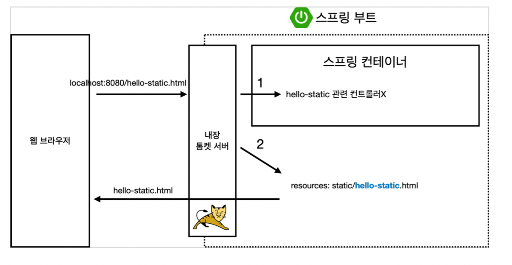
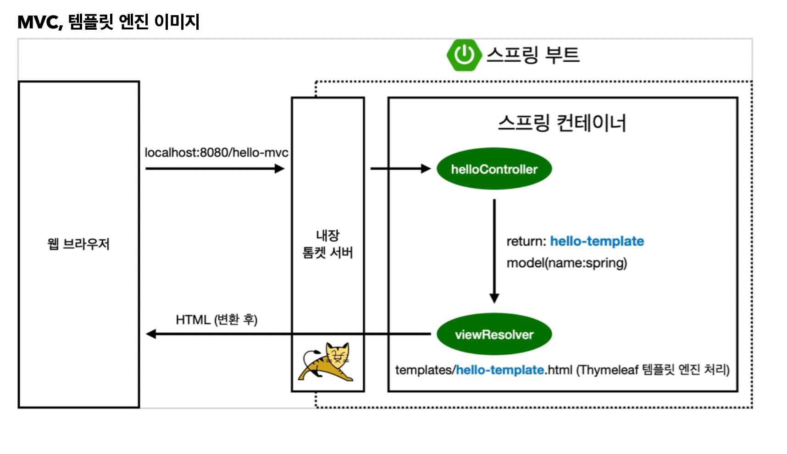
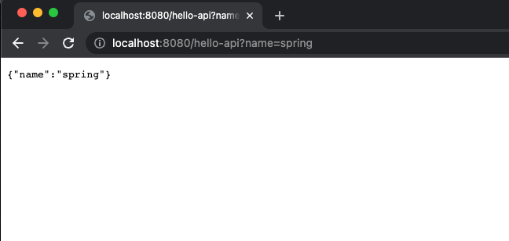
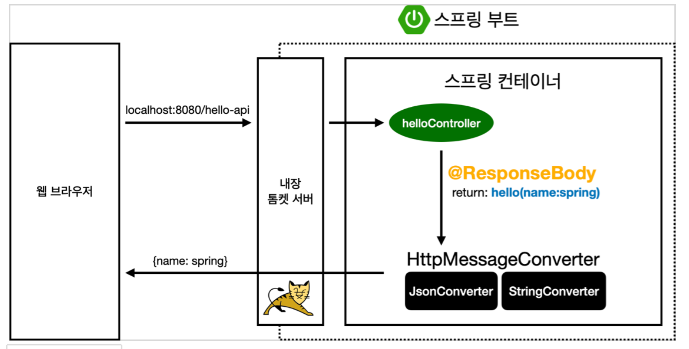

# ✅ 스프링 웹 개발 기초 
## View 환경설정

- `static/index.html` 을 먼저 찾아 Welcome Page 기능을 제공

- 컨트롤러에서 리턴 갑으로 문자를 반환하면 뷰 리졸버`(viewResolver)`가 화면을 찾아서 처리
    - 스프링 부트 템플릿 엔진 기본 viewName 매핑
    - `resources:templates/` + {ViewName} + `.html`

## 스프링 웹 개발 기초
### 1. 정적 컨텐츠

### 2. MVC와 템플릿 엔진
- MVC : Model, View, Controller

- Spring MVC
  - 사용자 인터페이스, 데이터 및 논리 제어를 구현하는데 널리 사용되는 소프트웨어 디자인 패턴
  - 소프트웨어의 비즈니스 로직과 화면을 구분하는데 중점을 둠
  - 간단하게 Model, View, Controller로 분리하여 개발하는 디자인 패턴
- Model
  - 데이터와 비즈니스 로직을 관리
  - 애플리케이션이 포함되어야할 데이터가 무엇인지 정의
  - 일반적으로 POJO로 구성됨
  - JAVA BEANS
- View
  - 레이아웃과 화면을 처리
  - 애플리케이션의 데이터를 보여주는 방식을 정의
  - JSP
  - JSP 이외에도 Thymeleaf, Groovy 등 여러 Template Engine이 있음
- Controller
  - View와 Model 사이의 인터페이스 역할
  - 애플리케이션 사용자의 입력에 대한 응답으로 Model 및 View를 업데이트하는 로직을 포함
  - Model/View에 대한 사용자 입력 및 요청을 수신하여 그에 따라 적절한 결과를 Model에 담아 View에 전달
  - 즉, Model Object와 이 Model을 화면에 출력할 View Name을 반환
  - Controller ➡️ Service ➡️ Dao ➡️ DB

### 3. API
- `@ResponseBody` ➡️ http에서 head부와 body부 중, body부에 데이터를 직접 넣어주겠다는 어노테이션
  - `@ResponseBody`를 사용하면 뷰 리졸버 `(viewResolver)`를 사용하지 않음
  - 대신에 http의 body에 문자 내용을 직접 반화(html body tag가 아님)

  - `@ResponseBody`를 사용하고, 객체를 반환하면 객체가 JSON으로 변환됨

- `@ResponseBody`를 사용
  - HTTP의 BODY에 문자 내용을 직접 반환
  - viewResolver 대신에 `HttpMessageConverter`가 동작
  - 기본 문자처리 : `StringHttpMessageConverter`
  - 기본 객체처리 : `MappingJackson2HttpMessageConvert3r`
  - byte 처리 등등 기타 여러 `HttpMessageConverter`가 기본으로 등록되어 있음

> 참고 : 클라이언트의 HTTP Accept 헤더와 서버의 컨트롤러 반환 타입 정보 둘을 조합해서 `HttpMessageConverter`가 선택됨