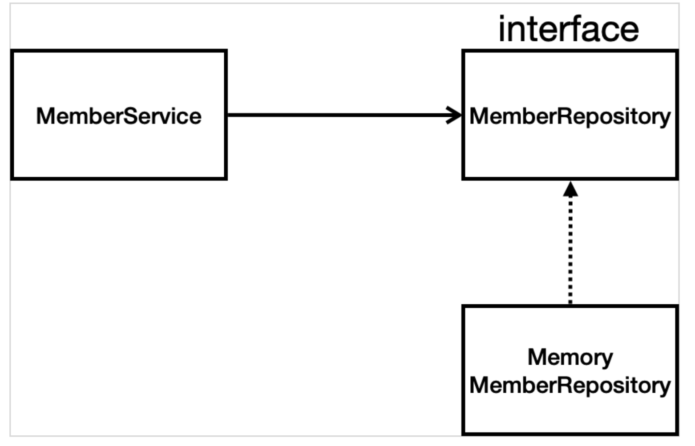

# 회원 관리 예제 - 백엔드 개발
*22.01.30*

## 비즈니스 요구사항 정리

- 데이터 : 회원ID, 이름
- 기능 : 회원 등록, 조회
- 아직 데이터 저장소가 선정되지 않음 (가상의 시나리오)

## 일반적인 웹 애플리케이션 계층 구조

- 컨트롤러 : 웹 MVC의 컨트롤러 역할
- 서비스 : 핵심 비즈니스 로직 구현 
  - ex) 회원은 중복 가입 불가
- 리포지토리 : 데이터베이스에 접근, 도메인 객체를 DB에 저장하고 관리
- 도메인 : 비즈니스 도메인 객체, 주로 데이터베이스에 저장하고 관리됨 
  - ex) 회원, 주문, 쿠폰등

## 클래스 의존관계

아직 데이터 저장소가 선정되지 않아서, 우선 인터페이스로 구현 클래스를 변경할 수 있도록 설계  
데이터 저장소는 RDB, NoSQL 등 다양한 저장소를 고민중인 상황으로 가정  
개발을 진행하기 위해서 초기 개발 단계에서는 구현체로 가벼운 메모리 기반의 데이터 저장소 사용  
> Optional<> : null이 반환될 수 있는데, Optional로 감싸서 반환하는 것을 최근 선호

## 회원 레포지토리 테스트 케이스 작성
개발한 기능을 실행해서 테스트 할 때 자바의 main 메서드를 통해서 실행하거나, 웹 애플리케이션의 컨트롤러를 통해서 해당 기능을 실행.  
이러한 방법은 준비하고 실행하는데 오래 걸리고, 반복 실행하기 어렵고 여러 테스트를 한 번에 실행하기 어렵다는 단점이 존재.  
자바는 JUnit이라는 프레임워크로 테스트를 실행해서 이러한 문제를 해결  

`@AfterEach` : 한 번에 여러 테스트를 실행하면 메모리 DB에 직전 테스트의 결과가 남을 수 있다. 이렇게 되면 이전 테스트 때문에 다음 테스트를 실패할 가능성이 존재  
`@AfterEach`를 사용하면 각 테스트가 종료될 때 마다 이 기능을 실행한다. 여기서는 메모리 DB에 저장된 데이터를 삭제. 테스트는 각각 독립적으로 실행되어야 한다. 테스트 순서에 의존관계가 있는 것은 좋은 테스트가 아니다.  

`@BeforeEach` : 각 테스트 실행 전에 호출됨. 테스트가 서로 영향이 없도록 항상 새로운 객체를 생성하고, 의존관계도 새로 맺어줌 

