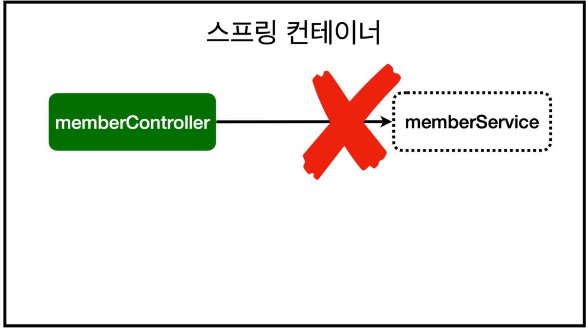
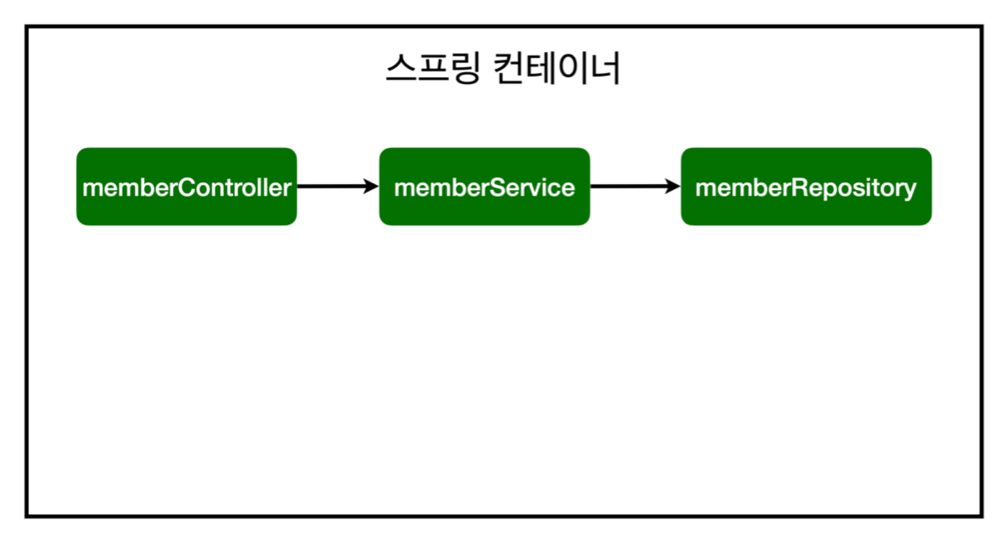

_22.01.30_

# 스프링 빈과 의존관계

## 1. 컴포넌트 스캔과 자동 의존관게 설정
회원 컨트롤러가 회원 서비스와 회원 리포지토리를 사용할 수 있게 의존관계를 준비‼️

- 생성자에 `@Autowired`가 있으면 스프링이 연관된 객체를 스프링 컨테이너에서 찾아서 넣어줌. 
  - 이렇게 객체 의존관계를 외부에서 넣어주는 것을 `DI(Dependency Injection), 의존성 주입` 이라 함
- 👉 new ~ () 할 필요가 없다. ‼
> 오류 발생  
> Consider defining a bean of type  
> 'hello.hellospring.service.MemberService' in your configuration.  

**➡️ memberService가 스프링 빈으로 등록되어있지 않다.**

> 참고 : helloController는 스프링이 제공하는 컨트롤러여서 스프링 빈으로 자동 등록됨.  
> @Controller가 있으면 자동 등록됨

### 스프링 빈을 등록하는 2가지 방법

- 컴포넌트 스캔과 자동 의존관계 설정 
- 자바 코드로 직접 스프링 빈 등록

### 1. 컴포넌트 스캔 원리
- `@Component` 애노테이션이 있으면 스프링 빈으로 자동 등록
- `@Controller`가 스프링 빈으로 자동 등록된 이유도 컴포넌트 스캔 때문
- `@Component`를 포함하는 다음 애노테이션도 스프링 빈으로 자동 등록됨
  - `@Controller`
  - `@Service`
  - `@Repository`

> 참고 :  생성자에 `@Autowired`를 사용하면 객체 생성 시점에 스프링 컨테이너에서 해당 스프링 빈을 찾아서 주입한다.  
> 생성자가 1개만 있으면 생략 가능

스프링 빈 등록 이미지

- memberService와 memberRepository가 스프링 컨테이너에 스프링 빈으로 등록됨
> 참고 : 스프링은 스프링 컨테이너에 스프링 빈으로 등록할 때, 기본으로 싱글톤으로 등록한다. (유일하게 하나만 등록해서 공유)  
> 따라서 같은 스프링 빈이면 모두 같은 인스턴스  
> 설정으로 싱글톤이 아니게 설정할 수 있지만, 특별한 경우를 제외하면 대부분 싱글톤을 사용


## 싱글톤(SingleTon) 패턴
객체의 인스턴스가 오직 1개만 생성되는 패턴을 의미    

**사용하는 이유**  
➡️ 메모리 측면 ‼️ 최초 한번의 new 연산자를 통해서 고정된 메모리 영역을 사용하기 때문에 추후 해당 객체에 접근할 때 메모리 낭비를 방지  
➡️ 이미 생성된 인스턴스를 활용하니 속도 측면에서도 이점이 있다고 볼 수 있음  
➡️ 다른 클래스 간에 데이터 공유가 쉬움. 싱글톤 인스턴스가 전역으로 사용되기 때문에 다른 클래스의 인스턴스들이 접근하여 사용할 수 있음.  
➡️ 여러 클래스의 인스턴스에서 싱글톤 인스턴스의 데이터에 동시에 접근하게 되면 동시성 문제가 발생할 수 있으니 유의해서 설계해야함  


### 2. 자바 코드로 직접 스프링 빈 등록하기
- 히원 서비스와 회원 레포지토리의 `@Service`, `@Repository`, `@Autowired` 애노테이션을 제거하고 진행
```java
package com.example.hello.hellospring;

import com.example.hello.hellospring.repository.MemberRepository;
import com.example.hello.hellospring.repository.MemoryMemberRepository;
import com.example.hello.hellospring.service.MemberService;
import org.springframework.context.annotation.Bean;
import org.springframework.context.annotation.Configuration;

@Configuration
public class SpringConfig {

    @Bean
    public MemberService memberService(){
        return new MemberService(memberRepository());
    }

    @Bean
    public MemberRepository memberRepository(){
        return new MemoryMemberRepository();
    }
}
```
> 참고 : DI에는 필드 주입, setter 주입, 생성자 주입 이렇게 3가지 방법이 존재  
> 의존관계가 실행중에 동적으로 변하는 경우는 거의 없으므로 생성자 주입을 권장  
 