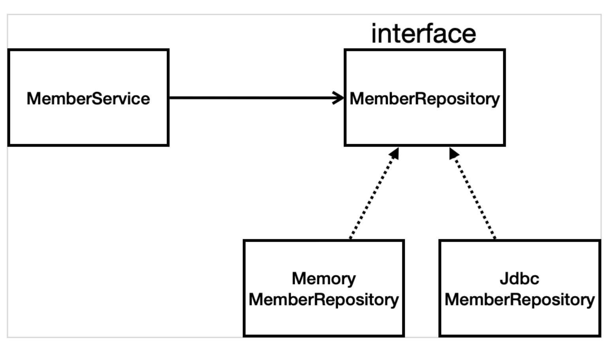
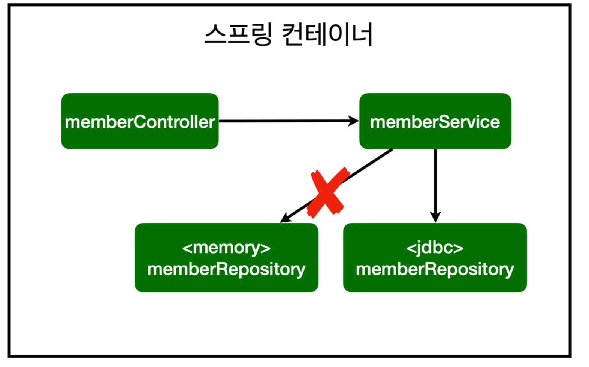
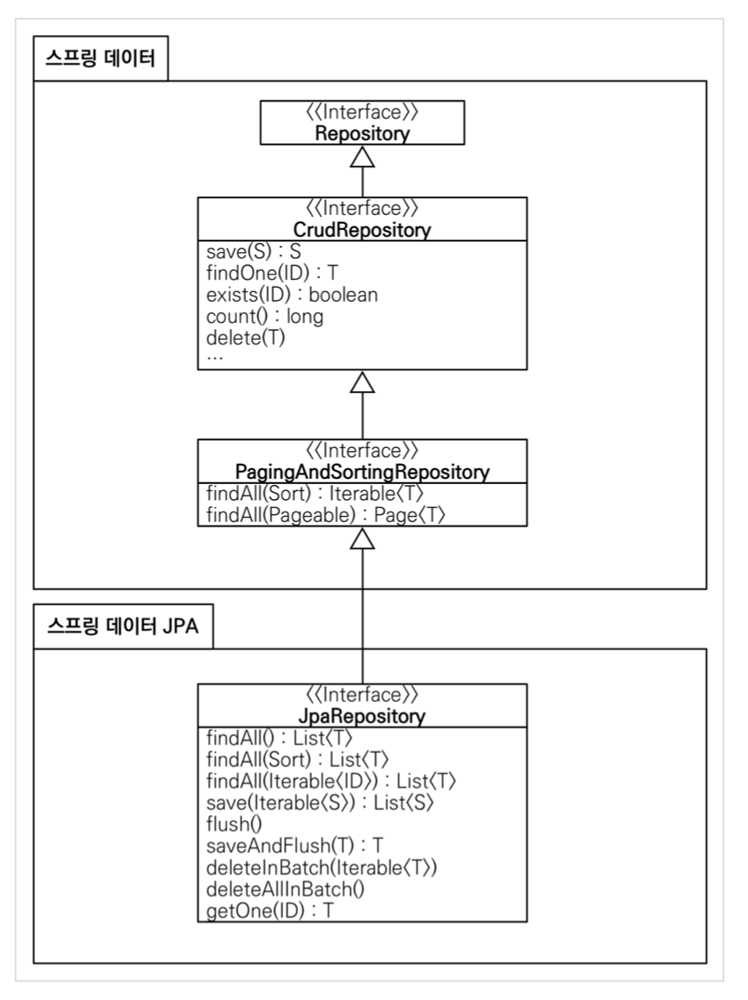

*22.01.30*

# 스프링 DB 접근 기술
스프링 데이터  액세스

- h2 데이터베이스 : 개발이나 테스트 용도로 가볍고 편리한 DB, 웹 화면 제공

## 순수 JDBC
### JDBC 리포지토리 구현
주의!! 이런 방식은 20년전~~~~~~ 참고만‼️
- DataSource는 데이터베이스 커넥션을 획득할 때 사용하는 객체. 스프링 부트는 데이터베이스 커넥션 정보를 바탕으로 DataSource를 생성하고 스프링 빈으로 만들어 둔다. 그래서 DI를 받을 수 있다.

### 구현 클래스 추가 이미지

### 스프링 설정 이미지

- 개방-폐쇄 원칙(OCP, Open-Closed Principle)
  - 확장에는 열려있고, 수정/변경에는 닫혀있다.
- 스프링의 DI(Dependency Injection)을 사용하면 기존 코드를 전혀 손대지 않고, 설정만으로 구현 클래스를 변경할 수 있다.

## 스프링 통합 테스트
- `@SpringBootTest` : 스프링 컨테이너와 테스트를 함께 실행한다.
- `@Transactional` : 테스트 케이스에 이 애노테이션이 있으면, 테스트 시작 전에 트랜잭션을 시작하고, 테스트 완료 후에 항상 롤백한다. 이렇게 하면 DB에 데이터가 남지 않으므로 다음 테스트에 영향을 주지 않는다.

## 스프링 JdbcTemplate
- 순수 JDBC와 동일한 환경설정을 하면 된다.
- 스프링 JdbcTemplate과 MyBatis 같은 라이브러리는 JDBC API에서 본 반복 코드를 대부분 제거해준다. 하지만 SQL문은 직접 작성해야한다.

## JPA
- JPA는 기존의 반복 코드는 물론이고, 기본적인 SQL도 JPA가 직접 만들어서 실행해준다.
- JPA를 사용하면, SQL과 데이터 중심의 설계에서 객체 중심의 설계로 패러다임을 전환할 수 있다.
- JPA를 사용하면 개발 생산성을 크게 높일 수 있다.

###  스프링 부트에 JPA 설정 추가
- show-sql : JPA가 생성하는 SQL을 출력
- ddl-auto : JPA는 테이블을 자동으로 생성하는 기능을 제공하는데 none을 사용하면 해당 기능을 끔
  - create를 사용하면 엔티티 정보를 바탕으로 테이블도 직접 생성

### 스프링 데이터 JPA
- 스프링 데이터 JPA가 SpringDataJapMemberRepository를 스프링 빈으로 자동 등록
- 스프링 데이터 JPA 제공 클래스

- 스프링 데이터 JPA 제공 기능
  - 인터페이스를 통한 기본적인 CRUD
  - findByName(), findByEmail() 처럼 메서드 이름 만으로 조회 기능 제공
  - 페이징 기능 자동 제공