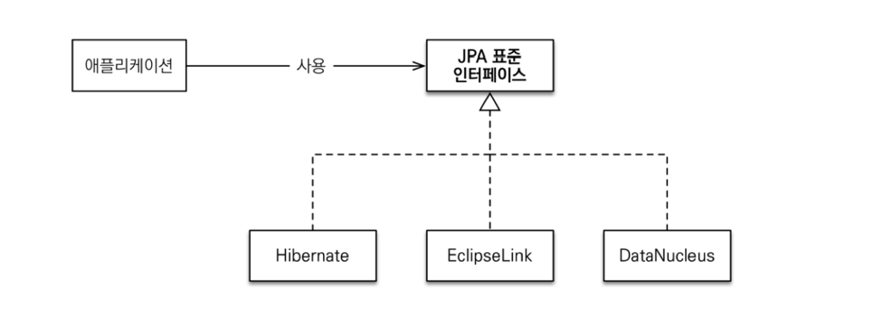
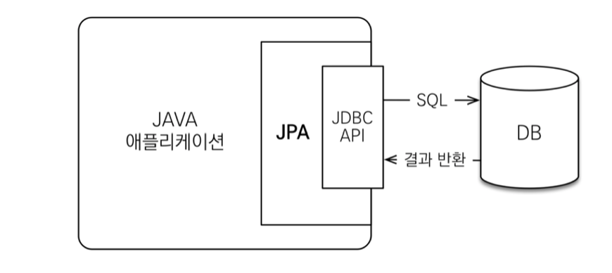
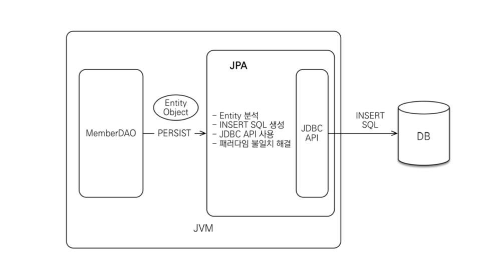
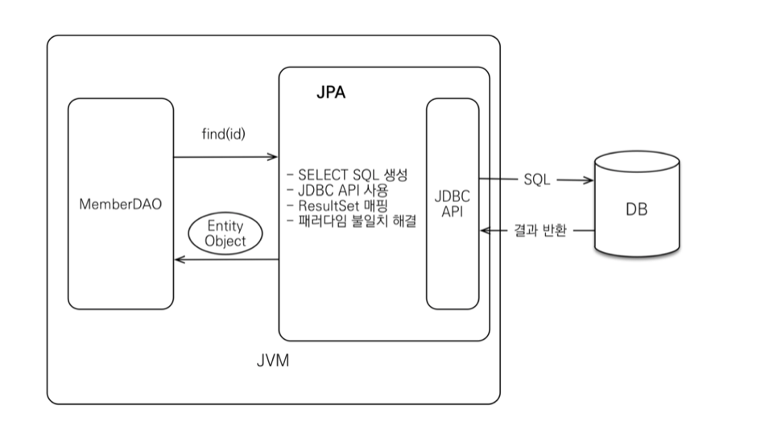
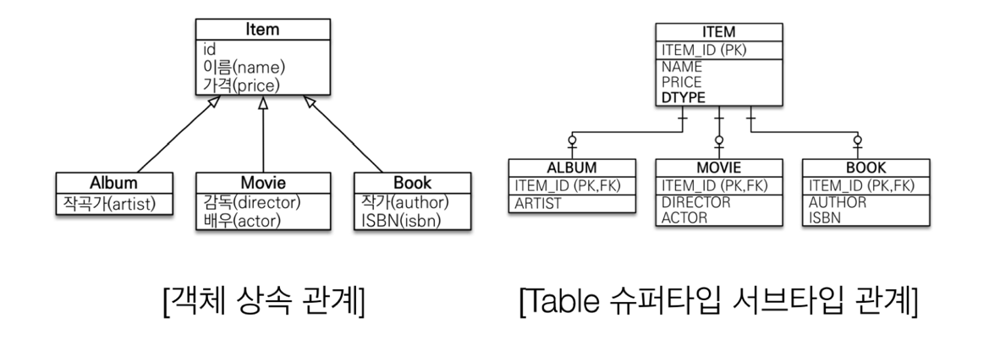
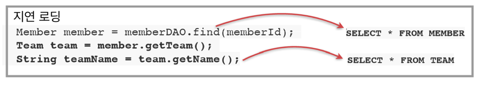
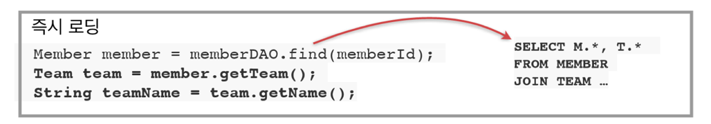

*22_02_01*
# JPA
## ORM(Object-Relational Mapping)이란?
- Object-Relational Mapping(객체 관계 매핑)
  - 객체는 객체대로 설계하고, 관계형 데이터베이스는 관계형 데이터베이스대로 설계
  - ORM 프레임워크가 중간에서 매핑해줌
- 대중적인 언어에는 대부분 ORM 기술이 존재
- ORM은 객체와 RDB 두 기둥위에 있는 기술

## JPA(Java Persistence API)란?
- EJB
  - 과거의 자바 표준(Entity Bean)
  - 과거의 ORM
  - 문제?
    - 코드가 매우 지저분
    - API의 복잡성이 높음 (interface를 많이 구현해야함)
    - 속도가 느림
- Hibernate
  - ORM 프레임워크, Open Source SW
  - 'Gaving King'과 시러스 테크놀러지 출신 동료들이 EJB2 스타일의 Entity Beans 이용을 대체할 목적으로 개발
- JPA(Java Persistence API)
  - 현재 자바 진영의 ORM 기술 표준으로, `인터페이스의 모음`
    - 즉, 실제로 동작하는 것은 아님
    - JPA 인터페이스를 구현한 대표적인 오픈소스가 Hibernate
  - JPA 2.1 표준 명세를 구현한 3가지 구현체 : Hibernate, EclipseLink, DataNucleus
  

### JPA 동작 과정

- JPA는 애플리케이션과 JDBC 사이에서 동작
  - 개발자가 JPA를 사용하면, JPA 내부에서 JDBC API를 사용하여 SQL을 호출하여 DB와 통신
  - 즉, 개발자가 직접 JDBC API를 쓰는 것이 아님

### 저장 과정

- EX ) MemberDAO에서 객체를 저장
  - 개발자는 JPA에 Member객체를 넘김
  - JPA는
    1. Member 엔티티를 분석
    2. Insert SQL문 생성
    3. JDBC API를 사용하여 SQL을 DB에 전송

### 조회 과정

- EX ) Member 객체를 조회
  - 개발자는 member의 pk값을 JPA에 넘김
  - JPA는
    1) 엔티티의 매핑 정보를 바탕으로 적절한 SELECT SQL을 생성
    2) JDBC API를 사용하여 SQL을 DB에 전송
    3) DB로부터 결과를 받음
    4) 결과(ResultSet)를 객체에 모두 매핑
  - 쿼리를 JPA가 만들어 주기 때문에 Object와 RDB간의 패러다임 불일치를 해결

### JPA를 왜 사용해야 하는가?
1. SQL 중심적인 개발에서 객체 중심으로 개발
2. 생산성
   1. JPA를 사용하는 것은 마치 Java Collection에 데이터를 넣었다 빼는 것처럼 사용할 수 있게 만든 것
   2. 간단한 CRUD
      1. 저장 : jpa.persist(member)
      2. 조회 : Member member = jpa.find(memberId)
      3. 수정 : member.setName(new name)
      4. 삭제 : jpa.remove(member)
   3. 특히, 수정이 굉장히 간단
      1. 객체를 변경하면 그냥 알아서 DB에 UPDATE QUERY가 나감
3. 유지보수
   1. 기존 : 필드 변경 시 모든 SQL을 변경해야함
   2. JPA : 필드만 추가하면 됨. SQL은 JPA가 처리하기 때문에 손댈 것이 없음
4. Object와 RDB 간의 패러다임 불일치 해결
   1. JPA와 상속
   2. JPA와 연관관계
      1. 객체의 참조로 연관관계 저장 가능
         1. member.setTeam(team)
         2. jpa.persist(member)
   3. JPA와 객체 그래프 탐색
      1. 신뢰할 수 있는 엔티티, 계층
      2. 내가 아닌 다른 개발자가 직접 구현한 DAO에서 가져오는 경우
         1. DAO에서 직접 어떤 쿼리를 날렸는지 확인하지 않는 이상, 그래프 형태의 관련된 객체들을 모두 잘 가져왔는지 알 수 없음
         2. 즉, 반환한 엔티티를 모두 신뢰하고 사용할 수 없음
      3. JPA를 통해서 가져오는 경우
         1. 객체 그래프를 완전히 자유롭게 탐색할 수 있게 됨
         2. 지연 로딩 전략(Lazy Loading) 사용
            1. 관련된 객체를 사용하는 그 시점에 SELECT QUERY를 날려서 객체를 가져오는 전략
   4. JPA와 비교하기
      1. 동일한 트랜잭션에서 조회한 엔티티는 같음을 보장함
5. JPA의 성능 최적화 기능
   1. 중간 계층이 있는 경우 아래의 방법으로 성능을 개선할 수 있는 기능이 존재
      1. 모아서 쓰는 버퍼링 기능
      2. 읽을 때 쓰는 캐싱 기능
   2. JPA도 JDBC API와 DB사이에 존재하기 때문에 위의 두 기능이 존재함
      1. 1차 캐시와 동일성(identity)보장 - 캐싱 기능
         1. 같은 트랜잭션 안에서는 같은 엔티티를 반환 - 약간의 조회 성능 향상(크게 도움❌)  
         👉 결과적으로, SQL을 한 번만 실행함
         2. DB Isolation Level이 Read Commit이어도 애플리케이션 Repeatable Read 보장
      2. 트랜잭션을 지원하는 쓰기 지연(transactional write-behind) - 버퍼링 기능  
         - INSERT
           1) [트랜잭션]을 commit할 때까지 INSERT SQL을 메모리에 쌓음  
            👉 이렇게 하지 않으면 DB에 INSERT QUERY를 날리기 위한 네트워크를 3번 타게 됨
           2) JDBC Batch SQL 기능을 사용해서 한 번에 SQL을 전송  
           👉 JDBC Batch를 사용하면 코드가 굉장히 지저분해짐  
           👉 지연 로딩 전략(Lazy Loading) 옵션을 사용  
         - UPDATE
           1) UPDATE, DELETE로 인한 로우(ROW)락 시간 최소화
           2) 트랜잭션 커밋 시 UPDATE, DELETE SQL 실행하고, 바로 커밋
      3. 지연 로딩(Lazy Loading)
         - 지연 로딩
           - 객체가 실제로 사용될 때 로딩하는 전략
            
           - memberDAO.find(memberId)에서는 Member 객체에 대한 SELECT 쿼리만 날림
           - Team team = member.getTeam()  Team 객체를 가져온 후에 team.getName()처럼 실제로 team객체를 건드릴 때!  
             👉 즉, 값이 실제로 필요한 시점에 JPA가 Team에 대한 SELECT 쿼리를 날림
           - Member와 Team 객체 각각 따로 조회하기 때문에 네트워크를 2번 타게 됨  
             👉 Member를 사용하는 경우에 대부분 Team도 같이 필요하다면 즉시 로딩을 사용함
         - 즉시 로딩
           - JOIN SQL로 한 번에 연관된 객체까지 미리 조회하는 전략
           
           - Join을 통해 항상 연관된 모든 객체를 같이 가져옴
         - 애플리케이션 개발할 때는 모두 로딩으로 설정한 후에, 성능 최적화가 필요할 때에 옵션을 변경하는 것을 추천
6. 데이터 접근 추상화와 벤더 독립성
7. 표준

