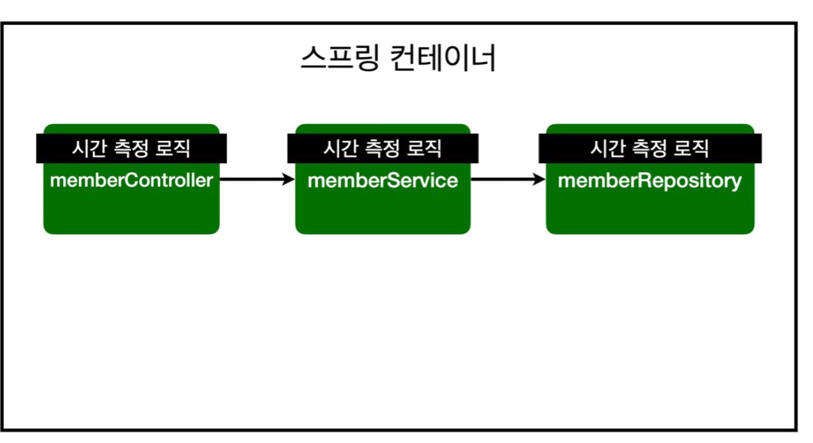

*22_02_01*
# AOP

## AOP가 필요한 상황
- 모든 메소드의 호출 시간을 측정하고 싶다면??
- 공통 관심 사항(cross-cutting concern) vs 핵심 관심 사항(core concern)
- 회원 가입 시간, 회원 조회 시간을 측정하고 싶다면?

```java
public Long join(Member member){

    long start = System.currentTimeMillis();

    try {
        validateDuplicateMember(member);
        memberRepository.save(member);
        return member.getId();
    }finally {
        long finish = System.currentTimeMillis();
        long timeMs = finish - start;
        System.out.println("join " + timeMs + "ms");
    }
}

/*
    * 전체 회원 조회
    * */
    public List<Member> findMembers(){
        long start = System.currentTimeMillis();

        try {
            return memberRepository.findAll();
        }finally {
            long finish = System.currentTimeMillis();
            long timeMs = finish - start;
            System.out.println("findMembers " + timeMs + "ms");
        }
    }
```

