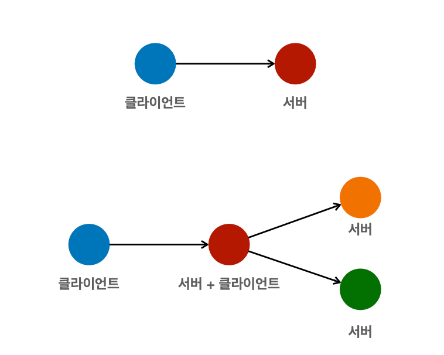
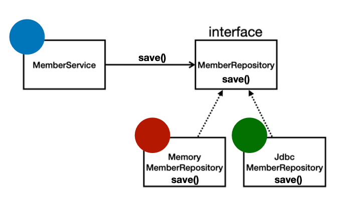
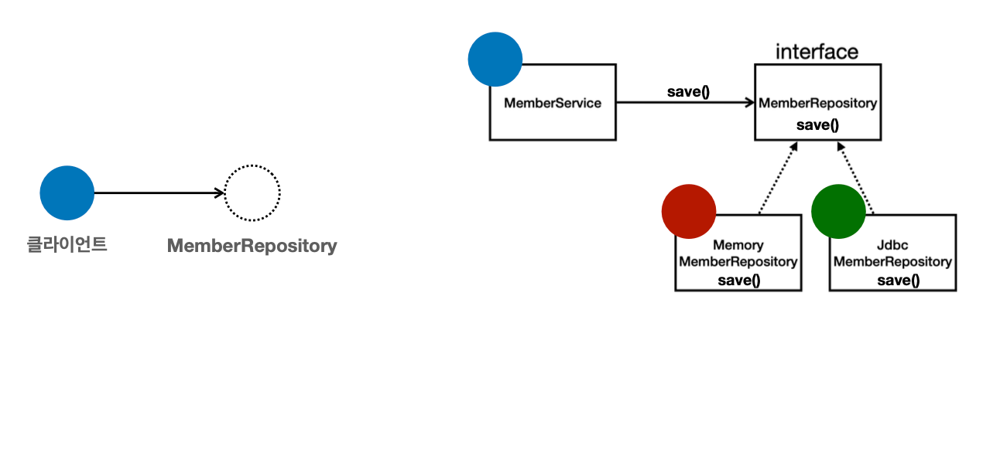
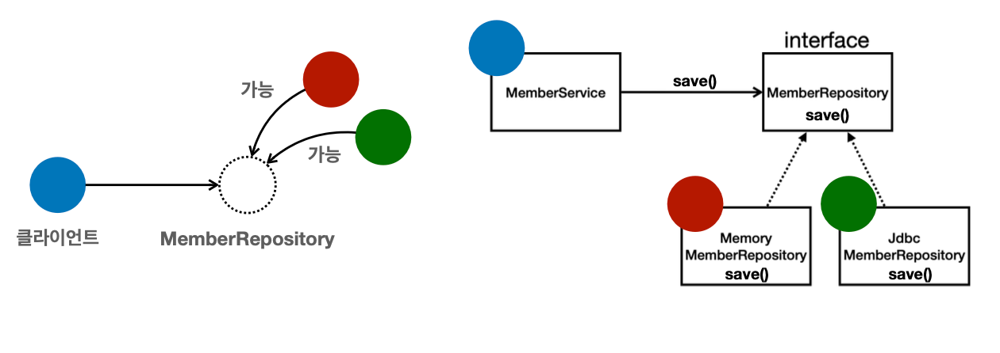
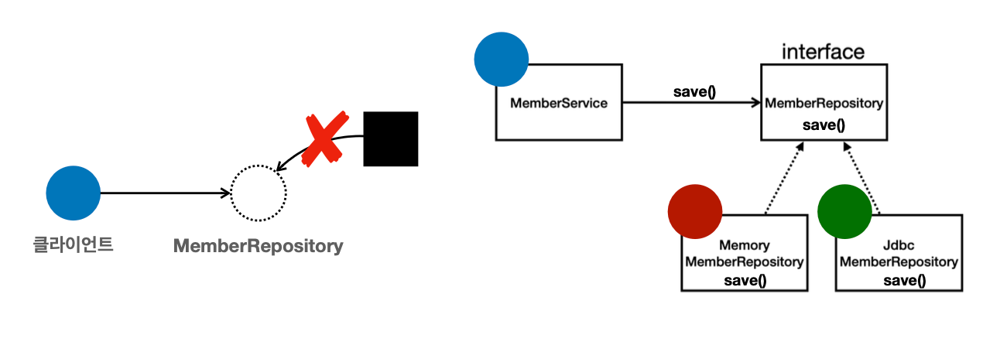
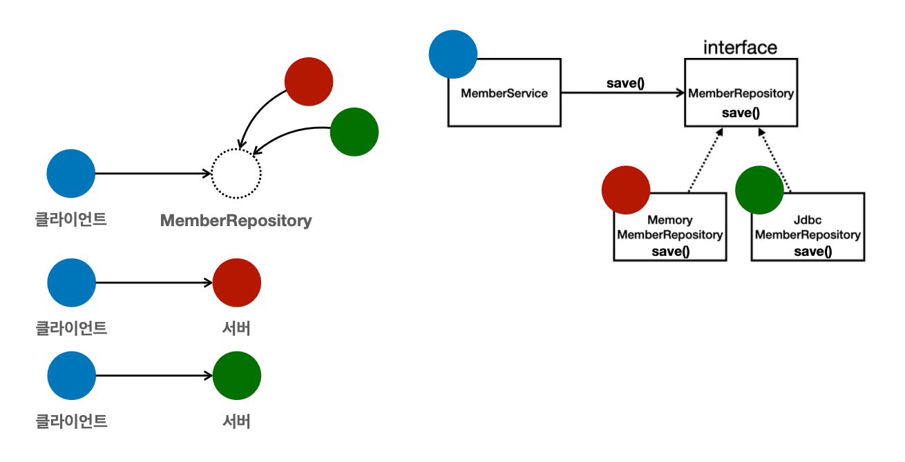

_22_02_04_
# 객체 지향 프로그래밍

## 객체 지향 특징 
- 추상화
- 캡슐화
- 상속
- 다형성

## 객체 지향 프로그래밍
- 객체 지향 프로그래밍은 컴퓨터 프로그램을 명령어의 목록으로 보는 시각에서 벗어나 여러개의 독립된 단위, 즉 "객체"들의 모임으로
파악하고자 하는 것. 각각의 객체는 메세지를 주고받고, 데이터를 처리할 수 있음 👉 `협력`
- 객체 지향 프로그래밍은 프로그램을 유연하고 변경이 용이하게 만들기 때문에 대규모 소프트웨어 개발에 많이 사용됨

### 유연하고, 변경이 용이?
- 레고 블럭 조립하듯이
- 키보드, 마우스 갈아 끼우듯이
- 컴퓨터 부품 갈아 끼우듯이
- 컴포넌트를 쉽고 유연하게 변경하면서 개발할 수 있는 방법


## 다형성 `(Polymorphism)`
### 다형성의 실세계 비유
- 실세계와 객체 지향을 1:1로 매칭❌
- 그래도 실세계의 비유로 이해하기는 좋음
- 역할과 구현으로 세상을 구분
- EX
  - 운전자 - 자동차
  - 공연 무대
  - 키보드, 마우스, 세상의 표준 인터페이스들
  - 정렬 알고리즘
  - 할인 정책 로직

### 역할과 구현을 분리
- 역할과 구현으로 구분하면 세상이 단순해지고, 유연해지며 변경도 편리해짐
- 장점
  - 클라이언트는 대상의 역할`(인터페이스)`만 알면 됨
  - 클라이언트는 구현 대상의 내부 구조를 몰라도 됨
  - 클라이언트는 구현 대상의 내부 구조가 변경되어도 영향을 받지 않음
  - 클라이언트는 구현 대상 자체를 변경해도 영향을 받지 않음

### 자바 언어
- 자바 언어의 다형성을 활용
  - 역할 = 인터페이스
  - 구현 = 인터페이스를 구현한 클래스, 구현 객체
- 객체를 설계할 때 역할과 구현을 명확히 분리
- 객체 설계 시 역할`(인터페이스)`을 먼저 부여하고, 그 역할을 수행하는 구현 객체 만들기

### 객체의 협력이라는 관계부터 생각
- 혼자있는 객체는 없다.
- 클라이언트 : 요청, 서버 : 응답
- 수 많은 객체 클라이언트와 객체 서버는 서로 협력 관계를 가짐


## 자바 언어의 다형성
- 오버라이딩을 떠올려보자
- 오버라이딩은 자바 기본 문법
- 오버라이딩 된 메서드가 실행
- 다형성으로 인터페이스를 구현한 객체를 실행 시점에 유연하게 변경할 수 있음
- 물론 클래스 상속 관계도 다형성, 오버라이딩 적용 가능




```java
public class MemberService {
    private final MemberRepository memberRepository = new MemoryMemberRepository();
}
```

```java
public class MemberService {
    private final MemberRepository memberRepository = new JdbcMemberRepository();
}
```




### 다형성의 본질
- 인터페이스를 구현한 객체 인스턴스를 실행 시점에 유연하게 변경할 수 있음
- 다형성의 본질을 이해하려면 협력이라는 객체사이의 관계에서 시작해야
- 클라이언트를 변경하지 않고, 서버의 구현 기능을 유연하게 변경할 수 있음


### 정리
- 실세계의 역할과 구현이라는 편리한 컨셉을 다형성을 통해 객체 세상으로 가져올 수 있음
- 유연하고, 변경이 용이
- 확장 가능한 설계
- 클라이언트에 영향을 주지 않는 변경 가능
- 인터페이스를 안정적으로 잘 설계하는 것이 중요

### 한계
- 역할`(인터페이스)` 자체가 변하면, 클라이언트, 서버 모두에 큰 변경이 발생함
- 인터페이스를 안정적으로 잘 설계하는 것이 중요

## 스프링과 객체 지향
- 다형성이 가장 중요 ‼️
- 스프링은 다형성을 극대화해서 이용할 수 있게 도와줌
- 스프링에서 이야기하는 `제어의 역젼(IoC)`, `의존관계 주입(DI)`은 다형성을 활용해서 역할과 구현을 편리하게 다룰 수 있도록 지원함
- 스프링을 사용하면 마치 레고 블럭 조립하듯이 ‼️ 구현을 편리하게 변경할 수 있다.