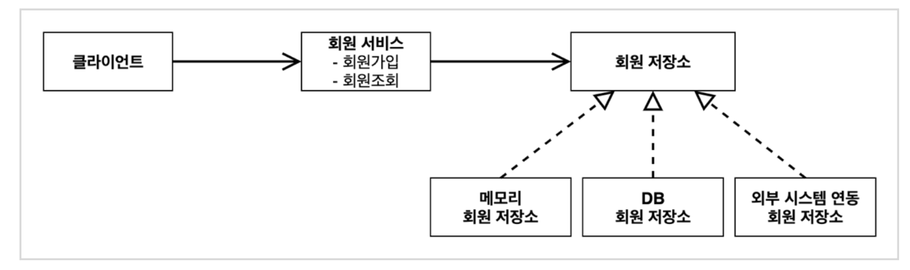
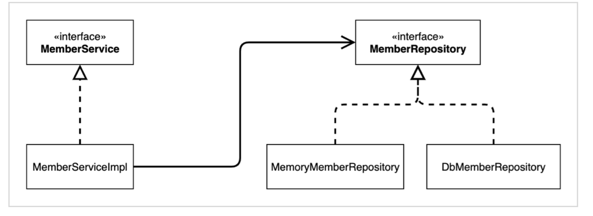
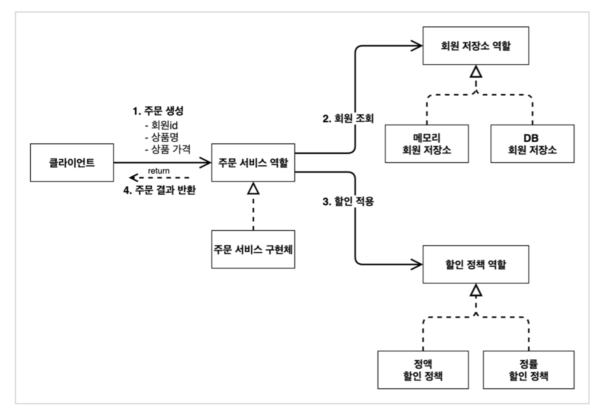
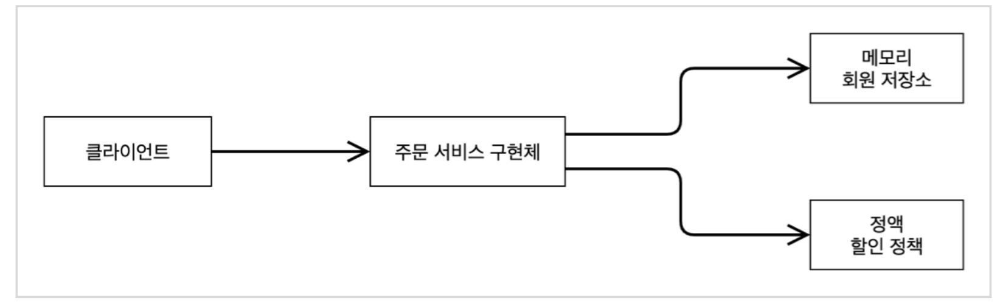
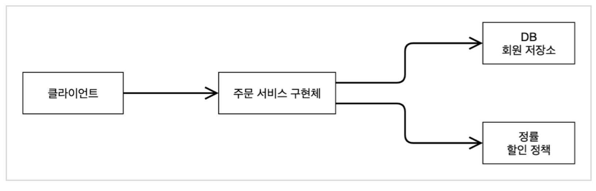

_22_02_07_

# 스프링 핵심 원리 이해 1 - 예제 만들기 

## 비즈니스 요구사항과 설계
- 회원
  - 회원을 가입하고 조회할 수 있음
  - 회원을 일반과 VIP 두 가지 등급이 존재
  - 회원 데이터는 자체 DB를 구축할 수 있고, 외부 시스템과 연동할 수 있음 **(미확정)**
- 주문과 할인 정책
  - 회원은 상품을 주문할 수 있음
  - 회원 등급에 따라 할인 정책을 적용할 수 있음
  - 할인 정책은 모든 VIP는 1000원을 할인하는, 고정 금액 할인을 적용 **(변경될수 있음)**
  - 할인 정책은 변경 가능성 ↑, 회사의 기본 할인 정책은 아직 미정, 최악의 경우 할인 적용 X **(미확정)**

요구사항을 보면 회원 데이터, 할인 정책 같은 부분은 지금 결정하기 어려운 부분  
그렇다고 무기한 개발을 기다릴 수 없음 👉 인터페이스를 만들고 구현체를 언제든지 갈아끼울 수 있게 설계하자

## 회원 도메인 설계
- 요구사항
  - 회원 가입과 조회 가능
  - 회원은 일반과 VIP 두 가지 등급 존재
  - 회원 데이터는 자체 DB를 구축할 수 있고, 외부 시스템과 연동 가능 **(미확정)**
    - ✅미확정이라서, 우선 메모리 회원 저장소를 만들어서 개발 진행

### 회원 도메인 협력 관계

### 회원 클래스 다이어그램

### 회원 객체 다이어그램

- 회원 서비스 : `MemberServiceImpl`

## 주문과 할인 도메인 설계
- 주문과 할인 정책
  - 회원은 상품 주문 가능
  - 회원 등급에 따라 할인 정책 적용
  - 할인 정책은 모든 VIP는 1000원을 할인하는, 고정 금액 할인을 적용 **(변경될수 있음)**
  - 할인 정책은 변경 가능성 ↑, 회사의 기본 할인 정책은 아직 미정, 최악의 경우 할인 적용 X **(미확정)**

### 주문 도메인 협력, 역활, 책임

1. 주문 생성 : 클라이언트는 주문 서비스에 주문 생성을 요청
2. 회원 조회 : 할인을 위해서는 회원 등급이 필요. 그래서 주문 서비스는 회원 저장소에서 회원 조회
3. 할인 적용 : 주문 서비스는 회원 등급에 따른 할인 여부를 할인 정책에 위임
4. 주문 결과 반환 : 주문 서비스는 할인 결과를 포함한 주문 결과를 반환

### 주문 도메인 전체

역할과 구현을 분리해서 자유롭게 구현 객체를 조립할 수 있게 설계  
덕분에 회원 저장소와 할인 정책을 유연하게 변경 가능

### 주문 도메인 클래스 다이어그램

### 주문 도메인 객체 다이어그램 1

회원을 메모리에서 조회하고, 정액 할인 정책을 지원해도 주문 서비스를 변경하지 않아도 됨.  
역할들의 협력 관계를 그대로 재사용 가능

### 주문 도메인 객체 다이어그램 2

회원을 메모리가 아닌 실제 DB에서 조회하고, 정률 할인 정책을 지원해도 주문 서비스를 변경하지 않아도 됨.  
협력 관계를 그대로 재사용 가능
