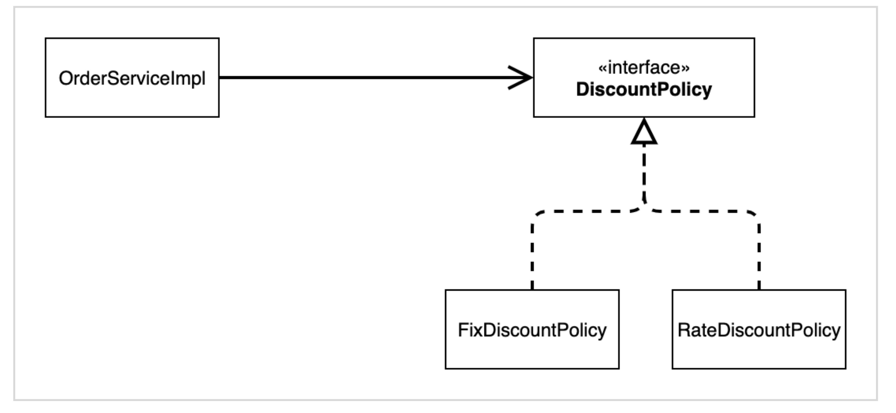
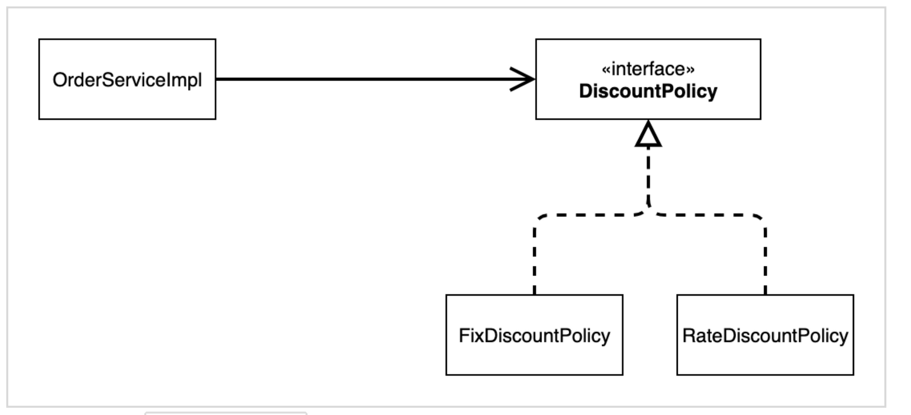
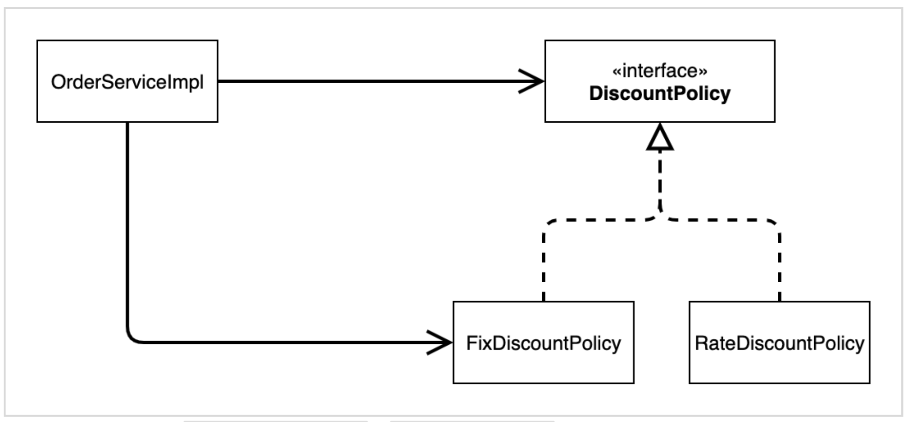
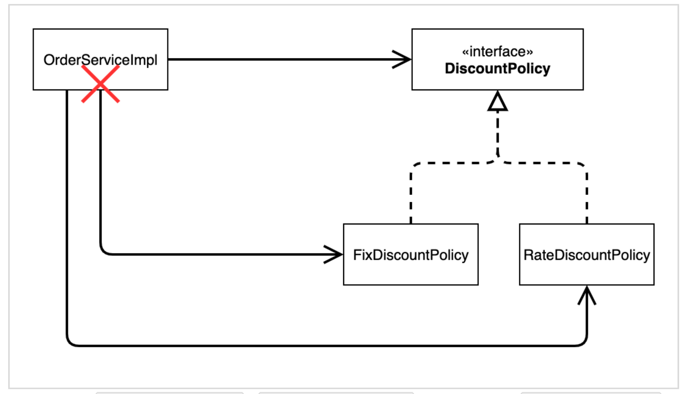
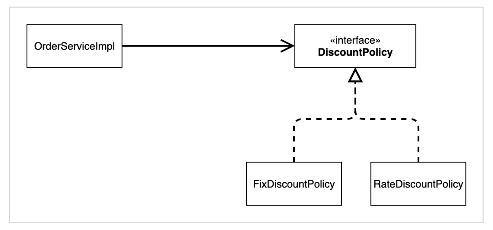
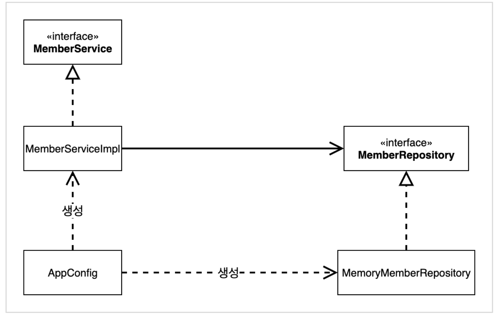
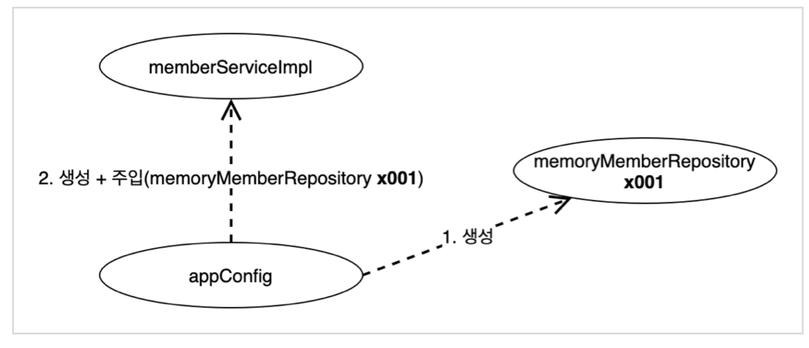
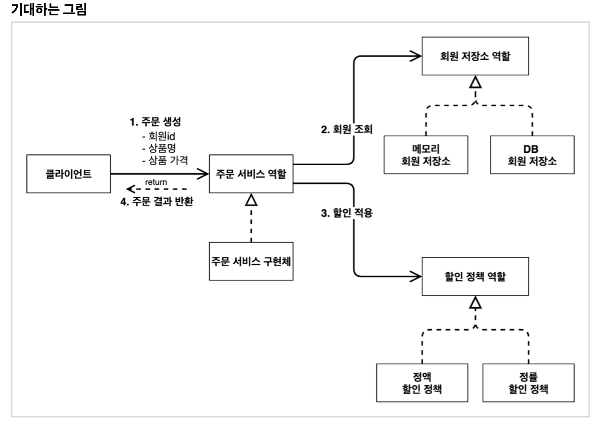

_22_02_08_

# 스프링 핵심 원리 이해 2 - 객체 지향 원리 적용

## 새로운 할인 정책
새로운 할인 정책 확장
- 악덕 기획자 : 서비스 오픈 직전에 할인 정책을 고정 금액 할인이 아니라 좀더 합리적인 정률% 할인으로 변겅하고 싶어요.

### RateDiscountPolicy 추가


할인 정책을 변경하려면 클라이언트인 OrderServiceImpl 코드를 고쳐야 함
```java
public class OrderServiceImpl implements OrderService{
    //private final DiscountPolicy discountPolicy = new FixDiscountPolicy();
    private final DiscountPolicy discountPolicy = new RateDiscountPolicy();
}
```

### 문제점
- 역할과 구현을 충실하게 분리했다? → 👌
- 다형성도 활용하고, 인터페이스와 구현 객체를 분리했다? → 👌
- OCP, DIP 같은 객체지향 설계를 충실히 준수했다?
  - → 그렇게 보이지만 사실은 ❌
- DIP : 주문 서비스 클라이언트 (OrderServiceImpl)는 DiscountPolicy 인터페이스에 의존하면서 DIP를 지킨거 같은데 ????
  - → 클래스 의존관계를 분석해 보자. 추상`(인터페이스)`뿐만 아니라 구체`(구현)`클래스에도 의존하고 있다.
    - 추상`(인터페이스)` 의존 : DiscountPolicy
    - 구체`(구현)` 클래스 : FixDiscountPolicy, RateDiscountPolicy
- OCP : 변경하지 않고 확장할 수 있다고 했는데 !!!!!
  - → 지금 코드는 기능을 확장해서 변경하면, 클라이언트 코드에 영향을 준다 ➡️ 따라서 OCP를 위반한다.


### 왜 클라이언트 코드를 변경해야 할까?
- 기대했던 의존관계

지금까지 단순히 DiscountPolicy 인터페이스에만 의존했다고 생각
- 실제 의존관계

잘보면 클라이언트인 OrderServiceImpl이 DiscountPolicy 인터페이스 뿐만 아니라 FixDiscountPolicy인 구체 클래스도 함께 의존하고 있다.  
👉 **DIP 위반!!**
- 정책 변경

중요 ! : 그래서 FixDiscountPolicy를 RateDiscountPolicy로 변경하는 순간 OrderServiceImpl의 소스 코드도 변경해야 한다‼  
👉 **OCP 위반!!**

### 해결 ‼
인터페이스에만 의존하도록 설계를 변경하자

```java
public class OrderServiceImpl implements OrderService{
    private DiscountPolicy discountPolicy;
}
```

- 변경 !
- 그런데 구현체가 없는데 어떻게 코드를 실행 ⁇
- 실행하면 NPE 발생

### 해결 방안
- 해결하려면 누군가가 클라이언트인 OrderServiceImpl에 DiscountPolicy의 구현 객체를 대신 생성하고 주입해주어야 한다.

### 관심사의 분리
- 애플리케이션을 하나의 공연이고, 각각의 인터페이스를 배역이라 생각. 그런데! 실제 배역에 맞는 배우를 선택하는 것은 누가 하는가?
- 역할을 누가 할지는 배우들이 정하는 것이 아니다. 이전의 코드는 로미오 배역의 배우가 줄리엣 역할의 배우를 직접 초빙하는 것과 같다. 로미오 배우는 공연도 하고, 동시에 줄리엣도 캐스팅해야하는 다양한 책임을 갖고 있다.

### 관심사를 분리하자
- 배우는 본인의 역할인 배역을 수행하는 것에만 집중해야 한다.
- 디카프리오는 어떤 여자 주인공이 선택되더라도 똑같이 공연할 수 있어야 한다.
- 공연을 구성하고, 담당 배우를 섭외하고, 역할에 맞는 배우를 지정하는 책임을 담당하는 별도의 공연 기획자가 나올 시점이다.
- 공연 기획자를 만들고, 배우와 공연 기획자의 책임을 확실히 분리하자.

### AppConfig
- 애플리케이션의 전체 동작 방식을 구성`(config)`하기 위해, 구현 객체를 생성하고, 연겷하는 책임을 가지는 별도의 설정 클래스를 만들자.
```java
import hello.core.member.MemberMemoryRepository;
import hello.core.member.MemberService;
import hello.core.member.MemberServiceImpl;
import hello.core.order.OrderService;
import hello.core.order.OrderServiceImpl;

public class AppConfig {
    public MemberService memberService(){
        return new MemberServiceImpl(new MemberMemoryRepository());
    }

    public OrderService orderService(){
        return new OrderServiceImpl(
                new MemberMemoryRepository(),
                new FixDiscountPolicy()
        );
    }
}
```
- AppConfig는 애플리케이션의 실제 동작에 필요한 구현 객체를 생성한다.
  - MemberServiceImpl
  - MemoryMemberRepository
  - OrderServiceImpl
  - FixDiscountPolicy
- AppConfig는 생성한 객체 인스턴스의 참조`(레퍼런스)`를 생성자를 통해서 주입`(연결)`해준다.
  - MemberServiceeImpl → MemoryMemberRepository
  - OrderServiceImpl → MemoryMemberRepository, FixDiscountPolicy

### MemberServiceImpl
- 설계 변경으로 MemberServiceImpl는 MemoryMemberRepository를 의존하지 않는다.
- 단지 MemberRepository 인터페이스만 의존한다.
- MemberServiceImpl 입장에서 생성자를 통해 어떤 구현 객체가 들어올지(주입될지)는 알 수 없다.
- MemberServiceImpl의 생성자를 통해서 어떤 구현 객체를 주입할 지는 오직 외부 `(AppCOnfig)`에서 결정된다.
- MemberServiceImpl는 이제부터 의존관계에 대한 고민은 외부에 맡기고 실행에만 집중하면 된다.

### 클래스 다이어그램

- 객체의 생성과 연결은 AppConfig가 담당
- **DIP 완성** : MemberServiceImpl은 MemberRepository인 추상에만 의존하면 된다. 이제 구체 클래스를 몰라도 된다.
- **관심사의 분리** : 객체를 생성하고 연결하는 역할과 실행하는 역할이 명확히 분리되었다.

### 회원 객체 인스턴스 다이어그램

- appConfig 객체는 memoryMemberRepository 객체를 생성하고 그 참조값을 memberServiceImpl을 생성하면서 생성자로 전달한다.
- 클라이언트인 memberServiceImpl 입장에서 보면 의존관계를 마치 외부에서 주입해 주는 것 같다고 `DI(Dependency Injection)` 우리말로 의존관계 주입 또는 의존성 주입이라고 한다.

### OrderServiceImpl
- 설계 변경으로 OrderServiceImpl는 FixDiscountPolicy를 의존하지 않는다!
- 단지 DiscountPolicy 인터페이스만 의존한다.
- OrderServiceImpl 입장에서 생성자를 통해서 어떤 구현 객체가 들어올지(주입될지)는 알 수 없다.
- OrderServiceImpl의 생성자를 통해서 어떤 구현 객체를 주입할지는 오직 외부`(AppConfig)`에서 결정한다.
- OrderServiceImpl는 이제 실행에만 집중
- OrderServiceImpl에는 MemoryMemberRepository, FixDiscountPolicy 객체의 의존관계가 주입된다.

### 정리
- AppConfig를 통해서 관심사를 확실하게 분리했다.
- 배역, 배우를 생각해보자
- AppConfig는 공연 기획자다.
- AppConfig는 구체 클래스를 선택한다. 배역에 맞는 담당 배우를 선택한다. 애플리케이션이 어떻게 동작해야 할지 전체 구성을 책임진다.
- 이제 각 배우들은 담당 기능을 실행하는 책임만 지면 된다.
- OrderServiceImpl은 기능을 실행하는 책임만 지면 된다.

### AppConfig 리팩토링
현재 AppConfig를 보면 중복이 있고, 역할에 따른 구현이 잘 안보인다.


```java
package hello.core;

import hello.core.discount.DiscountPolicy;
import hello.core.discount.FixDiscountPolicy;
import hello.core.member.MemberRepository;
import hello.core.member.MemoryMemberRepository;
import hello.core.member.MemberService;
import hello.core.member.MemberServiceImpl;
import hello.core.order.OrderService;
import hello.core.order.OrderServiceImpl;

public class AppConfig {
    public MemberService memberService(){
        return new MemberServiceImpl(memberRepository());
    }

    public OrderService orderService(){
        return new OrderServiceImpl(
                memberRepository(),
                discountPolicy()
        );
    }

    public MemberRepository memberRepository(){
        return new MemoryMemberRepository();
    }

    public DiscountPolicy discountPolicy(){
        return new FixDiscountPolicy();
    }
}
```

- `new MemeoryMemberRepository() ` 이 부분 → 이 중복 제거되었다. 이제 `MemoryMemberRepository`를 다른 구현체로 변경할 때 한 부분만 변경하면 된다.
- AppConfig를 보면 역할과 구현 클래스가 한눈에 들어온다. 애플리케이션 전체 구성이 어떻게 되었는지 빠르게 파악할 수 있다.
