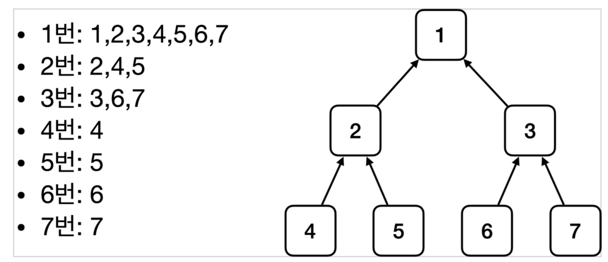

__22_02_10__

# 현재까지 정리

## 전체의 흐름 정리
- 새로운 할인 정책 개발
  - 다형성 덕분에 새로운 정률 할인 정책 코드를 추가로 개발하는 것 자체는 아무 문제가 없음
- 새로운 할인 정책 적용과 문제점
  - 새로 개발한 정률 할인 정책을 적용하려고 하니 클라이언트 코드인 주문 서비스 구현체도 함께 변경해야함
  - 주문 서비스 클라이언트가 인터페이스인 `DiscountPolicy` 뿐만 아니라, 구체 클래스인 `FixDiscountPolicy`도 함께 의존 👉 **DIP 위반**
- 관심사의 분리
  - 애플리케이션을 하나의 공연으로 생각
  - 기존에는 클라이언ㅌ가 의존하는 서버 구현 객체를 직접 생성하고, 실행함
  - 비유를 하면 기존에는 남자 주인공 배우가 공연도 하고, 다른 배우를 직접 캐스팅하는 다양한 책임을 가지고 있음
  - 공연을 구성하고, 담당 배우를 섭외하고, 지정하는 책임을 담당하는 별도의 공연 기획자가 나올 시점
  - 공연 기획자인 `AppConfig` 등장
  - `AppConfig`는 애플리케이션의 전체 동작 방식을 구성`(config)`하기 위해, 구현 객체를 생성하고, 연결하는 책임
  - 이제부터 클라이언트 객체는 자신의 역할을 실행하는 것만 집중, 권환이 줄어듬`(책임이 명확해짐)`
- `AppConfig` 리팩토링
  - 구성 정보에서 역할과 구현을 명확하게 분리
  - 역할이 잘 들어남
  - 중복 제거 
- 새로운 구조와 할인 정책 적용
  - 정액 할인 정책 → 정률% 할인 정책으로 변경
  - `AppConfig`의 등장으로 애플리케이션이 크게 사용 영역과, 객체를 생성하고 구성`(Configuration)`하는 영역으로 분리
  - 할인 정책을 변경해도 `AppConfig`가 있는  구성 영역만 변경하면 됨, 사용 영역은 변경할 필요가 없음. 물론 클라이언트 코드인 주문 서비스 코드도 변경하지 않음

## 좋은 객체 지향 설계의 5가지 원칙 적용
여기서 3가지 `SRP`, `DIP`, `OCP` 적용

### SRP (단일 책임 원리)
한 클래스는 하나의 책임만 가져야 한다.
- 클라이언트 객체는 직접 구현 객체를 생성하고, 연결하고, 실행하는 다양한 책임을 가지고 있음
- `SRP` 단일 책임 원칙을 따르면서 관심사를 분리함
- 구현 객체를 생성하고 연결하는 책임은 `AppConfig`가 담당
- 클라이언트 객체는 실행하는 책임만 담당

### DIP (의존관계 역전 원칙)
프로그래머는 "추상화에 의존해야지, 구체화에 의존하면 안된다." 의존성 주입은 이 원칙을 따르는 방법 중 하나
- 새로운 할인 정책을 개발하고, 적용하려고 하니 클라이언트 코드도 함께 변경해야 했다. 왜냐하면 기존 클라이언트 코드`(OrderServiceImpl)`는 DIP를 지키며 `DiscountPolicy` 추상화 인터페이스에 의존하는 것 같았지만, `FixDiscountPolicy` 구체화 구현 클래스에도 의존했다.
- 클라이언트 코드가 `DiscountPolicy` 추상화 인터페이스에만 의존하도록 코드를 변경했음
- 하지만 클라이언트 코드는 인터페이스만으로는 아무것도 실행할 수 없음.
- `AppConfig`가 `FixDiscountPoliy` 객체 인스턴스를 클라이언트 코드 대신 생성해서 클라이언트 코드에 의존관계를 주입했음. 이렇게해서 DIP원칙을 따르면서 문제도 해결

### OPC (개방-폐쇄 원칙)
소프트웨어 요소는 확장에 열려있으나 변경에는 닫혀있어야 한다.
- 다형성 사용하고 클라이언트가 DIP를 지킴
- 애플리케이션을 사용 영역과 구성 영역으로 나눔
- `AppConfig`가 의존관계를 `FixDiscountPolicy` → `RateDiscountPolicy`로 변경해서 클라이언트 코드에 주입하므로 클라이언트 코드는 변경하지 않아도 됨
- 소프트웨어 요소를 새롭게 확장해도 사용 영역의 변경은 닫혀 있다 ‼️

# IOC, DI 그리고 컨테이너
## 제어의 역전 `IoC(Inversion Of Control)`
- 기존 프로그램은 클라이언트 구현 객체가 스스로 필요한 서버 구현 객체를 생성하고, 연결하고 실행했다. 한마디로 구현 객체가 프로그램의 제어 흐름을 스스로 조종했다. 개발자 입장에서는 자연스러운 흐름
- 반면에 `AppConfig`가 등장한 이후에 구현 객체는 자신의 로직을 실행하는 역할만 담당한다. 프로그램 제어  흐름은 이제 `AppConifg`가 가져간다. 예를 들어서 `OrderServiceImpl`은 필요한 인터페이스를 호출하지만 어떤 구현 객체들이 실행될지 모른다.
- 프로그램에 대한 제어 흐름에 대한 권한은 모두 `AppConfig`가 가지고 있다. 심지어 `OrderServiceImpl`도 `AppConfig`가 생성한다. 그리고 `AppConfig`는 `OrderServiceImpl`가 아닌 `OrderService` 인터페이스의 다른 구현 객체를 생성하고 실행할 수 있다. 그런 사실을 모른체 `OrderServiceImpl`는 자신의 로직을 실행할 뿐
- 이렇게 프로그램의 제어 흐름을 직접 제어하는 것이 아니라 외부에서 관리하는 것을 `제어의 역전(IoC)`이라 한다.

### 프레임워크 vs 라이브러리
- 프레임워크는 내가 작성한 코드를 제어하고, 대신 실행하면 그것은 프레임워크 (JUnit)
- 반면에 내가 작성한 코드가 직접 제어의 흐름을 담당한다면 그것은 라이브러리

## 의존관계 주입`DI(Dependency Injection)`
- `OrderServiceImpl`은 `DiscountPolicy` 인터페이스에 의존했다. 실제 어떤 구현 객체가 사용될지는 모른다.
- 의존관계는 **정적인 클래스 의존 관계와, 실행 시점에 결정되는 동적인 객체(인스턴스) 의존 관계 둘을** 분리해서 생각해야 한다.

### 정적인 클래스 의존관계
클래스가 사용하는 import 코드만 보고 의존관계를 쉽게 판단할 수 있다. 정적인 의존관계는 애플리케이션을 실행하지 않아도 분석할 수 있다. 클래스 다이어그램을 보자  
`OrderServiceImpl`은 `MemberRepository`, `DiscountPolicy`에 의존한다는 것을 알 수 있다.  
그런데 이러한 클래스 의존관계만으로는 실제 어떤 객체가 `OrderServiceImpl`에 주입될지 알 수 없다.


### 동적인 객체 인스턴스 의존관계
애플리케이션 실행 시점에 실제 생성된 객체 인스턴스의 참조가 연결된 의존 관계다.

- **애플리케이션 실행 시점(런타임)에 외부에서 실제 구현 객체를 생성하고 클라이언트에 전달해서 클라이언트와 서버의 실제 의존관계가 연결되는 것을 의존관계 주입**이라 한다.
- 객체 인스턴스를 생성하고, 그 참조값을 전달해서 연결된다.
- 의존관계 주입을 사용하면 클라이언트 코드를 변경하지 않고, 클라이언트가 호출하는 대상의 타입 인스턴스를 변경할 수 있다.
- 의존관계 주입을 사용하면 정적인 클래스 의존관계를 변경하지 않고, 동적인 객체 인스턴스 의존관계를 쉽게 변경할 수 있다.


## IoC 컨테이너, DI 컨테이너
- `AppCofing` 처럼 객체를 생성하고 관리하면서 의존관계를 연결해주는 것을 
- `IoC 컨테이너` 또는 `DI 컨테이너`라 한다.
- 의존관계 주입에 초점을 맞추어 최근에는 주로 `DI 컨테이너`라고 한다.
- 또는 어셈블러, 오브젝트 팩토리등으로 불리기도 한다. 


# 스프링으로 전환하기
```java
package hello.core;

import hello.core.discount.DiscountPolicy;
import hello.core.discount.FixDiscountPolicy;
import hello.core.member.MemberRepository;
import hello.core.member.MemoryMemberRepository;
import hello.core.member.MemberService;
import hello.core.member.MemberServiceImpl;
import hello.core.order.OrderService;
import hello.core.order.OrderServiceImpl;
import org.springframework.context.annotation.Bean;
import org.springframework.context.annotation.Configuration;

@Configuration
public class AppConfig {
    @Bean
    public MemberService memberService(){
        return new MemberServiceImpl(memberRepository());
    }

    @Bean
    public OrderService orderService(){
        return new OrderServiceImpl(
                memberRepository(),
                discountPolicy()
        );
    }

    @Bean
    public MemberRepository memberRepository(){
        return new MemoryMemberRepository();
    }

    @Bean
    public DiscountPolicy discountPolicy(){
        return new FixDiscountPolicy();
    }
}
```
- AppConfig에 설정을 구성한다는 뜻의 `@Configuration`을 붙여준다.
- 각 메서드에 `@Bean`을 붙여준다. 이렇게하면 스프링 컨테이너에 스프링 빈으로 등록한다.

```java
package hello.core;

import hello.core.member.Grade;
import hello.core.member.Member;
import hello.core.member.MemberService;
import hello.core.member.MemberServiceImpl;
import org.springframework.context.ApplicationContext;
import org.springframework.context.annotation.AnnotationConfigApplicationContext;

public class MemberApp {
    public static void main(String[] args) {
        /*AppConfig appConfig = new AppConfig();
        MemberService memberService = appConfig.memberService();*/

        ApplicationContext applicationContext = new AnnotationConfigApplicationContext(AppConfig.class);
        MemberService memberService = applicationContext.getBean("memberService", MemberService.class);
        Member member = new Member(1L, "memberA", Grade.VIP);
        memberService.join(member);

        Member findMember = memberService.findMember(1L);
        System.out.println("new Member = " + member.getName());
        System.out.println("find Member = " + findMember.getName());

    }
}
```
```java
package hello.core;

import hello.core.member.Grade;
import hello.core.member.Member;
import hello.core.member.MemberService;
import hello.core.order.Order;
import hello.core.order.OrderService;
import org.springframework.context.ApplicationContext;
import org.springframework.context.annotation.AnnotationConfigApplicationContext;

public class OrderApp {
    public static void main(String[] args) {
/*        AppConfig appConfig = new AppConfig();
        MemberService memberService = appConfig.memberService();
        OrderService orderService = appConfig.orderService();*/

        ApplicationContext applicationContext = new AnnotationConfigApplicationContext(AppConfig.class);
        MemberService memberService = applicationContext.getBean("memberService", MemberService.class);
        OrderService orderService = applicationContext.getBean("orderService", OrderService.class);

        long memberId = 1L;
        Member member = new Member(memberId, "memberA", Grade.VIP);
        memberService.join(member);

        Order order =  orderService.createOrder(memberId, "itemA", 10000);

        System.out.println("order = " + order);
    }
}
```

### 스프링 컨테이너 
- `ApplicationContext`를 `스프링 컨테이너`라고 한다.
- 기존에는 개발자가 `AppConfig`를 사용해서 직접 객체를 생성하고 `DI`를 했지만, 이제부터는 스프링 컨테이너를 통해서 사용한다.
- 스프링 컨테이너는 `@Configuration`이 붙은 `AppConfig`를 설정(구성)정보로 사용한다. 여기서 `@Bean`이라 적힌 메서드를 모두 호출해서 반환된 객체를 스프링 컨테이너에 등록한다. 이렇게 스프링 컨테이너에 등록된 객체를 `스프링 빈`이라고 한다.
- 스프링 빈은 `@Bean`이 붙은 메서드 명을 스프링 빈의 이름으로 사용한다.
- 이전에는 개발자가 필요한 객체를 `AppConfig`를 사용해서 직접 조회했지만, 이제부터는 스프링 컨테이너를 통해서 스프링 빈(객체)를 찾아야 한다. 스프링 빈은 `applicationContext.getBean()` 메서드를 사용해서 찾을 수 있다.
- 기존에는 개발자가 직접 자바코드로 모든 것을 했다면 이제부터는 스프링 컨테이너에 객체를 스프링 빈으로 등록하고, 스프링 컨테이너에서 스프링 빈을 찾아서 사용하도록 변경되었다.

# 스프링 컨테이너와 스프링 빈
## 스프링 컨테이너 생성
스프링 컨테이너가 생성되는 과정
```java
//스프링 컨테이너 생성
ApplicationContext applicationContext = 
						new AnnotationConfigApplicationContext(AppConfig.class);
```
- `ApplicationContext`를 스프링 컨테이너라 한다. 
- `ApplicationContext`는 인터페이스이다.
- 스프링 컨테이너는 XML을 기반으로 만들 수 있고, 애노테이션 기반의 자바 설정 클래스로 만들 수 있다.
- 직전에 `AppConfig`를 사용했던 방식이 애노테이션 기반의 자바 설정 클래스로 스프링 컨테이너를 만든 것이다.
- 자바 설정 클래스를 기반으로 `스프링 컨테이너(ApplicationContext)`를 만들어보자
  - `new AnnotationConfigApplicationContext(AppConfig.class);`
  - 이 클래스는 `ApplicationContext` 인터페이스의 구현체이다.

### 생성 과정
1. 스프링 컨테이너 생성

   - `new AnnotationConfigApplicationContext(AppConfig.class)`
   - 스프링 컨테이너를 생성할 때는 구성 정보를 지정해주어야 한다.
   - 여기서는 `AppConfig.class`를 구성 정보를 지정했다.
2. 스프링 빈 등록

   - 스프링 컨테이너는 파라미터로 넘어온 설정 클래스 정보를 사용해서 스프링 빈을 등록한다.

✅ 빈 이름
- 빈 이름은 메서드 이름을 사용한다.
- 빈 이름을 직접 부여할 수 도 있다. 
  - `@Bean(name="memberService")`
> 주의 : 빈 이름은 항상 다른 이름을 부여해야 한다. 같은 이름을 부여하면, 다른 빈이 무시되거나, 기존 빈을 덮어버리거나 설정에 따라 오류가 발생한다.

3. 스프링 빈 의존관계 설정 - 준비

4. 스프링 빈 의존관계 설정 - 완료

  - 스프링 컨테이너는 설정 정보를 참고해서 의존관계를 주입(DI)한다.
  - 단순히 자바 코드를 호출하는 것 같지만, 차이가 있다.

> 참고 : 스프링은 빈을 생성하고, 의존관계를 주입하는 단계가 나누어져 있다. 그런데 이렇게 자바 코드로 스프링 빈을 등록하면 생성자를 호출하면서 의존관계를 주입도 한번에 처리된다. 여기서는 이해를 돕기 위해 개념적으로 나누어 설명

### 정리 
스프링 컨테이너를 생성하고, 생성(구성)정보를 참고해서 스프링 빈도 등록하고, 의존관계도 설정했다. 이제 스프링 컨테이너에서 데이터를 조회해보자.
- 모든 빈 출력하기 
  - 실행하면 스프링에 등록된 모든 빈 정보를 출력할 수 있다.
  - `ac.getBeanDefinitionNames()` : 스프링에 등록된 모든 빈 이름을 조회한다. 
  - `ac.getBean()` : 빈 이름으로 빈 객체(인스턴스)를 조회한다.
- 애플리케이션 빈 출력하기
  - 스프링이 내부에서 사용하는 빈은 제외하고, 내가 등록한 빈만 출력해보자
  - 내부에서 사용하는 빈은 `getRole()`로 구분할 수 있다.
    - `ROLE_APPLICATION` : 일반적으로 사용자가 정의한 빈
    - 'ROLE_INFRASTRUCTURE' : 스프링이 내부에서 사용하는 빈

### 스프링 빈 조회 - 기본
스프링 컨테이너에서 스프링 빈을 찾는 가장 기본적인 조회 방법
- `ac.getBean(빈 이름, 타입)`
- `ac.getBean(타입)`
- 조회 대상 스프링 빈이 없으면 예외 발생
  - `NoSuchBeanDefinitionException: No bean named 'xxxx' available`

### 스프링 빈 조회 - 동일한 타입이 둘 이상
- 타입으로 조회 시 같은 타입의 스프링 빈이 둘 이상이면 오류가 발생한다. 이때는 빈 이름을 지정한다.
- `ac.getBeansOfType()`을 사용하면 해당 타입의 모든 빈을 조회할 수 있다.

### 스프링 빈 조회 - 상속 관계
- 부모 타입으로 조회하면, 자식 타입도 함께 조회한다.
- 그래서 모든 자바 객체의 최고 부모인 Object 타입으로 조회하면, 모든 스프링 빈을 조회했다.


## Bean Factory와 ApplicationContext
`beanFactory`와 `ApplicationContext`에 대해서 알아보자


### Bean Factory
- 스프링 컨테이너의 최상위 인터페이스이다. 
- 스프링 빈을 관리하고 조회하는 역할을 담당한다. 
- `getBean()`을 제공한다. 
- 지금까지 우리가 사용했던 대부분의 기능은 `BeanFactory`가 제공하는 기능이다.

### ApplicationContext
- `BeanFactory` 기능을 모두 상속받아서 제공한다. 
- 빈을 관리하고 검색하는 기능을 `BeanFactory`가 제공해주는데, 둘의 차이?
- 애플리케이션을 개발할 때는 빈을 관리하고 조회하는 기능은 물론이고, 수많은 부가기능이 필요하다.

### ApplicationContext가 제공하는 부가기능

- 메시지소스를 활용한 국제화 기능
  - EX. 한국에서 들어오면 한국어로, 영어권에서 들어오면 영어로 출력
- 환경변수
  - 로컬, 개발, 운영등을 구분해서 처리
- 애플리케이션 이벤트
  - 이벤트를 발행하고 구독하는 모델을 편리하게 지
- 편리한 리소스 조회
  - 파일, 클래스 패스, 외부등에서 리소스를 편리하게 조회

### 정리 
- `ApplicationContext`는 `BeanFactory`의 기능을 상속받는다.
- `ApplicationCOntext`는 빈 관리 기능 + 편리한 부가 기능을 제공한다. 
- `BeanFactory`를 직접 사용할 일은 없다. 부가기능이 포함된 `ApplicationContext`를 사용한다.
- `BeanFactory`나 `ApplicationContext`를 스프링 컨테이너라 한다.


## 다양한 설정 형식 지원 - 자바 코드, XML
- 스프링 컨테이너는 다양한 형식의 설정 정보를 받아드릴 수 있게 유연하게 설계되어 있다.
- 자바 코드, XML, Groovy 등등


### 애노테이션 기반 자바 코드 설정 사용
- 지금까지 한 것들
- `new AnnotationConfigApplicationContext(AppConfig.class)`
- `AnnotationConfigApplicationContext` 클래스를 사용하면서 자바 코드로된 설정 정보를 넘기면 된다.

### XML 설정 사용
- 최근에는 스프링 부트를 많이 사용하면서 XML 기반의 설정은 잘 사용하지 않는다. 
- `GenericXmlApplicationContext`를 사용하면서 xml설정 파일을 넘기면 된다. 

### 스프링 빈 설정 메타 정보 - BeanDefinition
- 스프링은 어떻게 이런 다양한 설정 형식을 지원? → 그 중심에는 `BeanDefinition`이라는 추상화가 존재
- **역할과 구현을 개념적으로 나눈 것**
  - XML을 읽어서 `BeanDefinition`을 만들면 된다.
  - 자바 코드를 읽어서 `BeanDefinition`을 만들면 된다.
  - 스프링 컨테이너는 자바 코드인지, XML인지 몰라도 된다. 오직 `BeanDefinition`만 알면된다.
- `BeanDefinition`을 빈 설정 메타정보라 한다. 
  - `@Bean, <bean>` 당 각각 하나씩 메타 정보가 생성된다.
- 스프링 컨테이너는 이 메타 정보를 기반으로 스프링 빈을 생성한다.

## ↓

- `AnnotationConfigApplicationContext`는 `AnnotationBeanDefinitionReader`를 사용해서 `AppConfig.class`를 읽고 `BeanDefinition`을 생성한다.
- `GenericXmlApplicationContext`는 `XmlBeanDefinitionReader`를 사용해서 `appConfig.xml` 설정 정보를 읽고, `BeanDefinition` 을 생성한다.
- 새로운 형식의 설정 정보가  추가되면 `XxxBeanDefinitionReader`를 만들어서 `BeanDefinition`을 생성하면 된다.

### BeanDefinition 살펴보기
`BeanDefinition` 정보
- BeanClassName : 생성할 빈의 클래스 명(자바 설정 처럼 팩토리 역할의 빈을 사용하면 없음)
- factoryBeanName : 팩토리 역할의 빈을 사용할 경우 이름, EX) appConfig
- factoryMethodName : 빈을 생성할 팩토리 메서드 이름, EX) memberService
- Scope : 싱글톤(기본값)
- lazyInit : 스프링 컨테이너를 생성할 때 빈을 생성하는 것이 아니라, 실제 빈을 사용할 때까지 최대한 생성을 지연 처리하는지 여부
- InitMethodName : 빈을 생성하고, 의존관계가 적용한 뒤에 호출되는 초기화 메서드 명
- DestroyMethodName : 빈의 생명주기가 끝나서 제거하기 직전에 호출되는 메서드 명
- Constructor argument, Properties : 의존 관계 주입에서 사용한다. (자바 설정처럼 팩토리 역할의 빈을 사용하면 없음)