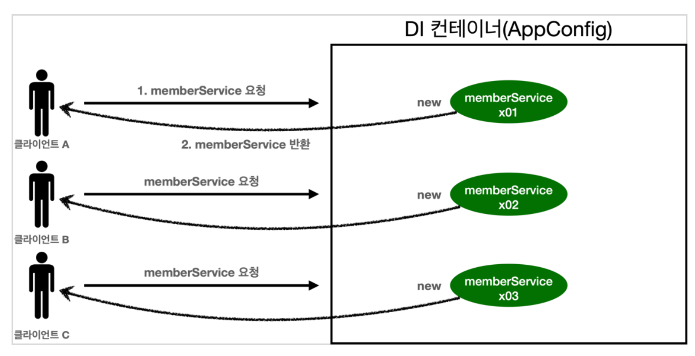
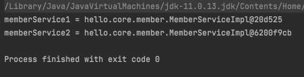
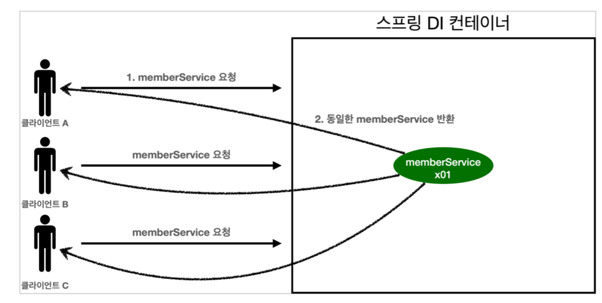
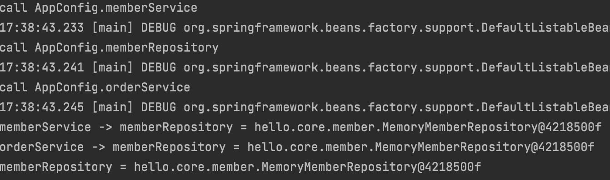
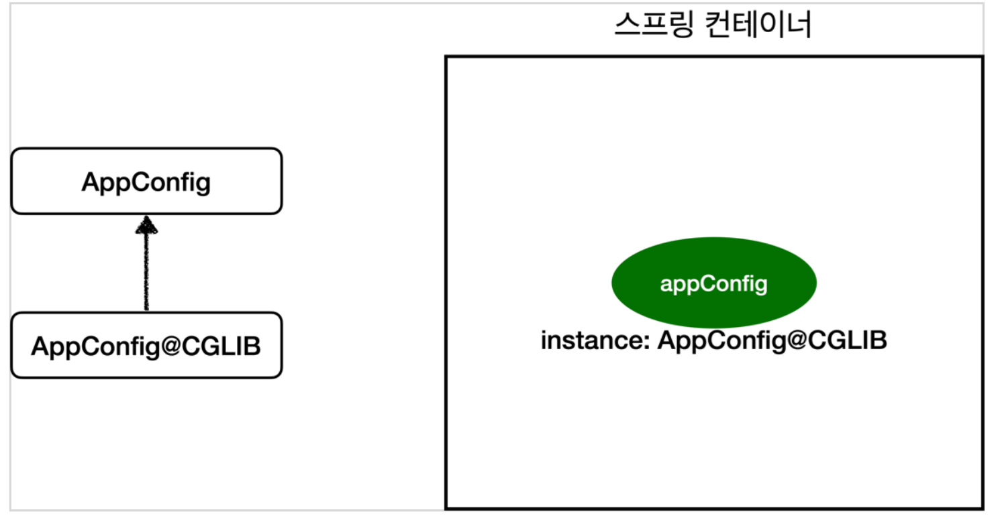
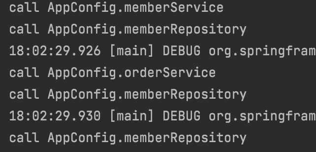
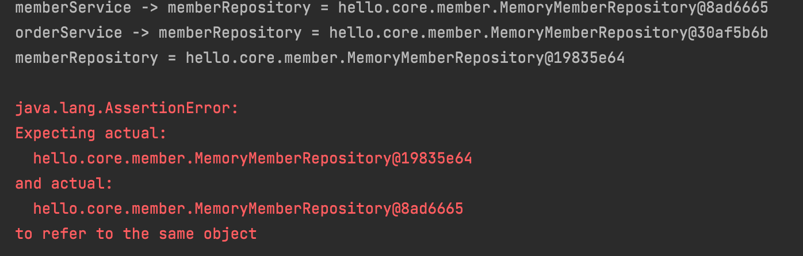

__22_02_10__

# 싱글톤 컨테이너
## 웹 애플리케이션과 싱글톤
- 스프링은 태생이 기업용 온라인 서비스 기술을 지원하기 위해 탄생
- 대부분의 스프링 애플리케이션은 웹 애플리케이션이다. 물론 웹이 아닌 애플리케이션 개발도 얼마든지 개발할 수 있다.
- 웹 애플리케이션은 보통 여러 고객이 동시에 요청을 한다.



- 우리가 만들었던 스프링 없는 순수한 DI컨테이너인 `AppConfig`는 요청할 때마다 객체를 새로 생성
- 고객 트래픽이 초당 100이 나오면 초당 100개인 객체가 생성되고 소멸 ‼ → 메모리 낭비
- 해결방안은 해당 객체가 딱 1개만 생성되고 공유하도록 설계하면 된다. → 싱글톤 패턴


## 싱글톤 패턴
- 클래스의 인스턴스가 딱 1개만 생성되는 것을 보장하는 디자인 패턴
- 그래서 객체 인스턴스가 2개이상 생성되지 못하도록 막아야한다.
  - private 생성자를 사용해서 외부에서 임의로 new 키워드를 사요하지 못하도록 막야야한다.
- 싱글톤 패턴을 적용하면 고객의 요청이 올 때마다 객체를 생성하는 것이 아니라, 이미 만들어진 객체를 공유해서 효율적으로 사용할 수 있다.

### 문제점
- 싱글톤 패턴을 구현하는 코드 자체가 많이 들어간다.
- 의존관계상 클라이언트가 구체 클래스에 의존한다. → **DIP를 위반**
- 클라이언트가 구체 클래스에 의존해서 **OCP 원칙을 위반할 가능성이 높다.**
- 테스트하기 어렵다.
- 내부 속성을 변경하거나 초기화하기 어렵다.
- private 생성자로 자식 클래스를 만들기 어렵다.
- 결론적으로 유연성이 떨어진다.
- 안티패턴으로 불리기도 한다.


## 싱글톤 컨테이너
스프링 컨테이너는 싱글톤 패턴의 문제점을 해결하면서, 객체 인스턴스를 싱글톤(1개만 생성)으로 관리
지금까지 우리가 학습한 스프링 빈이 바로 싱글톤으로 관리되는 빈

### 싱글톤 컨테이너
- 스프링 컨테이너는 싱글톤 패턴을 적용하지 않아도, 객체 인스턴스를 싱글톤으로 관리한다.
  - 이전에 설명한 컨테이너 생성 과정 → 컨테이너는 하나만 생성해서 관리
- 스프링 컨테이너는 싱글톤 컨테이너 역할 → 이렇게 싱글톤 객체를 생성하고 관리하는 기능을 `싱글톤 레지스트리`라 함
- 스프링 컨테이너의 이런 기능 덕분에 싱글톤 패턴의 모든 단점을 해결하면서 객체를 싱글톤으로 유지할 수 있다.
  - 싱글톤 패턴을 위한 지저분한 코드가 들어가지 않아도 된다.
  - `DIP`, `OCP`, `테스트`, `private 생성자`로 부터 자유롭게 싱글톤을 사용할 수 있다.

#### 싱글톤 컨테이너 적용 후 

- 스프링 컨테이너 덕분에 고객의 요청이 올 때마다 객체를 생성하는 것이 아니라, 이미 만들어진 객체를 공유해서 효율적으로 재사용할 수 있다.

#### 주의점
- 싱글톤 패턴이든, 스프링 같은 싱글톤 컨테이너를 사용하든, 객체 인스턴스를 하나만 생성해서 공유하는 싱글톤 방식은 여러 클라이언트가 하나의 같은 객체 인스턴스를 공유하기 때문에 싱글톤 객체는 상태를 유지(stateful)하게 설계하면 된다.
- `무상태(stateless)`하게 설계해야 한다.‼️
  - 특정 클라이언트에 의존적인 필드가 있으면 안된다. 
  - 특정 클라이언트가 값을 변경할 수 있는 필드가 있으면 안된다.
  - 가급적 읽기만 가능해야 한다.
  - 필드 대신에 자바에서 `공유되지 않는`, 지역 변수, 파라미터, ThreadLocal등을 사용해야 한다.
- 스프링 빈의 필드에 공유 값을 설정하면 정말 큰 장애가 발생할 수 있다.

##### 상태를 유지할 경우 발생하는 문제점 예시
```java
package hello.core.singleton;

public class StatefulService {

    private int price;

    public void order(String name, int price) {
        System.out.println("name = " + name + " price = " + price);
        this.price = price; // 여기가 문제
    }

    public int getPrice() {
        return price;
    }
}

```
```java
package hello.core.singleton;

import org.assertj.core.api.Assertions;
import org.junit.jupiter.api.Test;
import org.springframework.context.ApplicationContext;
import org.springframework.context.annotation.AnnotationConfigApplicationContext;
import org.springframework.context.annotation.Bean;

public class StatefulServiceTest {

    @Test
    void statefulServiceSingleton() {
        ApplicationContext ac = new AnnotationConfigApplicationContext(TestConfig.class);
        StatefulService statefulService1 = ac.getBean("statefulService", StatefulService.class);
        StatefulService statefulService2 = ac.getBean("statefulService", StatefulService.class);

        // ThreadA : A사용자 10000원 주문
        statefulService1.order("userA", 10000);
        // ThreadB : B사용자 20000원 주문
        statefulService2.order("userB", 20000);

        // ThreadA : 사용자A 주문 금액 조회
        int price = statefulService1.getPrice();
        // ThreadA : 사용자ASMS 10000원을 기대했지만, 기대와 다르게 20000원 출력
        System.out.println("price = " + price);

        Assertions.assertThat(statefulService1.getPrice()).isEqualTo(20000);
    }

    static class TestConfig {

        @Bean
        public StatefulService statefulService(){
            return new StatefulService();
        }
    }
}

```

- 최대한 단순히 설명하기 위해, 실제 쓰레드는 사용하지 않았다.
- ThreadA가 사용자A 코드를 호출하고 ThreadB가 사용자B 코드를 호출
- `StatefulService`의 `price`필드는 공유되는 필드인데, 특정 클라이언트가 값을 변경
- 사용자A의 주문금액은 10,000원이 되어야 하는데, 20,000원이라는 결과
- **진짜 공유필드는 조심해야 한다! 스프링 빈은 항상`무상태(stateless)`로 설계하자**


## @Configuration과 싱글톤
그런데 이상한점 !!! `AppConfig`를 보자
```java
package hello.core;

import hello.core.discount.DiscountPolicy;
import hello.core.discount.FixDiscountPolicy;
import hello.core.member.MemberRepository;
import hello.core.member.MemoryMemberRepository;
import hello.core.member.MemberService;
import hello.core.member.MemberServiceImpl;
import hello.core.order.OrderService;
import hello.core.order.OrderServiceImpl;
import org.springframework.context.annotation.Bean;
import org.springframework.context.annotation.Configuration;

@Configuration
public class AppConfig {
    @Bean
    public MemberService memberService(){
        return new MemberServiceImpl(memberRepository());
    }

    @Bean
    public OrderService orderService(){
        return new OrderServiceImpl(
                memberRepository(),
                discountPolicy()
        );
    }

    @Bean
    public MemberRepository memberRepository(){
        return new MemoryMemberRepository();
    }

    @Bean
    public DiscountPolicy discountPolicy(){
        return new FixDiscountPolicy();
    }
}

```
- `memberService` 빈을 만드는 코드를 보면 `memberRepository()`를 호출
  - 이 메서드를 호출하면 `new MemoryMemberRepository()`를 호출
- `orderServce` 빈을 만드는 코드도 동일하게 `memberRepository()`를 호출
  - 이 메서드를 호출하면 `new MemoryMemberRepository()`를 호출

결과적으로 각각 다른 2개의 `MemoryMemberRepository`가 생성되면서 싱글톤이 깨지는 것처럼 보인다.  
스프링 컨테이너는 이 문제를 어떻게 해결????

#### 직접 테스트 해보자.
검증 용도의 코드 추가
```java
public class MemberServiceImpl implements MemberService {
      private final MemberRepository memberRepository;
//테스트 용도
public MemberRepository getMemberRepository() {
          return memberRepository;
      }
  }
  public class OrderServiceImpl implements OrderService {
      private final MemberRepository memberRepository;
//테스트 용도
public MemberRepository getMemberRepository() {
          return memberRepository;
      }
}
```
- 테스트를 위해 MemberRepository를 조회할 수 있는 기능을 추가한다. 기능 검증을 위해 잠깐 사용하는 것이니 인터페이스에 조회기능까지 추가하지는 말자

테스트 코드
```java
package hello.core.singleton;

import hello.core.AppConfig;
import hello.core.member.MemberRepository;
import hello.core.member.MemberServiceImpl;
import hello.core.order.OrderServiceImpl;
import org.assertj.core.api.Assertions;
import org.junit.jupiter.api.Test;
import org.springframework.context.ApplicationContext;
import org.springframework.context.annotation.AnnotationConfigApplicationContext;

import static org.assertj.core.api.Assertions.assertThat;

public class ConfigurationSingleTonTest {

    @Test
    void configurationTest() {
        ApplicationContext ac = new AnnotationConfigApplicationContext(AppConfig.class);

        MemberServiceImpl memberService = ac.getBean("memberService", MemberServiceImpl.class);
        OrderServiceImpl orderService = ac.getBean("orderService", OrderServiceImpl.class);
        MemberRepository memberRepository = ac.getBean("memberRepository", MemberRepository.class);

        // 모두 같은 인스턴스를 참고하고 있다.
        System.out.println("memberService -> memberRepository = " + memberService.getMemberRepository());
        System.out.println("orderService -> memberRepository = " + orderService.getMemberRepository());
        System.out.println("memberRepository = " + memberRepository);

        // 모두 같은 인스턴스를 참고하고 있다.
        assertThat(memberService.getMemberRepository()).isSameAs(memberRepository);
        assertThat(orderService.getMemberRepository()).isSameAs(memberRepository);
    }
}

```
- 확인해보면 `memberRepository` 인스턴스는 모두 같은 인스턴스가 공유되어 사용된다.
- `AppConfig`의 자바 코드를 보면 각각 2번 `new MemoryMemberRepository` 호출해서 다른 인스턴스가 생성되어야 하는데?
- 어떻게 된 일일까? 혹시 두 번 호출이 안되는 것일까? 실험을 통해 알아보자

AppConfig에 호출 로그 남김
```java
package hello.core;

import hello.core.discount.DiscountPolicy;
import hello.core.discount.FixDiscountPolicy;
import hello.core.member.MemberRepository;
import hello.core.member.MemoryMemberRepository;
import hello.core.member.MemberService;
import hello.core.member.MemberServiceImpl;
import hello.core.order.OrderService;
import hello.core.order.OrderServiceImpl;
import org.springframework.context.annotation.Bean;
import org.springframework.context.annotation.Configuration;

@Configuration
public class AppConfig {
    @Bean
    public MemberService memberService(){
        // 1번
        System.out.println("call AppConfig.memberService");
        return new MemberServiceImpl(memberRepository());
    }

    @Bean
    public OrderService orderService(){
        // 1번
        System.out.println("call AppConfig.orderService");
        return new OrderServiceImpl(
                memberRepository(),
                discountPolicy()
        );
    }

    @Bean
    public MemberRepository memberRepository(){
        // 2번? 3번?
        System.out.println("call AppConfig.memberRepository");
        return new MemoryMemberRepository();
    }

    @Bean
    public DiscountPolicy discountPolicy(){
        return new FixDiscountPolicy();
    }
}

```

스프링 컨테이너가 각각 `@Bean`을 호출해서 스프링 빈을 생성한다. 그래서 `memberRepository()`는 다음과 같이 총 3번이 호출되어야 하는 것 아닐까?
1. 스프링 컨테이너가 스프링 빈에 등록하기 위해 `@Bean`이 붙어있는 `memberRepository()`호출
2. `memberService()`로직에서 `memberRepository()` 호출
3. `orderService()`로직에서 `memberRepository()` 호출

그런데 출력 결과는 모두 1번만 호출된다.



## @Configuration과 바이트코드 조작의 마법
스프링 컨테이너는 싱글톤 레지스트리다. 따라서 스프링 빈이 싱글톤이 되도록 보장해주어야 한다. 그런데 스프링이 자바 코드까지 어떻게 하기는 어렵다. 저 자바 코드를 보면 분명 3번 호출되어야 하는 것이 맞다.   
그래서 스프링은 클래스의 바이트코드를 조작하는 라이브러리를 사용한다.   
모든 비밀은 `@Configuration`을 적용한 `AppConfig`에 있다.

다음 코드를 보자
```java
 @Test
    void configurationDeep(){
        ApplicationContext ac = new AnnotationConfigApplicationContext(AppConfig.class);

        // AppConfig도 스프링 빈으로 등록된다.
        AppConfig bean = ac.getBean(AppConfig.class);
        System.out.println("bean = " + bean.getClass());

    }
```
- 사실 `AnnotationConfigApplicationContext`에 파라미터로 넘긴 값은 스프링 빈으로 등록된다. 그래서 `AppConfig`도 스프링 빈이 된다.
- `AppConfig` 스프링 빈을 조회해서 클래스 정보를 출력해보자


순수한 클래스라면 다음과 같이 출력되어야 한다.
```
class hello.core.AppConfig
```

그런데 예상과는 다르게 클래스 명에 xxxCGLIB라는 바이트코드 조작 라이브러리를 사용해서 AppConfig 클래스를 상속받은 임의의 다른 클래스를 만들고 그 다른 클래스를 스프링 빈으로 등록한 것이다!


그 임의의 다른 클래스가 바로 싱글톤이 보장되도록 해준다. 아마도 다음과 같이 바이트 코드를 조작해서 작성되어 있을 것이다.(실제로는 CGLIB의 내부 기술을 사용하는데 매우 복잡하다.)

#### AppConfig@CGLIB 예상 코드
```java
Bean
public MemberRepository memberRepository() {
        if (memoryMemberRepository가 이미 스프링 컨테이너에 등록되어 있으면?) { 
            return 스프링 컨테이너에서 찾아서 반환;
        } else { //스프링 컨테이너에 없으면
        기존 로직을 호출해서 MemoryMemberRepository를 생성하고 스프링 컨테이너에 등록 
        return 반환
        } }
```

- `@Bean`이 붙은 메서드마다 이미 스프링 빈이 존재하는 빈을 반환하고, 스프링 빈이 없으면 생성해서 스프링 빈으로 등록하고 반환하는 코드가 동적으로 만들어진다.
- 덕분에 싱글톤이 보장되는 것

> 참고 : AppConfig@CGLIB는 AppConfig의 자식 타입이므로, AppConfig 타입으로 조회 할 수 있다.

##### `@Coonfiguration`을 적용하지 않고, `@Bean`만 적용하면 어떻게 될까?
`@Configuration`을 붙이면 바이트코드를 조작하는 CGLIB기술을 사용해서 싱글톤을 보장하지만, 만약 `@Bean`만 적용하면 어떻게 될까?

이 출력 결과를 통해서 `AppConfig`가 CGLIB 기술없이 순수한 `AppConfig`로 스프링 빈에 등록된 것을 확인할 수 있다.

이 출력 결과를 통해서 `MemberRepository`가 총 3번 호출된 것을 알 수 있다. 1번은 `@Bean`에 의해 스프링 컨테이너에 등록하기 위해서이고, 2번은 각각 `memberRepository()`를 호출하면서 발생한 코드다.

###### 인스턴스가 같은지 테스트 결과

당연히 테스트도 실패고, 각각 다 다른 `MemoryMemberRepository`인스턴스를 가지고 있다.

### 정리 
- `@Bean`만 사용해도 스프링 빈으로 등록되지만, 싱글톤을 보장하지 않는다.
  - `memberRepository()`처럼 의존관계 주입이 필요해서 메서드를 직접 호출할 때 싱글톤을 보장하지 않음
- 스프링 설정 정보는 항상 `@Configuration`을 사용하자
