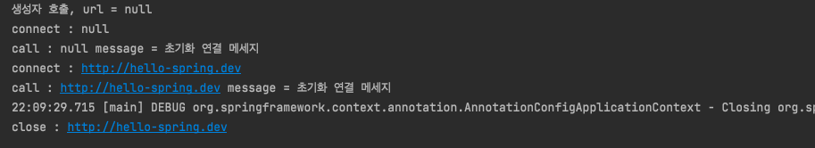

__22_02_15__

# 빈 생명주기 콜백 시작
데이터베이스 커넥션 풀이나, 네트워크 소켓처럼 애플리케이션 시작 시점에 필요한 연결을 미리 해두고, 애플리케이션 종료 시점에 연결을 모두 종료하는 작업을 진행하려면, 객체의 초기화와 종료 작업이 필요  

간단하게 외부 네트워크에 미리 연결하는 객레를 하나 생성한다고 가정.  
실제로 네트워크에 연결하는 것은 아니고, 단순히 문자만 출력하도록 했다.  
이 `NetworkClient`는 애플리케이션 시작 시점에 `connect()`를 호출해서 연결을 맺어두어야 하고, 애플리케이션이 종료되면 `disConnect()`를 호출해서 연결을 끊어야함

### `NetworkClent`
```java
package hello.core.lifecycle;

public class NetworkClient {
    private String url;

    public NetworkClient() {
        System.out.println("생성자 호출, url = " + url);
        connect();
        call("초기화 연결 메세지");
    }

    public void setUrl(String url) {
        this.url = url;
    }

    private void call(String message) {
        System.out.println("call : " + url + " message = " + message);
    }

    private void connect() {
        System.out.println("connect : " + url);
    }

    public void disconnect() {
        System.out.println("close : " + url);
    }
}

```
### `BeanLifeCycleTest`
```java
package hello.core.lifecycle;

import org.junit.jupiter.api.Test;
import org.springframework.context.ConfigurableApplicationContext;
import org.springframework.context.Lifecycle;
import org.springframework.context.annotation.AnnotationConfigApplicationContext;
import org.springframework.context.annotation.Bean;
import org.springframework.context.annotation.Configuration;

public class BeanLifeCycleTest {

    @Test
    public void lifeCycleTest() {
        ConfigurableApplicationContext ac = new AnnotationConfigApplicationContext(LifecycleConfig.class);
        NetworkClient client = ac.getBean(NetworkClient.class);
        ac.close();
    }

    @Configuration
    static class LifecycleConfig {

        @Bean
        public NetworkClient networkClient() {
            NetworkClient networkClient = new NetworkClient();
            networkClient.setUrl("http://hello-spring.dev");
            return networkClient;
        }
    }
}

```
이상한 결과 👉  


생성자 부분을 보면 url 정보 없이 `connect()`가 호출  
외부에서 수정자 주입을 통해서 `setUrl()`이 호출되어야 url이 존재하게 됨

스프링 빈은 간단하게 다음과 같은 라이프사이클을 가짐  
`객체 생성 → 의존관계 주입`

스프링 빈은 객체를 생성하고, 의존관계 주입이 다 끝난 다음에야 필요한 데이터를 사용할 수 있는 준비가 완료됨  
따라서 초기화 작업은 의존관계 주입이 모두 완료되고 난 다음에 호출해야 한다.   
그런데 개발자가 의존관계 주입이 모두 완료된 시점을 어떻게 알 수 있을까?  
👉 스프링은 의존관계 주입이 완료되면 스프링 빈에게 콜백 메서드를 통해서 초기화 시점을 알려주는 다양한 기능을 제공  
👉 스프링은 스프링 컨테이너가 종료되기 직전에 소멸 콜백을 줌 → 안전하게 종료 작업을 진행할 수 있음

### 스프링 빈의 이벤트 라이프사이클
스프링 컨테이너 생성 → 스프링 빈 생성 → 의존관계 주입 → 초기화 콜백 → 사용 → 소멸전 콜백 → 스프링 종료

- **초기화 콜백** : 빈이 생성되고, 빈의 의존관계 주입이 완료된 후 호출
- **소멸전 콜백** : 빈이 소멸되기 직전에 호출

> **참고 : 객체의 생성과 초기화를 분리하자.**  
> 생성자는 필수 정보`(파라미터)`를 받고, 메모리를 할당해서 객체를 생성하는 책임을 가짐  
> 반면에 초기화는 이렇게 생성된 값들을 활용해서 외부 커넥션을 연결하는등 무거은 동작 수행  
> 👉 생성자 안에서 무거운 초기화 작업을 함께 하는 것 보다는 객체를 생성하는 부분과 초기화하는 부분을 명확하게 나누는 것이 유지보수 관점에서 좋음  
> 👉 물론 초기화 작업이 내부 값들만 약간 변경하는 정도로 단순한 경우에는 생성자에서 한번에 다 처리하는게 더 나을 수 있음


## 스프링은 크게 3가지 방법으로 빈 생명주기 콜백을 지원
- 인터페이스`(InitializingBean, DisposableBean)`
- 설정 정보에 초기화 메서드, 종료 메서드 지정
- `@PostConstruct`, `@PreDestroy` 애노테이션 지원

### 1. 인터페이스`(InitializingBean, DisposableBean)`
#### `NetworkClient`
```java
package hello.core.lifecycle;

import org.springframework.beans.factory.DisposableBean;
import org.springframework.beans.factory.InitializingBean;

public class NetworkClient implements InitializingBean, DisposableBean {
    private String url;

    public NetworkClient() {
        System.out.println("생성자 호출, url = " + url);
        connect();
        call("초기화 연결 메세지");
    }

    public void setUrl(String url) {
        this.url = url;
    }

    private void call(String message) {
        System.out.println("call : " + url + " message = " + message);
    }

    private void connect() {
        System.out.println("connect : " + url);
    }

    public void disconnect() {
        System.out.println("close : " + url);
    }

    @Override
    public void destroy() throws Exception {
        disconnect();
    }

    @Override
    public void afterPropertiesSet() throws Exception {
        connect();
        call("초기화 연결 메세지");
    }
}

```
- `InitializingBean`은 `afterPropertiesSet()` 메서드로 초기화를 지원
- `DisposableBean`은 `destroy()` 메서드로 소멸을 지원



#### 단점
- 이 인터페이스는 스프링 전용 인터페이스 👉 해당 코드가 스프링 전용 인터페이스에 의존
- 초기화, 소멸 메서드의 이름 변경 불가
- 코드를 고칠 수 없는 외부 라이브러리에 적용할 수 없음

> 참고 : 이 방법은 초창기에 나온 방법으로, 최근에는 거의 사용되지 않음

### 2. 빈 등록 초기화, 소멸 메서드 지정
설정 정보에 `@Bean(initMethod = "init", destroyMethod = "close")` 처럼 초기화, 소멸 메서드를 지정 가능
`NetworkClient`에 메서드 생성


`configure` `@Bean`에 속성 추가


#### 설정 정보 사용 특징
- 메서드 이름을 자유롭게 줄 수 있음
- 스프링 빈이 스프링 코드에 의존하지 않음
- 코드가 아니라 설정 정보를 사용하기 때문에 코드를 고칠 수 없는 외부 라이브러리에도 초기화, 종료 메서드를 적용 가능

#### 종료 메서드 추론
- `@Bean의 destroyMethod`속성에는 아주 특별한 기능이 있음
- 라이브러리는 대부분 `close`,`shutdown` 이라는 이름의 종료 메서드를 사용
- `@Bean`의 `destroyMethod`는 기본값이 `(inferred)`(추론)으로 등록되어 있음
- 이 추론 기능은 `close`, `shutdown`라는 이름의 메서드를 자동으로 호출. 이름 그대로 종료 메서드를 추론해서 호출
- 따라서 직접 스프링 빈으로 등록하며 종료 메서드는 따로 적어주지 않아도 잘 동작
- 추론기능을 사용하기 싫으면 `destroyMethod="""`처럼 빈 공백을 지정하면 됨

### 3. 애노테이션 `@PostConstruct`, `@PreDestory`


`@PostConstruct`, `@PreDestroy` 이 두 애노테이션을 사용하면 가장 편리하게 초기화와 종료를 실행할 수 있음

#### `@PreConstruct`, `@PreDestroy` 애노테이션 특징
- ✅ 최신 스프링에서 가장 권장되는 방법
- 애노테이션 하나만 붙이면 되므로 매우 편리
- 패키지를 잘 보면 `javax.annotation.PostConstruct`이다. 스프링에 종속적인 기술이 아니라 JSR-250라는 자바 표준이다. 따라서 스프링이 아닌 다른 컨테이너에서도 동작
- 컴포넌트 스캔과 잘 어울림
- 유일한 단점은 외부 라이브러리에는 적용하지 못한다는 것. 외부 라이브러리를 초기화, 종료 해야 하면 `@Bean`으 기능을 사용하자

### 정리
- `@PostConstruct`, `@PreDestroy` 애노테이션을 사용하자
- 코드를 고칠 수 없는 외부 라이브러리를 초기화, 종료해야 하면 `@Bean`의 `initMethod`, `destroyMethod`를 사용하자

