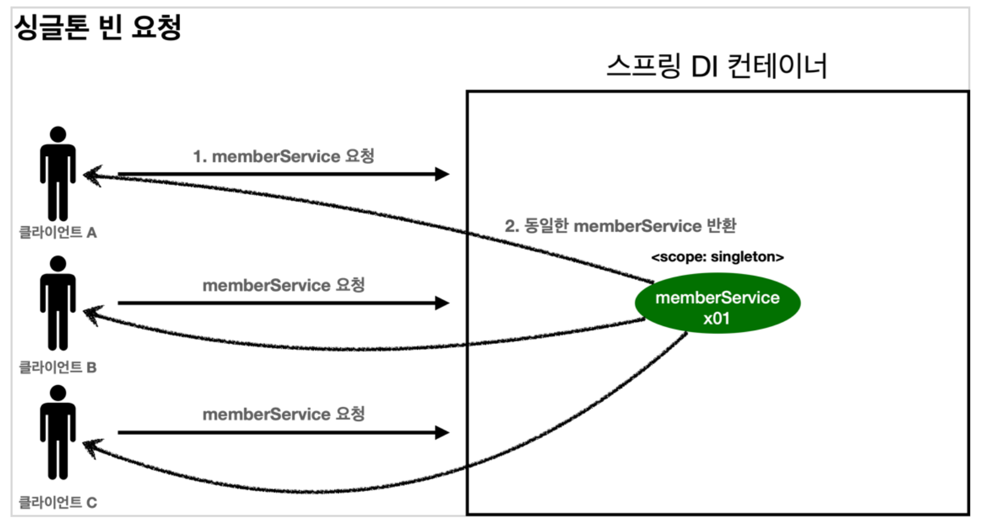
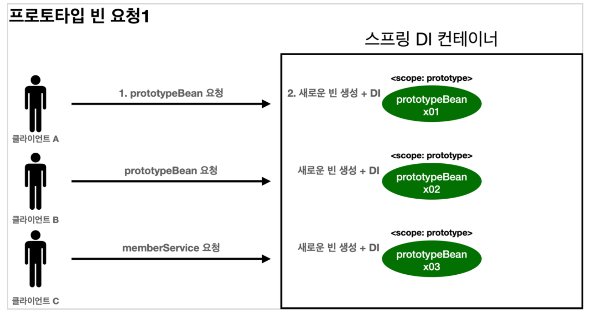
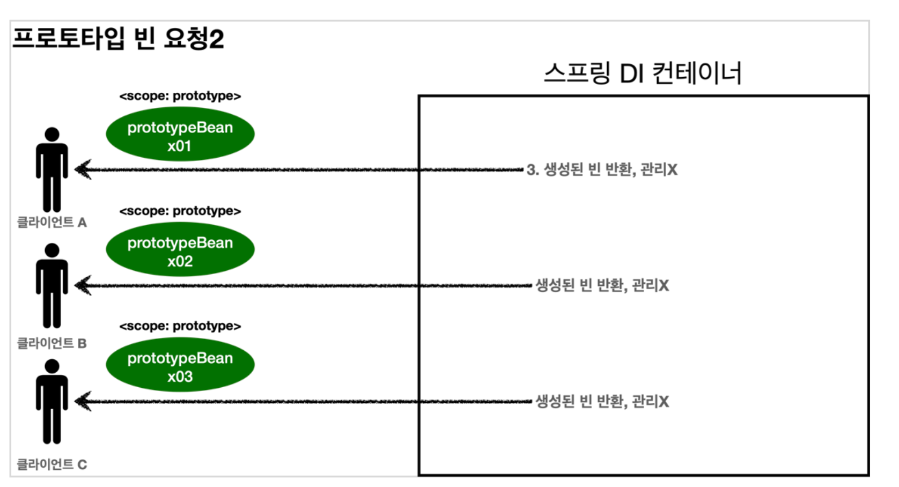
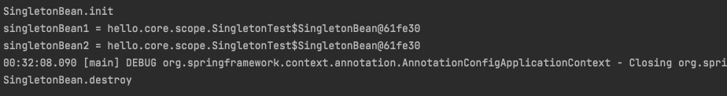
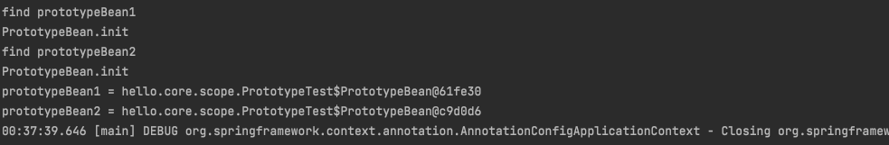
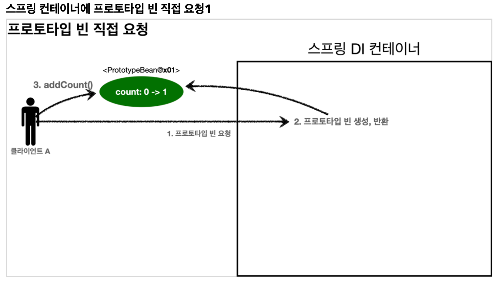
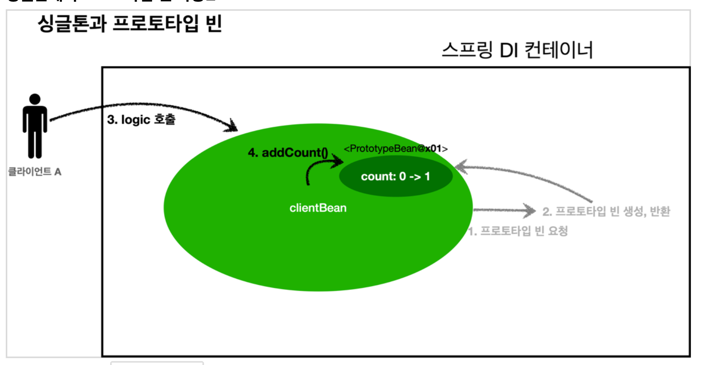
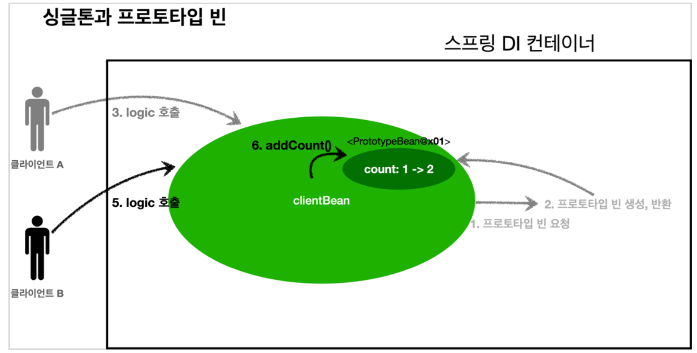
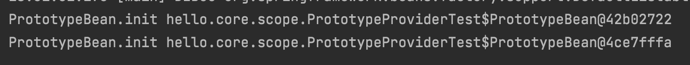
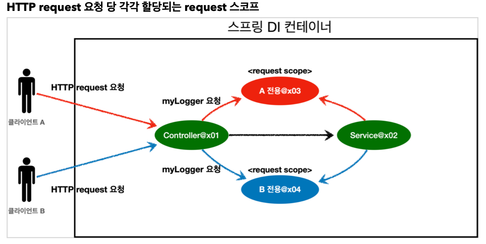

__22_02_16__

# 빈 스코프
## 빈 스코프란?
지금까지 우리는 스프링 빈이 스프링 컨테이너의 시작과 함께 생성되어서 스프링 컨테이너가 종료될 때까지 유지된다고 학습  
이것은 스프링 빈이 기본적으로 싱글톤 스코프로 생성되기 때문  
`스코프는 번역 그대로 빈이 존재할 수 있는 범위`

### 스프링은 다음과 같은 다양한 스코프를 지원
- `싱글톤` : 기본 스코프, 스프링 컨테이너의 시작과 종료까지 유지되는 가장 넓은 범위의 스코프
- `프로토타입` : 스프링 컨테이너는 프로토타입 빈의 생성과 의존관계 주입까지만 관여하고 더는 관리하지 않는 매우 짧은 범위의 스코프
- `웹 관련 스코프`
  - `request` : 웹 요청이 들어오고 나갈때까지 유지되는 스코프
  - `session` : 웹 세션이 생성되고 종료될때까지 유지되는 스코프
  - `application` : 웹의 서블릿 컨텍스트와 같은 범위 유지되는 스코프

빈 스코프는 다음과 같이 지정 가능

**컴포넌트 스캔 자동 등록**
```java
@Scope("prototype")
@Component
public class HelloBean{}
```
**수동 등록**
```java
@Scope("prototype")
@Bean
PrototypeBean HelloBean(){
    return new HelloBean();
}
```

### 프로토타입 스코프
싱글톤 스코프의 빈을 조회하면 스프링 컨테이너는 항상 같은 인스턴스의 스프링 빈을 반환  
반면에 프로토타입 스코프를 스프링 컨테이너에 조회하면 스프링 컨테이너는 항상 새로운 인스턴스를 생성해서 반환

**싱글톤 빈 요청**

1. 싱글톤 스코프의 빈을 스프링 컨테이너에 요청
2. 스프링 컨테이너는 본인이 관리하는 스프링 빈을 반환
3. 이후에 스프링 컨테이너에 같은 요청이 와도 같은 객체 인스턴스의 스프링 빈을 반환

**프로토타입 빈 요청 1**

1. 프로토타입 스코프의 빈을 스프링 컨테이너에 요청
2. 스프링 컨테이너는 이 시점에 프로토타입 빈을 생성하고, 필요한 의존관계를 주입

**프로토타입 빈 요청 2**

3. 스프링 컨테이너는 생성한 프로토타입 빈을 클라이언트에 반환
4. 이후에 스프링 컨테이너에 같은 요청이 오면 항상 새로운 프로토타입 빈을 생성해서 반환


### 정리 
여기서 핵심 ‼️  
👉 `스프링 컨테이너는 프로토타입 빈을 생성하고, 의존관계 주입, 초기화까지만 처리한다는 것`  
클라이언트에 빈을 반환하고, 이후 스프링 컨테이너는 생성된 프로토타입 빈을 관리하지 않는다.  
프로토타입 빈을 관리할 책임은 프로토타입 빈을 받은 클라이언트에 있다.   
👉 그래서 `@PreDestroy`같은 종료 메서드가 호출되지 않음

#### 싱글톤 스코프 빈 테스트
```java
package hello.core.scope;

import org.assertj.core.api.Assertions;
import org.junit.jupiter.api.Test;
import org.springframework.context.annotation.AnnotationConfigApplicationContext;
import org.springframework.context.annotation.Scope;

import javax.annotation.PostConstruct;
import javax.annotation.PreDestroy;

public class SingletonTest {

    @Test
    public void singletonBeanFind() {
        AnnotationConfigApplicationContext ac = new AnnotationConfigApplicationContext(SingletonBean.class);
        SingletonBean singletonBean1 = ac.getBean(SingletonBean.class);
        SingletonBean singletonBean2 = ac.getBean(SingletonBean.class);
        System.out.println("singletonBean1 = " + singletonBean1);
        System.out.println("singletonBean2 = " + singletonBean2);
        Assertions.assertThat(singletonBean1).isSameAs(singletonBean2);

        ac.close();
    }

    @Scope("singleton")
    static class SingletonBean {

        @PostConstruct
        public void init() {
            System.out.println("SingletonBean.init");
        }

        @PreDestroy
        public void destroy() {
            System.out.println("SingletonBean.destroy");
        }
    }
}

```
실행 결과


- 빈 초기화 메서드를 실행하고,
- 같은 인스턴스의 빈을 조회하고,
- 종료 메서드까지 정상 호출된 것을 확인할 수 있음

#### 프로토타입 스코프 빈 테스트
```java
package hello.core.scope;

import org.assertj.core.api.Assertions;
import org.junit.jupiter.api.Test;
import org.springframework.context.annotation.AnnotationConfigApplicationContext;
import org.springframework.context.annotation.Scope;

import javax.annotation.PostConstruct;
import javax.annotation.PreDestroy;

public class PrototypeTest {

    @Test
    public void prototypeBeanFind() {

        AnnotationConfigApplicationContext ac = new AnnotationConfigApplicationContext(PrototypeBean.class);
        System.out.println("find prototypeBean1");
        PrototypeBean prototypeBean1 = ac.getBean(PrototypeBean.class);
        System.out.println("find prototypeBean2");
        PrototypeBean prototypeBean2 = ac.getBean(PrototypeBean.class);
        System.out.println("prototypeBean1 = " + prototypeBean1);
        System.out.println("prototypeBean2 = " + prototypeBean2);
        Assertions.assertThat(prototypeBean1).isNotSameAs(prototypeBean2);
        ac.close();
    }

    @Scope("prototype")
    static class PrototypeBean {

        @PostConstruct
        public void init() {
            System.out.println("PrototypeBean.init");
        }

        @PreDestroy
        public void destroy() {
            System.out.println("PrototypeBean.destroy");
        }
    }
}

```
실행 결과


- 싱글톤 빈은 스프링 컨테이너 생성 시점에 초기화 메서드가 실행되지만, 프로토타입 스코프의 빈은 스프링 컨테이너에서 빈을 조회할 때 생성되고, 초기화 메서드도 실행됨
- 프로토타입 빈을 2번 조회했으므로 완전히 다른 스프링 빈이 생성되고, 초기화도 2번 실행된 것을 확인할 수 있음
- 싱글톤 빈은 스프링 컨테이너가 관리하기 때문에 스프링 컨테이너가 종료될 때 빈의 종료 메서드가 샐행되지만, 프로토타입 빈은 스프링 컨테이너가 생성과 의존관계 주입 그리고 초기화까지만 관여하고,더는 관리하지 않음
- 따라서 프로토타입 빈은 스프링 컨테이너가 종료될 때 `@PreDestroy`같은 종료 메서드가 전혀 실행되지 않음

#### 프로토타입 빈의 특징 정리
- 스프링 컨테이너에 요청할 때마다 새로 생성
- 스프링 컨테이너는 프로토타입 빈의 생성과 의존관계 주입 그리고 초기화까지만 관여
- 종료 메서드가 호출되지않음
- 그래서 프로토타입 빈은 클라이언트가 관리해야함. 종료 메서드에 대한 호출도 클라이언트가 직접 해야함

### 프로토타입 스코프 - 싱글톤 빈과 함께 사용시 문제점
스프링 컨테이너에 프로토타입 스코프의 빈을 요청하면 항상 새로운 객체 인스턴스를 생성해서 반환  
하지만 싱글톤 빈과 함께 사용할 때는 의도한 대로 잘 동작하지 않으므로 주의해야함

먼저 스프링 컨테이너에 프로토타입 빈을 직접 요청하는 예제

**프로토타입 빈 직접 요청**

1. 클라이언트A는 스프링 컨테이너에 프로토타입 빈을 요청
2. 스프링 컨테이너는 프로토타입 빈을 새로 생성해서 반환(x01)한다. 해당 빈의 count 필드 값은 0
3. 클라이언트는 조회한 프로토타입 빈에 `addCount()`를 호출하면서 count 필드를 +1 한다.
4. 결과적으로 프로토타입 빈(x01)의 count는 1이 된다.


1. 클라이언트B는 스프링 컨테이너에 프로토타입 빈을 요청
2. 스프링 컨테이너는 프로토타입 빈을 새로 생성해서 반환(x02). 해당 빈의 count필드 값은 0
3. 클라이언트는 조회한 프로토타입 빈에 `addCount()`를 호출하면서 count 필드를 +1
4. 결과적으로 프로토타입 빈(x02)의 count는 1

```java
package hello.core.scope;

import org.assertj.core.api.Assertions;
import org.junit.jupiter.api.Test;
import org.springframework.context.annotation.AnnotationConfigApplicationContext;
import org.springframework.context.annotation.Scope;

import javax.annotation.PostConstruct;
import javax.annotation.PreDestroy;

public class SingletonWithPrototypeTest1 {

    @Test
    void prototypeFind() {
        AnnotationConfigApplicationContext ac = new AnnotationConfigApplicationContext(PrototypeBean.class);
        PrototypeBean prototypeBean1 = ac.getBean(PrototypeBean.class);
        prototypeBean1.addCount();
        Assertions.assertThat(prototypeBean1.getCount()).isEqualTo(1);

        PrototypeBean prototypeBean2 = ac.getBean(PrototypeBean.class);
        prototypeBean2.addCount();
        Assertions.assertThat(prototypeBean2.getCount()).isEqualTo(1);
    }

    @Scope("prototype")
    static class PrototypeBean {
        private int count = 0;

        public void addCount() {
            count += 1;
        }

        public int getCount() {
            return count;
        }

        @PostConstruct
        public void init() {
            System.out.println("PrototypeBean.init " + this);
        }

        @PreDestroy
        public void destroy() {
            System.out.println("PrototypeBean.destroy");
        }
    }
}

```

실행결과


#### 싱글톤 빈에서 프로토타입 빈 사용
이번에는 `clientBean`이라는 싱글톤 빈이 의존관계 주입을 통해서 프로토타입 빈을 주입받아서 사용하는 예
**싱글톤에서 프로토타입 빈 사용1**

- `clientBean`은 싱글톤이므로, 보통 스프링 컨테이너 생성 시점에 함께 생성되고, 의존관계 주입도 발생
1. `clientBean`은 의존관꼐 자동 주입을 사용. 주입 시점에 스프링 컨테이너에 프로토타입 빈을 요청
2. 스프링 컨테이너는 프로토타입 빈을 생성해서 `clientBean`에 반환. 프로토타입 빈의 count 필드 값은 0
- 이제 `clientBean`은 프로토타입 빈을 내부 필드에 보관 (정확히는 참조값을 보관)

**싱글톤에서 프로토타입 빈 사용2**

- 클라이언트A는 `clientBean`을 스프링 컨테이너에 요청해서 받음. 싱글톤이므로 항상 같은 `clientBean`이 반환
3. 클라이언트A는 `clientBean.logic()`을 호출
4. `clientBean`은 prototypeBean의 `addCount()` 호출해서 프로토타입 빈이 count를 증가, count 값이 1

**싱글톤에서 프로토타입 빈 사용3**

- 클라이언트B는 `clientBean`을 스프링 컨테이너에 요청해서 받음. 싱글톤이므로 항상 같은 `clientBean`이 반환됨
- 여기서 중요한 점 ✅
  - **`clientBean`이 내부에 가지고 있는 프로토타입 빈은 이미 과거에 주입이 끝난 빈. 주입 시점에 스프링 컨테이너에 요청해서 프로토타입 빈이 새로 생성이 된 것이지, 사용할 때마다 새로 생성되는 것은 아님**
5. 클라이언트B는 `clientBean.logic()`을 호출
6. `clientBean`은 prototypeBean의 `addCount()`를 호출해서 프로토타입 빈의 count를 증가. 원래 count 값이 1이었으므로 2가 됨

```java
package hello.core.scope;

import org.assertj.core.api.Assertions;
import org.junit.jupiter.api.Test;
import org.springframework.beans.factory.annotation.Autowired;
import org.springframework.context.annotation.AnnotationConfigApplicationContext;
import org.springframework.context.annotation.Scope;

import javax.annotation.PostConstruct;
import javax.annotation.PreDestroy;

import static org.assertj.core.api.Assertions.assertThat;

public class SingletonWithPrototypeTest1 {

    @Test
    void prototypeFind() {
       /* AnnotationConfigApplicationContext ac = new AnnotationConfigApplicationContext(PrototypeBean.class);
        PrototypeBean prototypeBean1 = ac.getBean(PrototypeBean.class);
        prototypeBean1.addCount();
        Assertions.assertThat(prototypeBean1.getCount()).isEqualTo(1);

        PrototypeBean prototypeBean2 = ac.getBean(PrototypeBean.class);
        prototypeBean2.addCount();
        Assertions.assertThat(prototypeBean2.getCount()).isEqualTo(1);*/

        AnnotationConfigApplicationContext ac = new AnnotationConfigApplicationContext(ClientBean.class, PrototypeBean.class);

        ClientBean clientBean1 = ac.getBean(ClientBean.class);
        int count1 = clientBean1.logic();
        assertThat(count1).isEqualTo(1);

        ClientBean clientBean2 = ac.getBean(ClientBean.class);
        int count2 = clientBean2.logic();
        assertThat(count2).isEqualTo(2);
    }

    @Scope("prototype")
    static class PrototypeBean {
        private int count = 0;

        public void addCount() {
            count += 1;
        }

        public int getCount() {
            return count;
        }

        @PostConstruct
        public void init() {
            System.out.println("PrototypeBean.init " + this);
        }

        @PreDestroy
        public void destroy() {
            System.out.println("PrototypeBean.destroy");
        }
    }

    static class ClientBean {

        private final PrototypeBean prototypeBean;

        @Autowired
        public ClientBean(PrototypeBean prototypeBean) {
            this.prototypeBean = prototypeBean;
        }

        public int logic() {
            prototypeBean.addCount();
            int count = prototypeBean.getCount();
            return count;
        }

    }
}

```


스프링은 일반적으로 싱글톤 빈을 사용하므로, 싱글톤 빈이 프로토타입 빈을 사용하게 된다. 그런데 싱글톤 빈은 생성 시점에만 의존관계를 주입받기 때문에, 프로토타입 빈이 새로 생성되기는 하지만, 싱글톤 빈과 함꼐 계속 유지되는 것이 문제

아마 원하는 것은 👉 주입 시점에만 새로 생성하는게 아니라, 사용할 때마다 새로 생성해서 사용하는 것
> **참고** : 여러 빈에서 같은 프로토타입 빈을 주입 받으면, **주입 받는 시점에 각각 새로운 프로토타입 빈이 생성**된다.  
> 예를 들어서 clientA, clientB가 각각 의존관계 주입을 받으면 각각 다른 인스턴스의 프로토타입 빈을 주입 받음  
> clientA → prototypeBean@x01  
> clientB → prototypeBean@x02  
> 물론 사용할 때마다 새로 생성되는 것이 아님


### 프로토타입 스코프 - 싱글톤 빈과 함께 사용시 Provider로 문제 해결
싱글톤 빈과 프로토타입 빈을 함께 사용할 때, 어떻게 하면 사용할때마다 항상 새로운 프로토타입 빈을 생성할 수 있을까?

#### 스프링 컨테이너에 요청
가장 간단한 방법은 프로토타입을 사용할 때마다 새로 요청하는 것
```java
package hello.core.scope;

import org.assertj.core.api.Assertions;
import org.junit.jupiter.api.Test;
import org.springframework.beans.factory.annotation.Autowired;
import org.springframework.context.ApplicationContext;
import org.springframework.context.annotation.AnnotationConfigApplicationContext;
import org.springframework.context.annotation.Scope;

import javax.annotation.PostConstruct;
import javax.annotation.PreDestroy;

import static org.assertj.core.api.Assertions.assertThat;

public class PrototypeProviderTest {

    @Test
    void providerTest() {
        AnnotationConfigApplicationContext ac = new AnnotationConfigApplicationContext(ClientBean.class, PrototypeBean.class);

        ClientBean clientBean1 = ac.getBean(ClientBean.class);
        int count1 = clientBean1.logic();
        assertThat(count1).isEqualTo(1);

        ClientBean clientBean2 = ac.getBean(ClientBean.class);
        int count2 = clientBean2.logic();
        assertThat(count2).isEqualTo(1);
    }

    @Scope("prototype")
    static class PrototypeBean {
        private int count = 0;

        public void addCount() {
            count += 1;
        }

        public int getCount() {
            return count;
        }

        @PostConstruct
        public void init() {
            System.out.println("PrototypeBean.init " + this);
        }

        @PreDestroy
        public void destroy() {
            System.out.println("PrototypeBean.destroy");
        }
    }

    static class ClientBean {

        @Autowired
        private ApplicationContext ac;


        public int logic() {
            PrototypeBean prototypeBean = ac.getBean(PrototypeBean.class);
            prototypeBean.addCount();
            int count = prototypeBean.getCount();
            return count;
        }

    }
}

```

- `ac.getBean()`을 통해서 항상 새로운 빈이 생성
- 의존관계를 외부에서 주입`(DI)`받는게 아니라, 직접 필요한 의존관계를 찾는 것을 `Dependencty Lookup(DL)` 의존관계 조회(탐색)이라함
- BUT ‼️ 이렇게 스프링의 애플리케이션 컨텍스트 전체를 주입받게 되면, 스프링 컨테이너에 종속적인 코드가 되고, 단위 테스트도 어려움
- 지정한 프로토타입 빈을 컨테이너에서 대신 찾아주는 **DL** 정도의 기능만 제공하는 무언가만 있으면 됨

#### ObjectFactory, ObjectProvider
지정한 빈을 컨테이너에서 대신 찾아주는 DL 서비스를 제공하는 것이 바로 `ObjectProvider`  
`ObjectFactory`에 편의 기능을 추가한 것
```java
static class ClientBean {

        @Autowired
//        private ApplicationContext ac;
        private ObjectProvider<PrototypeBean> prototypeBeanObjectProvider;


        public int logic() {
//            PrototypeBean prototypeBean = ac.getBean(PrototypeBean.class);
            PrototypeBean prototypeBean = prototypeBeanObjectProvider.getObject();
            prototypeBean.addCount();
            int count = prototypeBean.getCount();
            return count;
        }

    }
```

- `prototypeBeanObjectProvider.getObject()`를 통해서 항상 새로운 프로토타입 빈이 생성
- `ObjectProvider`의 `getObject()`를 호출하면 내부에서는 스프링 컨테이너를 통해 해당 빈을 찾아서 반환`(DL)`
- 스프링이 제공하는 기능을 사용하지만, 기능이 단순하므로 단위테스트를 만들거나 mock 코드를 만들기는 훨씬 쉬워짐
- `ObjectProvider`는 딱 필요한 DL 정도의 기능만 제공

##### 특징
- ObjectFactory : 기능이 단순, 별도의 라이브러리 필요 없음, 스프링에 의존
- ObjectProvider : ObjectFactory 상속, 옵션, 스트림 처리등 편의 기능이 많고, 별도의 라이브러리 필요 없음, 스프링에 의존

#### JSR-330 Provider
`javax.inject.Provider`라는 JSR-330 자바 표준을 사용하는 방법  
이 방법을 사용하려면 `javax.inject:javax.inject:1` 라이브러리를 gradle에 추가해야함
```java
 static class ClientBean {
    
        @Autowired
        private Provider<PrototypeBean> provider;

        public int logic() {
            PrototypeBean prototypeBean = provider.get();
            prototypeBean.addCount();

            return prototypeBean.getCount();
        }


    }
```

- `provider.get()`을 통해서 항상 새로운 프로토타입 빈이 생성됨
- `provider`의 `get()`을 호출하면 내부에서는 스프링 컨테이너를 통해 찾아서 반환`(DL)`
- 자바 표준이고, 기능이 단순하므로 단위테스트를 만들거나 Mock코드를 만들기는 훨씬 쉬움
- `Provider`는 딱 필요한 DL정도의 기능만 제공

##### 특징
- `get()`메서드 하나로 기능이 매우 단순
- 별도의 라이브러리가 필요
- 자바 표준이므로 스프링이 아닌 다른 컨테이너에서도 사용 가능

### 정리
- 프로토타입 빈은 언제 사용???
  - 👉 매번 사용할때 마다 의존관계 주입이 완료된 새로운 객체가 필요하면 사용하면 됨.
  - 그런데 실무에서는, 싱글톤 빈으로 대부분 문제를 해결할 수 있으므로, 직접적으로 사용하는 일은 매우 드뭄
- `ObjectProvider`, `JSR330 Provider`등은 프로토타입 뿐만 아니라 DL이 필요한 경우는 언제든지 사용 가능
  - 지연해서 또는 optional 해서 가져올때
  - 순한 의존(참조)을 깨뜨릴때 (a->b, b->a)
  - multiple instance가 필요할 때

> 참고 : 스프링이 제공하는 메서드에 `@Lookup` 애노테이션을 사용하는 방법도 있지만, 이전 방법들로 충분해서 생략

### 웹 스코프
#### 특징
- 웹 환경에서만 동작
- 프로토타입과 다르게 스프링이 해당 스코프의 종료시점까지 관리함. 따라서 종료 메서드가 호출됨

#### 종류
- `request` : HTTP 요청 하나가 들어오고 나갈 때까지 유지되는 스코프, 각각의 HTTP 요청마다 별도의 빈 인스턴스가 생성되고 관리됨
- `session` : HTTP Session과 동일한 생명주기를 가지는 스코프
- `application` : 서블릿 컨텍스트`(ServletContext)`와 동일한 생명주기를 가지는 스코프
- `websocket` : 웹 소켓과 동일한 생명주기를 가지는 스코프

여기서는 request scope를 예제로 설명.  
나머지도 범위만 다르지 동작 방식은 비슷  



#### request 스코프 예제 개발
동시에 여러 HTTP 요청이 오면 정확히 어떤 요청이 남긴 로그인지 구분하기 어려움  
이럴때 사용하기 좋은게 `request 스코프`

로그가 남도록 request 스코프를 활용해서 추가기능 개발  
- 기대하는 공통 포맷 : [UUID][requestURL]{message}
- UUID를 사용해서 HTTP 요청을 구분하자
- requestURL 정보도 추가로 넣어서 어떤 URL을 요청해서 남은 로그인지 확인

