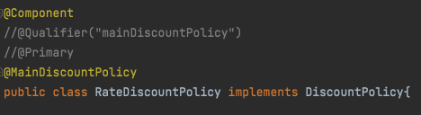
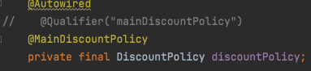
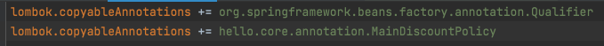

__22_02_15__

# 애노테이션 직접 만들기
`@Qualifier("mainDiscountPolicy")` 이렇게 적으면 컴파일시 타입 체크가 안된다.  
다음과 같은 애노테이션을 만들어서 문제 해결 가능 
```java
package hello.core.annotation;

import org.springframework.beans.factory.annotation.Qualifier;

import java.lang.annotation.ElementType;
import java.lang.annotation.Retention;
import java.lang.annotation.RetentionPolicy;
import java.lang.annotation.Target;

@Target({ElementType.FIELD, ElementType.METHOD, ElementType.PARAMETER, ElementType.TYPE, ElementType.ANNOTATION_TYPE})
@Retention(RetentionPolicy.RUNTIME)
@Qualifier("mainDiscountPolicy")
public @interface MainDiscountPolicy {
}

```



**lombok.config**


애노테이션에는 상속이라는 개념이 없다. 이렇게 여러 애노테이션을 모아서 사용하는 기능은 스프링이 지원해주는 기능  
`@Qualifier` 뿐만 아니라 다른 애노테이션들도 함께 조합해서 사용할 수 있다.  
단적으로 `@Autowired`도 재정의 할 수 있다. 물론 스프링이 제공하는 기능을 뚜렷한 목적 없이 무분별하게 재정의하는 것은 유지보수에 더 혼란만 가중할 수 있음

