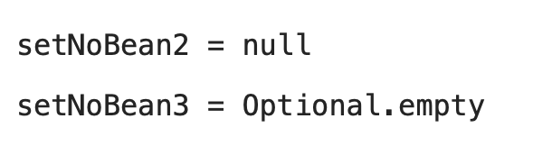

__22_02_14__

# 의존관계 자동 주입

## 다양한 의존관계 주입 방법
의존관계 주입은 크게 4가지 방법이 있다.
- 생성자 주입
- 수정자 주입(setter 주입)
- 필드 주입
- 일반 메서드 주입

### 1. 생성자 주입
- 이름 그대로 생성자를 통해서 의존 관계를 주입 받는 방법
- 지금까지 우리가 진행했던 방법은 바로 생성자 주입
- 특징
  - 생성자 호출시점에 딱 1번만 호출되는 것이 보장됨
  - **불변, 필수**  의존관계에 사용
```java
@Component
public class OrderServiceImpl implements OrderService {
    private final MemberRepository memberRepository;
    private final DiscountPolicy discountPolicy;

    @Autowired
    public OrderServiceImpl(MemberRepository memberRepository, DiscountPolicy
            discountPolicy) {
        this.memberRepository = memberRepository;
        this.discountPolicy = discountPolicy;
    }
}
```
**중요! 생성자가 딱 1개만 있으면 @Autowired를 생략해도 자동 주입된다.** 물론 스프링 빈에만 해당

### 2. 수정자 주입(setter 주입)
- setter라 불리는 필드의 값을 변경하는 수정자 메서드를 통해서 의존관계를 주입하는 방법
- 특징
  - **선택, 변경** 가능성이 있는 의존관계에 사용
  - 자바빈 프로퍼티 규약의 수정자 메서드 방식을 사용하는 방법
```java
@Component
public class OrderServiceImpl implements OrderService {
  private MemberRepository memberRepository;
  private DiscountPolicy discountPolicy;

  @Autowired
  public void setMemberRepository(MemberRepository memberRepository) {
    this.memberRepository = memberRepository;
  }

  @Autowired
  public void setDiscountPolicy(DiscountPolicy discountPolicy) {
    this.discountPolicy = discountPolicy;
  }
}
```
> 참고 : `@Autowired`의 기본 동작은 주입할 대상이 없으면 오류가 발생한다. 주입할 대상이 없어도 동작하게 하려면 `@Autowired(required = false)`로 지정하면 됨  

> 참고 : 자바빈 ㅍ로퍼티, 자바에서는 과거부터 필드의 값을 직접 변경하지 않고, setXxx, getXxx라는 메서드를 통해서 값을 읽거나 수정하는 규칙을 만들었는데, 그것이 자바빈 프로퍼티 규약이다.

자바빈 프로퍼티 규약 예시
```java
 class Data {
      private int age;
      public void setAge(int age) {
        this.age = age;
      }
      public int getAge() {
        return age;
} }
```

### 3. 필드 주입
- 이름 그대로 필드에 바로 주입하는 방법
- 특징
  - 코드가 간결하지만, 외부에서 변경이 불가능해서 테스트 하기 힘들다는 치명적인 단점이 있음
  - DI 프레임워크가 없으면 아무것도 할 수 없음
  - 사용NoNo‼️
    - 애플리케이션의 실제 코드와 관계 없는 테스트 코드
    - 스프링 설정을 목적으로 하는 `@Configuration` 같은 곳에서만 특별한 용도로 사용
```java
    @Component
    public class OrderServiceImpl implements OrderService {
        @Autowired
        private MemberRepository memberRepository;
        @Autowired
        private DiscountPolicy discountPolicy;
  }
```
> 참고 : 순수한 자바 테스트 코드에는 당연히 `@Autowired`가 동작하지 않는다. `@SpringBootTest`처럼 스프링 컨테이너를 테스트에 통합한 경우에만 사용 가능

> 참고 : 다음 코드와 같이 `@Bean`에서 파라미터에 의존관계는 자동 주입됨. 수동 등록시 자동 등록된 빈의 의존관계가 필요할 때 문제를 해결할 수 있다.
```java
    @Bean
    OrderService orderService(MemberRepository memberRepoisitory, DiscountPolicy
    discountPolicy) {
        new OrderServiceImpl(memberRepository, discountPolicy)
    }
```

### 4. 일반 메서드 주입
- 일반 메서드를 통해서 주입 받을 수 있음
- 특징
  - 한 번에 여러 필드를 주입 받을 수 있음
  - 일반적으로 잘 사용 ❌
```java
@Component
public class OrderServiceImpl implements OrderService {
  private MemberRepository memberRepository;
  private DiscountPolicy discountPolicy;

  @Autowired
  public void init(MemberRepository memberRepository, DiscountPolicy
          discountPolicy) {
    this.memberRepository = memberRepository;
    this.discountPolicy = discountPolicy;
  }
}
```

### 옵션 처리
주입할 스프링 빈이 없어도 동작해야 할 때가 있다.  
그런데 `@Autowired`만 사용하면 `required` 옵션의 기본값이 `true`로 되어 있어서 자동 주입 대상이 없으면 오류 발생

자동 주입 대상을 옵션으로 처리하는 방법은 다음과 같음
- `@Autowired(required=false)` : 자동 주입할 대상이 없으면 수정자 메서드 자체가 호출 안됨
- `org.springframework.lang.@Nullable` : 자동 주입할 대상이 없으면 null이 입력됨
- `Optional<>` : 자동 주입할 대상이 없으면 `Optional.empty`가 입력됨

예제
```java
//호출 안됨
@Autowired(required = false)
public void setNoBean1(Member member) {
        System.out.println("setNoBean1 = " + member);
    }
//null 호출
@Autowired
public void setNoBean2(@Nullable Member member) {
        System.out.println("setNoBean2 = " + member);
    }
//Optional.empty 호출
@Autowired(required = false)
public void setNoBean3(Optional<Member> member) {
        System.out.println("setNoBean3 = " + member);
    }
```
- **Member는 스프링 빈이 아니다.**
- `setNoBean1()`은 `@Autowired(required=false)`이므로 호출자체가 안됨

출력결과

> 참고 : @Nullable, Optional은 스프링 전반에 걸쳐서 지원됨. 예를 들어서 생성자 자동 주입에서 특정 필드에만 사용해도 됨


## 생성자 주입을 선택해라!
과거에는 수정자 주입과 필드 주입을 많이 사용했지만, 최근에는 스프링을 포함한 DI 프레임워크 대부분이 생성자 주입을 권장   
이유 👉
### 불변
- 대부분의 의존관계 주입은 한번 일어나면 애플리케이션 종료시점까지 의존관계를 변경할 일이 없다. 오히려 대부분의 의존관계는 애플리케이션 종료 전까지 변하면 안된다.`(불변해야함)`
- 수정자 주입을 사용하면, setXxx 메서드를 public으로 열어두어야 한다.
- 누군가 실수로 변경할 수도 있고, 변경하면 안되는 메서드를 열어두는 것은 좋은 설계 방법이 아니다.
- 생성자 주입은 객체를 생성할 때 딱 1번만 호출되므로 이후에 호출되는 일이 없다. 따라서 불변하게 설계할 수 있음

### 누락
프레임워크 없이 순수한 자바 코드를 단위 테스트 하는 경우에 다음과 같이 수정자 의존관계인 경우
```java
public class OrderServiceImpl implements OrderService {
  private MemberRepository memberRepository;

  private DiscountPolicy discountPolicy;

  @Autowired
  public void setMemberRepository(MemberRepository memberRepository) {
    this.memberRepository = memberRepository;
  }

  @Autowired
  public void setDiscountPolicy(DiscountPolicy discountPolicy) {
    this.discountPolicy = discountPolicy;
  }
}
```
- `@Autowired`가 프레임워크 안에서 동작할 때는 의존관계가 없으면 오류가 발생하지만, 지금은 프레임워크없이 순수한 자바 코드로만 단위 테스트를 수행하고 있다.

이렇게 테스트를 수행하면 실행은 됨
```java
 @Test
  void createOrder() {
      OrderServiceImpl orderService = new OrderServiceImpl();
      orderService.createOrder(1L, "itemA", 10000);
  }
```
그런데 막상 실행 결과는 `NPE(Null Point Exception)`이 발생하는데, `memberRepository`, `discountPolicy`모두 의존관계 주입이 누락되었기 때문

생성자 주입을 사용하면 다음처럼주입 데이터를 누락했을 때, **컴파일 오류**가 발생  
그리고 IDE에서 바로 어떤 값을 필수로 주입해야하는지 알 수 있음
```java
@Test
  void createOrder() {
    OrderServiceImpl orderService = new OrderServiceImpl();
    orderService.createOrder(1L, "itemA", 10000);
  }
```

## final 키워드
생성자 주입을 사용하면 필드에 `final` 키워드를 사용할 수 있다. 그래서 생성자에 혹시라도 값이 설정되지 않는 오류를 컴파일 시점에 막아준다. 
```java
@Component
    public class OrderServiceImpl implements OrderService {
        private final MemberRepository memberRepository;
        private final DiscountPolicy discountPolicy;
@Autowired
        public OrderServiceImpl(MemberRepository memberRepository, DiscountPolicy
    discountPolicy) {
            this.memberRepository = memberRepository;
        }
//...
}
```
- 잘 보면 필수 필드인 `discountPolicy`에 값을 설정해야 하는데, 이 부분이 누락되었다. 자바는 컴파일 시점에 다음 오류를 발생시킨다.
- `java: variable discountPolicy might not have been initialized`
- 기억하자 ! **컴파일 오류는 세상에서 가장 빠르고, 좋은 오류다!**

> 참고 : 수정자 주입을 포함한 나머지 주입 방식은 모두 생성자 이후에 호출되므로, 필드에 `final` 키워드를 사용할 수 없다. 오직 생성자 주입 방식만 `final`키워드를 사용가능

## 정리
- 생성자 주입 방식을 선택하는 이유는 여러가지가 있지만, 프레임워크에 의존하지 않고, 순수한 자바 언어의 특징을 잘 살리는 방법이다.
- 기본으로 생성자 주입을 사용하고, 필수 값이 아닌 경우에는 수정자 주입 방식을 옵션으로 부여하면 된다. 생성자 주입과 수정자 주입을 동시에 사용할 수 있다.
- 항상 생성자 주입을 선택해라! 그리고 가끔 옵션이 필요하면 수정자 주입을 선택해라. 필드 주입을 사용하지 않는게 좋다.
