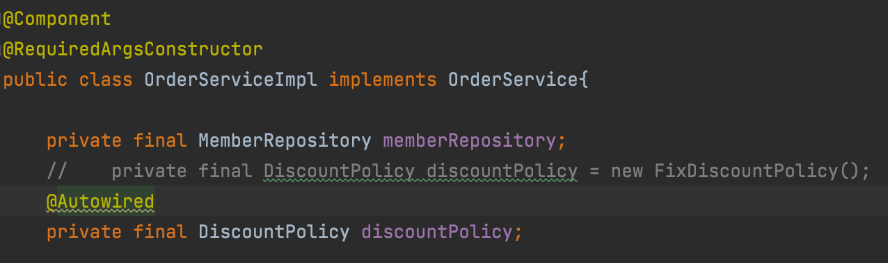
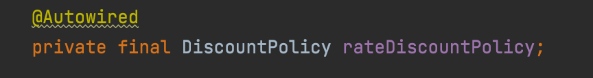
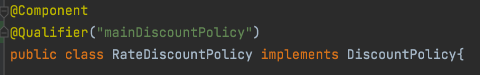
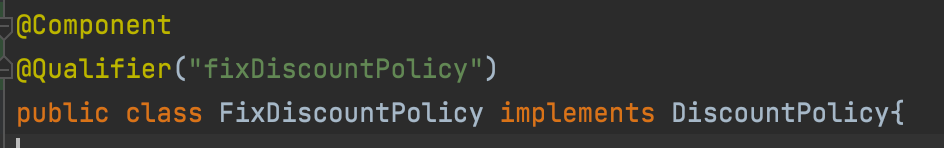
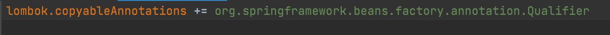
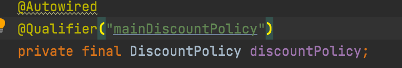
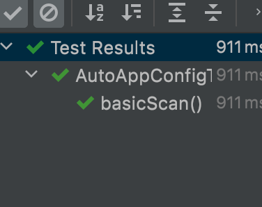
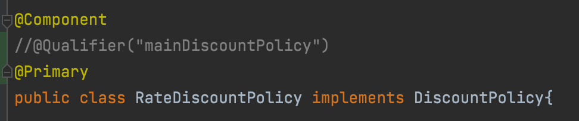
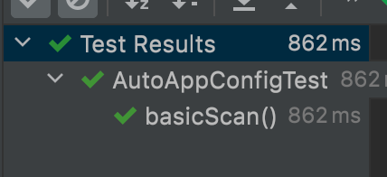

__22_02_15__

# 조회 빈이 2개 이상 - 문제
`@Autowired`는 타입(Type)으로 조회
```
@Autowired
private DiscountPolicy discountPolicy;
```
타입으로 조회하기 때문에, 마치 다음 코드와 유사하게 동작(실제로는 더 많은 기능 제공)
`ac.getBean(DiscountPolicy.class)`

스프링 빈 조회에서 학습했듯이 타입으로 조회하면 선택된 빈이 2개 이상일 때 문제가 발생한다.  
`DiscountPolicy`의 하위타입인 `FixDiscountPolicy`, `RateDiscountPolicy` 둘다 스프링 빈으로 설정해보자
```java
@Component
public class FixDiscountPolicy implements DiscountPolicy{}
```
```java
@Component
public class RateDiscountPolicy implements DiscountPolicy{}
```
의존관계 자동 주입


👉 오류 발생


이때 하위 타입으로 지정할 수 도 있지만, 하위 타입으로 지정하는 것은 DIP를 위배하고 유연성이 떨어진다.  
그리고 이름만 다르고, 완전히 똑같은 타입의 스프링 빈이 2개 있을 때 해결이 안됨  
스프링 빈을 수동 등록해서 문제를 해결해도 되지만, 의존관계 자동 주입에서 해결하는 여러방법이 있다.

## @Autowired 필드 명, @Qualifier, @Primary
조회 대상 빈이 2개 이상일 때 해결 방법
### 1. `@Autowired` 필드 명 맻ㅇ
`@Autowired`는 타입 매칭을 시도하고, 이때 여러 빈이 있으면 필드 이름, 파라미터 이름으로 빈 이름을 추가 매칭
기존 코드
```
@Autowired
private DiscountPolicy discountPolicy;
```
필드 명을 빈 이름으로 변경


필드 명이 `rateDiscountPolicy`이므로 정상 주입됨  
**필드 명 매칭은 먼저 타입 매칭을 시도하고 그 결과에 여러 빈이 있을 때 추가로 동작하는 기능**

#### @Autowired 매칭 정리
- 타입 매칭
- 타입 매칭의 결과가 2개 이상일 때 필드 명, 파라미터 명으로 빈 이름 매칭

## 2. @Qualifier 사용
`@Qualifier`는 추가 구분자를 붙여주는 방법. 주입 시 추가적인 방법을 제공하는 것이지 빈 이름을 변경하는 것이 아님

빈 등록시 `@Qualifier`를 붙여줌



주입 시에 `@Qualifier`를 붙여주고 등록한 이름을 적어줌
> 주의 : lombok이 제공하는 @RequiredArgsConstructor는 애노테이션까지 포함해서 생성자를 만들지 않음  
> 벗 방법 존재 👉   
> lombok.cofig 파일에  추가




`@Qualifier`로 주입할 때 `@Qualifier("mainDiscountPolicy")`를 못찾으면 어떻게 될까??  
그러면 `mainDiscountPolicy`라는 이름의 스프링 빈을 추가로 찾는다. 하지만 `@Qualifier`는 `@Qualifier`를 찾는 용도로만 사용하는게 좋다.

### @Qualifier 정리
- @Qualifier 끼리 매칭
- 빈 이름 매칭
- `NoSuchBeanDefinitionException` 예외 발생

## 3. @Primary 사용
`@Primary`는 우선순위를 정하는 방법. `@Autowired`시에 여러 빈이 매칭되면 `@Primary`가 우선권을 가짐
`rateDiscountPolicy`가 우선권을 가지도록



### @Primary, @Qualifier 활용
자주 사용하는 메인 데이터베이스의 커넥션을 획득하는 스프링 빈이 있고, 특별한 기능으로 가끔 사용하는 서브 데이터베이스의 커넥션을 획득하는 스프링 빈이 있다고 생각  
메인 데이터베이스의 커넥션을 획득하는 스프링 빈은 `@Primary`를 적용해서 조회하는 곳에서 `@Qualifier` 지정없이 편리하게 조회하고, 서브 데이터베이스 커넥션 빈을 획득할 때는 `@Qualifier`를 지정해서 명시적으로 획득하는 방슥을 사용하면 코드를 깔끔하게 유지 가능

### 우선순위
`@Primary`는 기본값처럼 동작, `@Qualifier`는 매우 상세하게 동작.  
스프링은 자동보다는 수동이, 넓은 범위의 선택권보다는 좁은 범위의 선택권이 우선순위가 높다.  
여기서도 `@Qualifier`가 우선권이 높다.

