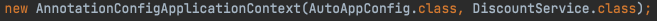

__22_02_15__

# 조회한 빈이 모두 필요할 때, List, Map
의도적으로 해당 타입의 스프링 빈이 다 필요한 경우가 있음  
예를 들어 할인 서비스를 제공하는데, 클라이언트가 할인의 종류(rate, fix)를 선택할 수 있다고 가정  
스프링을 사용하면 소위 말하는 전략 패턴을 매우 간단하게 구현 가능

```java
package hello.core.autowired;

import hello.core.AutoAppConfig;
import hello.core.discount.DiscountPolicy;
import hello.core.member.Grade;
import hello.core.member.Member;
import org.assertj.core.api.Assertions;
import org.junit.jupiter.api.Test;
import org.springframework.beans.factory.annotation.Autowired;
import org.springframework.context.ApplicationContext;
import org.springframework.context.annotation.AnnotationConfigApplicationContext;

import java.util.List;
import java.util.Map;

import static org.assertj.core.api.Assertions.assertThat;

public class AllBeanTest {

    @Test
    void findAllBean() {
        ApplicationContext ac = new AnnotationConfigApplicationContext(AutoAppConfig.class, DiscountService.class);
        DiscountService discountService = ac.getBean(DiscountService.class);
        Member member = new Member(1L, "userA", Grade.VIP);
        int discountPrice = discountService.discount(member, 10000, "fixDiscountPolicy");

        assertThat(discountService).isInstanceOf(DiscountService.class);
        assertThat(discountPrice).isEqualTo(1000);
    }

    static class DiscountService {
        private final Map<String, DiscountPolicy> policyMap;
        private final List<DiscountPolicy> policies;

        @Autowired
        public DiscountService(Map<String, DiscountPolicy> policyMap, List<DiscountPolicy> policies) {
            this.policyMap = policyMap;
            this.policies = policies;

            System.out.println("policyMap = " + policyMap);
            System.out.println("policies = " + policies);
        }

        public int discount(Member member, int price, String discountCode) {
            DiscountPolicy discountPolicy = policyMap.get(discountCode);

            System.out.println("discountCode = " + discountCode);
            System.out.println("discountPolicy = " + discountPolicy);

            return discountPolicy.discount(member, price);
        }
    }
}

```

### 로직 분석
- DiscountService는 Map으로 모든 `DiscountPolicy`를 주입받음. 이때 `fixDiscountPolicy`, `rateDiscountPolicy`가 주입됨
- `discount()`메서드는 discountCode로 "fixDiscountPolicy"가 넘어오면 map에 "fixDiscountPolicy" 스프링 빈을 찾아서 실행. 물론 "rateDiscountPolicy"가 넘어오면 `rateDiscountPolicy` 스프링 빈을 찾아서 실행

### 주입 분석
- `Map<String, DiscoutPolicy>` : map의 키에 스프링 빈의 이름을 넣어주고, 그 값으로 `DiscountPolicy` 타입으로 조회한 모든 스프링 빈을 담아줌
- `List<DiscountPolicy>` : `DiscountPolicy` 타입으로 조회한 모든 스프링 빈을 담아준다.
- 만약 해당하는 타입의 스프링 빈이 없으면, 빈 컬렉션이나 Map을 주입

스프링 컨테이너는 생성자에 클래스 정보를 받는다. 여기에 클래스 정보를 넘기면 해당 클래스가 스프링 빈으로 자동 등록된다.


이 코드는 2가지로 나누어 이해할 수 있음
- `new AnnotationConfigApplicationContext()`를 통해 스프링 컨테이너를 생성
- `AutoAppConfig.class`, `DiscountService.class`를 파라미터로 넘기면서 해당 클래스를 자동으로  스프링 빈으로 등록함

정리 👉 스프링 컨테이너를 생성하면서, 해당 컨테이너에 동시에 `AutoAppConfig`, `DiscountService`를 스프링 빈으로 자동 등록