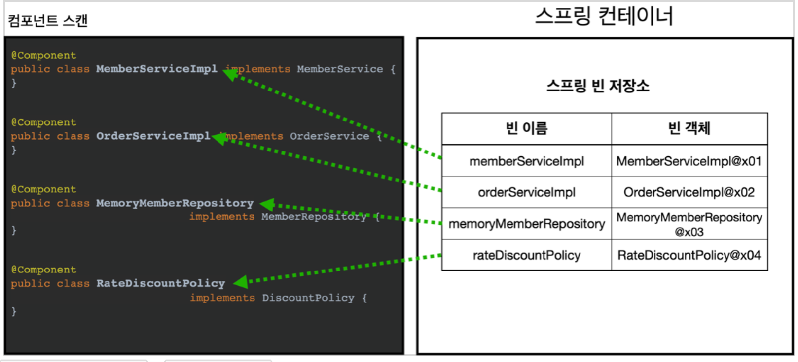
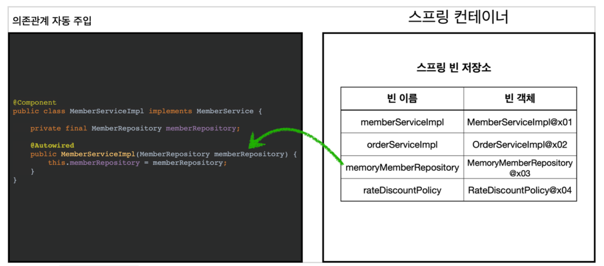
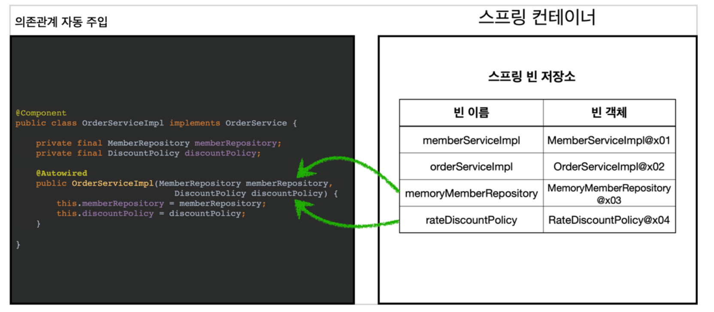

_22_02_12_

# 컴포넌트 스캔

## 컴포넌트 스캔과 의존관계 자동 주입 시작하기
- 지금까지 스프링 빈을 등록할 때는 자바 코드의 `@Bean`이나 XML의 `<bean>` 등을 통해서 설정 정보에 직접 등록할 스프링 빈을 나열했다.
- 이렇게 등록해야 할 스프링 빈이 수십, 수백개가 되면 일일이 등록하기도 귀찮고, 설정 정보도 커지고, 누락하는 문제도 발생한다.
- 그래서 스프링은 설정 정보가 없어도 자동으로 스프링 빈을 등록하는 `컴포넌트 스캔`이라는 기능을 제공
- 또 의존관계도 자동으로 주입하는 `@Autowired`라는 기능도 제공

새로운 `AutoAppConfig.java` 생성
```java
package hello.core;

import org.springframework.context.annotation.ComponentScan;
import org.springframework.context.annotation.Configuration;
import org.springframework.context.annotation.FilterType;

@Configuration
@ComponentScan(
        excludeFilters = @ComponentScan.Filter(type = FilterType.ANNOTATION, classes = Configuration.class)
)
public class AutoAppConfig {
}

```
- 컴포넌트 스캔을 사용하려면 먼저 `@ComponentScan`을 설정 정보에 붙여주면 된다.
- 기존의 `AppConfig`와 다르게 `@Bean`으로 등록한 클래스가 하나도 없다!
> 참고 : 컴포넌트 스캔을 사용하면 `@Configuration`이 붙은 설정 정보도 자동으로 등록되기 때문에, `AppConfig`, `TestConfig` 등 앞서 만들어두었던 설정 정보도 함께 등록되고, 실행되어 버린다.
> 그래서 `excludeFilters`를 이용해서 설정정보는 컴포넌트 스캔 대상에서 제외

컴포넌트 스캔은 이름 그대로 `@Component`애노테이션이 붙은 클래스를 스캔해서 스프링 빈으로 등록한다. 
> 참고 : `@Configuration`또한 `@Component` 애노테이션이 붙어있다.

- 이전에는 `AppConfig`에서는 `@Bean`으로 직접 설정 정보를 작성했고, 의존관계도 직접 명시했다. 이제는 이런 설정 정보 자체가 없기 때문에, 의존관계 주입도 이 클래스 안에서 해결해야 함
- `@Autowired`는 의존관계를 자동으로 주입
- `@Autowired`를 사용하면 생성자에서 여러 의존관계도 한번에 주입받을 수 있음

컴포넌트 스캔과 자동 의존관계 주입이 어떻게 동작하는지 그림
### 1. @ComponentScan

- `@ComponentScan`은 `@Component`가 붙은 모든 클래스를 스프링 빈으로 등록함
- 이때 스프링 빈의 기본 이름은 클래스명을 사용하되 맨 앞글자만 소문자를 사용
  - **빈 이름 기본 전략** : MemberServiceImpl 클래스 → memberServiceImpl
  - **빈 이름 직접 지정** : 만약 스프링 빈의 이름을 직접 지정하고 싶으면 `@Component("memberService2)`이런식으로 이름 부ㅜ여

### 2. @Autowired 의존관계 자동 주입

- 생성자에 `@Autowired`을 지정하면, 스프링 컨테이너가 자동으로 해당 스프링 빈을 찾아서 주입
- 이때 기본 조회 전략은 타입이 같은 빈을 찾아서 주입
  - `getBean(MemberRepository.class)`와 동일하다고 이해하면 됨


- 생성자에 파라미터가 많아도 다 찾아서 자동으로 주입


## 탐색 위치와 기본 스캔 대상
**탐색할 패키지의 시작 위치 지정**  
모든 자바 클래스를 다 컴포넌트 스캔하면 시간이 오래걸린다. 그래서 꼭 필요한 위치부터 탐색하도록 시작 위치를 지정 가능
```java
package hello.core;

import org.springframework.context.annotation.ComponentScan;
import org.springframework.context.annotation.Configuration;
import org.springframework.context.annotation.FilterType;

@Configuration
@ComponentScan(
        basePackages = "hello.core",
        excludeFilters = @ComponentScan.Filter(type = FilterType.ANNOTATION, classes = Configuration.class)
)
public class AutoAppConfig {
}

```
- `basePackages` : 탐색할 패키지의 시작 위치를 지정. 이 패키지를 포함해서 하위 패키지를 모두 탐색
  - `basePackages = {"hello.core", "hello.service"}` 이렇게 여러 시작 위치를 지정 가능
- `basePackageClasses` : 지정한 클래스의 패키지를 탐색 시작 위치로 지정
- 만약 지정하지 않으면 `@ComponentScan`이 붙은 설정 정보 클래스의 패키지가 시작 위치가 됨

> 권장하는 방법  
> 👉 패키지 위치를 지정하지 않고, 설정 정보 클래스의 위치를 프로젝트 최상단에 두는 것


### 컴포넌트 스캔 기본 대상
컴포넌트 스캔은 `@Component`뿐만 아니라 다음과 내용도 추가로 대상에 포함
- `@Component` : 컴포넌트 스캔에서 사용
- `@Controller` : 스프링 MVC 컨트롤러에서 사용
- `@Service` : 스프링 비즈니스 로직에서 사용
- `@Repository` : 스프링 데이터 접근 계층에서 사용
- `@Configuration` : 스프링 설정 정보에서 사용

컴포넌트 스캔의 용도 뿐만 아니라 다음 애노테이션이 있으면 스프링은 부가 기능을 수행
- `@Controller` : 스프링 MVC 컨트롤러로 인식
- `@Repository` : 스프링 데이터 접근 계층으로 인식하고, 데이터 계층의 예외를 스프링 예외로 변환
- `@Configuration` : 스프링 설정 정보로 인식하고, 스프링 빈이 싱글톤을 유지하도록 추가 처리
- `@Service` : 사실 `@Service`는 특별한 처리를 하지 않는다. 대신 개발자들이 핵심 비즈니스 로직이 여기에 있겠구나라고 비즈니스 계층을 인식하는데 도움을 줌


## 필터
- `includeFilters` : 컴포넌트 스캔 대상을 추가로 지정
- `excludeFilters` : 컴포넌트 스캔에서 제외할 대상을 지정

### FilterType 옵션
FilterType은 5가지 옵션이 있다.
- ANNOTATION : 기본값, 애노테이션을 인식해서 동작
  - EX ) `org.example.SomeAnnotation`
- ASSIGNABLE_TYPE : 지정한 타입과 자식 타입을 인식해서 동작
  - EX ) `org.example.SomeClass`
- ASPECTJ : AspectJ 패턴 사용
  - EX ) `org.example..*Service+`
- REGEX : 정규 표현식
  - EX ) `org\.example\.Default.*`
- CUSTOM : `TypeFilter`이라는 인터페이스를 구현해서 처리
  - EX ) `org.example.MyTypeFilter`

## 중복 등록과 충돌
컴포넌트 스캔에서 같은 빈 이름을 등록하면 어떻게 될까?
다음 두가지 상황
### 1. 자동 빈 등록 vs 자동 빈 등록
- 컴포넌트 스캔에 의해 자동으로 스프링 빈으로 등록되는데, 그 이름이 같은 경우 스프링은 오류를 발생시킴
  - `ConflictingBeanDefinitionException` 예외 발생

### 2. 수동 빈 등록 vs 자동 빈 등록
만약 수동 빈 등록과 자동 빈 등록에서 빈 이름이 충돌되면??  
👉 이 경우 수동 빈 등록이 우선권을 가짐 (수동 빈이 자동 빈을 오버라이딩)

#### 수동 빈 등록시 남는 로그
```
Overriding bean definition for bean 'memoryMemberRepository with a different definition: replacing
 ```

수동 빈 등록, 자동 빈 등록 오류시 스프링 부트 에러
```
Consider renaming one of the beans or enabling overriding by setting spring.main.allow-bean-definition-overriding=true
```

스프링 부트인 `CoreApplication`을 실행해보면 오류를 볼 수 있음